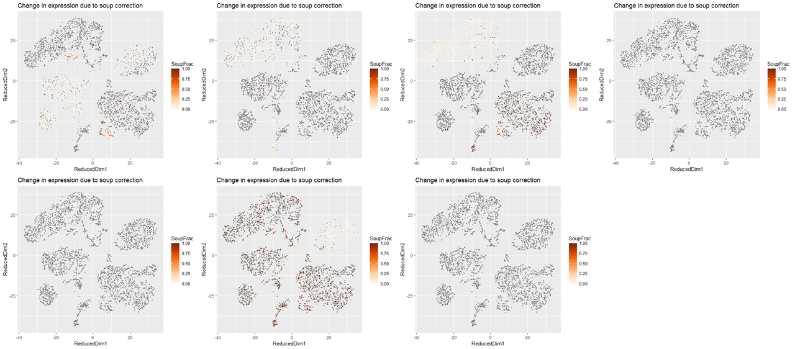
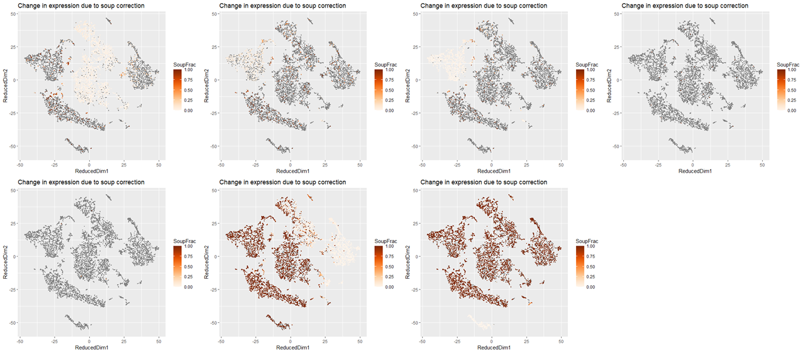

# Porcine Immune Single Cell Atlas

## Ambient RNA correction
Ambient RNA in scRNA-seq samples were cleaned using R package SoupX (v1.4.5; https://github.com/constantAmateur/SoupX) in Rstudio (v1.1.447; R v3.6.2).
Required packages: dplyr, scran, knitr, ggplot2, Rtsne, cowplot, Seurat, tidyr, DropletUtils, SoupX.
```
pacman::p_load(dplyr, scran, knitr, ggplot2, Rtsne, cowplot, Seurat, limma, tidyr, DropletUtils, SoupX, DoubletFinder)
setwd ("Raw count matrix location")

```

### A
Load raw read count matrix into R environment using load10X function from Seurat.
```
sc <- load10X('A/')
dd <- sc$metaData
mids <- aggregate(cbind(tSNE1,tSNE2) ~ clusters,data=dd,FUN=mean)
ggplot(dd,aes(tSNE1,tSNE2)) + geom_point(aes(colour=factor(clusters)),size=0.2) + geom_label(data=mids,aes(label=clusters))
```


Now let's look at some specific gene expression.
```
dd$CD3E = sc$toc["CD3E_ENSSSCG00000040140", ]
dd$IgLambdaV = sc$toc["ENSSSCG00000038719", ]
dd$CD79B = sc$toc["CD79B_ENSSSCG00000017283", ]
dd$FABP6 = sc$toc["FABP6_ENSSSCG00000017037", ]
dd$EPCAM = sc$toc["EPCAM_ENSSSCG00000008429", ]
dd$GNLY = sc$toc["GNLY_ENSSSCG00000008228", ]
dd$HBB = sc$toc["HBB_ENSSSCG00000014725", ]

A1 <- ggplot(dd, aes(tSNE1,tSNE2)) + geom_point(aes(colour = CD3E > 0))
A2 <- ggplot(dd, aes(tSNE1,tSNE2)) + geom_point(aes(colour = IgLambdaV > 0))
A3 <- ggplot(dd, aes(tSNE1,tSNE2)) + geom_point(aes(colour = CD79B > 0))
A4 <- ggplot(dd, aes(tSNE1,tSNE2)) + geom_point(aes(colour = FABP6 > 0))
A5 <- ggplot(dd, aes(tSNE1,tSNE2)) + geom_point(aes(colour = EPCAM > 0))
A6 <- ggplot(dd, aes(tSNE1,tSNE2)) + geom_point(aes(colour = GNLY > 0))
A7 <- ggplot(dd, aes(tSNE1,tSNE2)) + geom_point(aes(colour = HBB > 0))
plot_grid(A1, A2, A3, A4, A5, A6, A7, nrow = 2)

```


```
B1 <- plotMarkerMap(sc, "CD3E_ENSSSCG00000040140")
B2 <- plotMarkerMap(sc, "ENSSSCG00000038719")
B3 <- plotMarkerMap(sc, "CD79B_ENSSSCG00000017283")
B4 <- plotMarkerMap(sc, "FABP6_ENSSSCG00000017037")
B5 <- plotMarkerMap(sc, "EPCAM_ENSSSCG00000008429")
B6 <- plotMarkerMap(sc, "GNLY_ENSSSCG00000008228")
B7 <- plotMarkerMap(sc, "HBB_ENSSSCG00000014725")
plot_grid(B1, B2, B3, B4, B5, B6, B7, nrow = 2)
```


Estimate the contaminated RNA fraction automatically.
```
sc <- autoEstCont(sc)
out <- adjustCounts(sc)
```

Now let's see which genes were most affected by our correction.
```
cntSoggy <- rowSums(sc$toc > 0)
cntStrained <- rowSums(out > 0)
tail(sort((cntSoggy - cntStrained)/cntSoggy), n = 10)
tail(sort(rowSums(sc$toc > out)/rowSums(sc$toc > 0)), n = 10)
```

Let's make sure the results for some of our genes make sense by visualizing on a plot.
```
C1 <- plotChangeMap(sc, out, "CD3E_ENSSSCG00000040140")
C2 <- plotChangeMap(sc, out, "ENSSSCG00000038719")
C3 <- plotChangeMap(sc, out, "CD79B_ENSSSCG00000017283")
C4 <- plotChangeMap(sc, out, "FABP6_ENSSSCG00000017037")
C5 <- plotChangeMap(sc, out, "EPCAM_ENSSSCG00000008429")
C6 <- plotChangeMap(sc, out, "GNLY_ENSSSCG00000008228")
C7 <- plotChangeMap(sc, out, "HBB_ENSSSCG00000014725")
plot_grid(C1, C2, C3, C4, C5, C6, C7, nrow = 2)
```


The SoupX correction was completed and and need to save our strained count matrices in a new location.
```
write10xCounts("SoupX/A", out, version = "3")
```

## Same process was repeated to all other sample sets.

### B
```
sc <- load10X('B/')
dd <- sc$metaData
mids <- aggregate(cbind(tSNE1,tSNE2) ~ clusters,data=dd,FUN=mean)
ggplot(dd,aes(tSNE1,tSNE2)) + geom_point(aes(colour=factor(clusters)),size=0.2) + geom_label(data=mids,aes(label=clusters))
```


```
dd$CD3E = sc$toc["CD3E_ENSSSCG00000040140", ]
dd$IgLambdaV = sc$toc["ENSSSCG00000038719", ]
dd$CD79B = sc$toc["CD79B_ENSSSCG00000017283", ]
dd$FABP6 = sc$toc["FABP6_ENSSSCG00000017037", ]
dd$EPCAM = sc$toc["EPCAM_ENSSSCG00000008429", ]
dd$GNLY = sc$toc["GNLY_ENSSSCG00000008228", ]
dd$HBB = sc$toc["HBB_ENSSSCG00000014725", ]
A1 <- ggplot(dd, aes(tSNE1,tSNE2)) + geom_point(aes(colour = CD3E > 0))
A2 <- ggplot(dd, aes(tSNE1,tSNE2)) + geom_point(aes(colour = IgLambdaV > 0))
A3 <- ggplot(dd, aes(tSNE1,tSNE2)) + geom_point(aes(colour = CD79B > 0))
A4 <- ggplot(dd, aes(tSNE1,tSNE2)) + geom_point(aes(colour = FABP6 > 0))
A5 <- ggplot(dd, aes(tSNE1,tSNE2)) + geom_point(aes(colour = EPCAM > 0))
A6 <- ggplot(dd, aes(tSNE1,tSNE2)) + geom_point(aes(colour = GNLY > 0))
A7 <- ggplot(dd, aes(tSNE1,tSNE2)) + geom_point(aes(colour = HBB > 0))
plot_grid(A1, A2, A3, A4, A5, A6, A7, nrow = 2)
```


```
B1 <- plotMarkerMap(sc, "CD3E_ENSSSCG00000040140")
B2 <- plotMarkerMap(sc, "ENSSSCG00000038719")
B3 <- plotMarkerMap(sc, "CD79B_ENSSSCG00000017283")
B4 <- plotMarkerMap(sc, "FABP6_ENSSSCG00000017037")
B5 <- plotMarkerMap(sc, "EPCAM_ENSSSCG00000008429")
B6 <- plotMarkerMap(sc, "GNLY_ENSSSCG00000008228")
B7 <- plotMarkerMap(sc, "HBB_ENSSSCG00000014725")
plot_grid(B1, B2, B3, B4, B5, B6, B7, nrow = 2)
```


```
sc <- autoEstCont(sc)
out <- adjustCounts(sc)
cntSoggy <- rowSums(sc$toc > 0)
cntStrained <- rowSums(out > 0)
tail(sort((cntSoggy - cntStrained)/cntSoggy), n = 10)
tail(sort(rowSums(sc$toc > out)/rowSums(sc$toc > 0)), n = 10)
C1 <- plotChangeMap(sc, out, "CD3E_ENSSSCG00000040140")
C2 <- plotChangeMap(sc, out, "ENSSSCG00000038719")
C3 <- plotChangeMap(sc, out, "CD79B_ENSSSCG00000017283")
C4 <- plotChangeMap(sc, out, "FABP6_ENSSSCG00000017037")
C5 <- plotChangeMap(sc, out, "EPCAM_ENSSSCG00000008429")
C6 <- plotChangeMap(sc, out, "GNLY_ENSSSCG00000008228")
C7 <- plotChangeMap(sc, out, "HBB_ENSSSCG00000014725")
plot_grid(C1, C2, C3, C4, C5, C6, C7, nrow = 2)
write10xCounts("SoupX/B", out, version = "3")
```


### C
```
sc <- load10X('C/')
dd <- sc$metaData
mids <- aggregate(cbind(tSNE1,tSNE2) ~ clusters,data=dd,FUN=mean)
ggplot(dd,aes(tSNE1,tSNE2)) + geom_point(aes(colour=factor(clusters)),size=0.2) + geom_label(data=mids,aes(label=clusters))
```


```
dd$CD3E = sc$toc["CD3E_ENSSSCG00000040140", ]
dd$IgLambdaV = sc$toc["ENSSSCG00000038719", ]
dd$CD79B = sc$toc["CD79B_ENSSSCG00000017283", ]
dd$FABP6 = sc$toc["FABP6_ENSSSCG00000017037", ]
dd$EPCAM = sc$toc["EPCAM_ENSSSCG00000008429", ]
dd$GNLY = sc$toc["GNLY_ENSSSCG00000008228", ]
dd$HBB = sc$toc["HBB_ENSSSCG00000014725", ]
A1 <- ggplot(dd, aes(tSNE1,tSNE2)) + geom_point(aes(colour = CD3E > 0))
A2 <- ggplot(dd, aes(tSNE1,tSNE2)) + geom_point(aes(colour = IgLambdaV > 0))
A3 <- ggplot(dd, aes(tSNE1,tSNE2)) + geom_point(aes(colour = CD79B > 0))
A4 <- ggplot(dd, aes(tSNE1,tSNE2)) + geom_point(aes(colour = FABP6 > 0))
A5 <- ggplot(dd, aes(tSNE1,tSNE2)) + geom_point(aes(colour = EPCAM > 0))
A6 <- ggplot(dd, aes(tSNE1,tSNE2)) + geom_point(aes(colour = GNLY > 0))
A7 <- ggplot(dd, aes(tSNE1,tSNE2)) + geom_point(aes(colour = HBB > 0))
plot_grid(A1, A2, A3, A4, A5, A6, A7, nrow = 2)
```


```
B1 <- plotMarkerMap(sc, "CD3E_ENSSSCG00000040140")
B2 <- plotMarkerMap(sc, "ENSSSCG00000038719")
B3 <- plotMarkerMap(sc, "CD79B_ENSSSCG00000017283")
B4 <- plotMarkerMap(sc, "FABP6_ENSSSCG00000017037")
B5 <- plotMarkerMap(sc, "EPCAM_ENSSSCG00000008429")
B6 <- plotMarkerMap(sc, "GNLY_ENSSSCG00000008228")
B7 <- plotMarkerMap(sc, "HBB_ENSSSCG00000014725")
plot_grid(B1, B2, B3, B4, B5, B6, B7, nrow = 2)
```


```
sc <- autoEstCont(sc)
out <- adjustCounts(sc)
cntSoggy <- rowSums(sc$toc > 0)
cntStrained <- rowSums(out > 0)
tail(sort((cntSoggy - cntStrained)/cntSoggy), n = 10)
tail(sort(rowSums(sc$toc > out)/rowSums(sc$toc > 0)), n = 10)
C1 <- plotChangeMap(sc, out, "CD3E_ENSSSCG00000040140")
C2 <- plotChangeMap(sc, out, "ENSSSCG00000038719")
C3 <- plotChangeMap(sc, out, "CD79B_ENSSSCG00000017283")
C4 <- plotChangeMap(sc, out, "FABP6_ENSSSCG00000017037")
C5 <- plotChangeMap(sc, out, "EPCAM_ENSSSCG00000008429")
C6 <- plotChangeMap(sc, out, "GNLY_ENSSSCG00000008228")
C7 <- plotChangeMap(sc, out, "HBB_ENSSSCG00000014725")
plot_grid(C1, C2, C3, C4, C5, C6, C7, nrow = 2)
write10xCounts("SoupX/C", out, version = "3")
```


### CT21NOV
```
sc <- load10X('CT21NOV/')
dd <- sc$metaData
mids <- aggregate(cbind(tSNE1,tSNE2) ~ clusters,data=dd,FUN=mean)
ggplot(dd,aes(tSNE1,tSNE2)) + geom_point(aes(colour=factor(clusters)),size=0.2) + geom_label(data=mids,aes(label=clusters))
```


```
dd$CD3E = sc$toc["CD3E_ENSSSCG00000040140", ]
dd$IgLambdaV = sc$toc["ENSSSCG00000038719", ]
dd$CD79B = sc$toc["CD79B_ENSSSCG00000017283", ]
dd$FABP6 = sc$toc["FABP6_ENSSSCG00000017037", ]
dd$EPCAM = sc$toc["EPCAM_ENSSSCG00000008429", ]
dd$GNLY = sc$toc["GNLY_ENSSSCG00000008228", ]
dd$HBB = sc$toc["HBB_ENSSSCG00000014725", ]
A1 <- ggplot(dd, aes(tSNE1,tSNE2)) + geom_point(aes(colour = CD3E > 0))
A2 <- ggplot(dd, aes(tSNE1,tSNE2)) + geom_point(aes(colour = IgLambdaV > 0))
A3 <- ggplot(dd, aes(tSNE1,tSNE2)) + geom_point(aes(colour = CD79B > 0))
A4 <- ggplot(dd, aes(tSNE1,tSNE2)) + geom_point(aes(colour = FABP6 > 0))
A5 <- ggplot(dd, aes(tSNE1,tSNE2)) + geom_point(aes(colour = EPCAM > 0))
A6 <- ggplot(dd, aes(tSNE1,tSNE2)) + geom_point(aes(colour = GNLY > 0))
A7 <- ggplot(dd, aes(tSNE1,tSNE2)) + geom_point(aes(colour = HBB > 0))
plot_grid(A1, A2, A3, A4, A5, A6, A7, nrow = 2)
```


```
B1 <- plotMarkerMap(sc, "CD3E_ENSSSCG00000040140")
B2 <- plotMarkerMap(sc, "ENSSSCG00000038719")
B3 <- plotMarkerMap(sc, "CD79B_ENSSSCG00000017283")
B4 <- plotMarkerMap(sc, "FABP6_ENSSSCG00000017037")
B5 <- plotMarkerMap(sc, "EPCAM_ENSSSCG00000008429")
B6 <- plotMarkerMap(sc, "GNLY_ENSSSCG00000008228")
B7 <- plotMarkerMap(sc, "HBB_ENSSSCG00000014725")
plot_grid(B1, B2, B3, B4, B5, B6, B7, nrow = 2)
```


```
sc <- autoEstCont(sc)
out <- adjustCounts(sc)
cntSoggy <- rowSums(sc$toc > 0)
cntStrained <- rowSums(out > 0)
tail(sort((cntSoggy - cntStrained)/cntSoggy), n = 10)
tail(sort(rowSums(sc$toc > out)/rowSums(sc$toc > 0)), n = 10)
C1 <- plotChangeMap(sc, out, "CD3E_ENSSSCG00000040140")
C2 <- plotChangeMap(sc, out, "ENSSSCG00000038719")
C3 <- plotChangeMap(sc, out, "CD79B_ENSSSCG00000017283")
C4 <- plotChangeMap(sc, out, "FABP6_ENSSSCG00000017037")
C5 <- plotChangeMap(sc, out, "EPCAM_ENSSSCG00000008429")
C6 <- plotChangeMap(sc, out, "GNLY_ENSSSCG00000008228")
C7 <- plotChangeMap(sc, out, "HBB_ENSSSCG00000014725")
plot_grid(C1, C2, C3, C4, C5, C6, C7, nrow = 2)
write10xCounts("SoupX/CT21NOV", out, version = "3")
```


### CT230OCT
```
sc <- load10X('CT230OCT/')
dd <- sc$metaData
mids <- aggregate(cbind(tSNE1,tSNE2) ~ clusters,data=dd,FUN=mean)
ggplot(dd,aes(tSNE1,tSNE2)) + geom_point(aes(colour=factor(clusters)),size=0.2) + geom_label(data=mids,aes(label=clusters))
```


```
dd$CD3E = sc$toc["CD3E_ENSSSCG00000040140", ]
dd$IgLambdaV = sc$toc["ENSSSCG00000038719", ]
dd$CD79B = sc$toc["CD79B_ENSSSCG00000017283", ]
dd$FABP6 = sc$toc["FABP6_ENSSSCG00000017037", ]
dd$EPCAM = sc$toc["EPCAM_ENSSSCG00000008429", ]
dd$GNLY = sc$toc["GNLY_ENSSSCG00000008228", ]
dd$HBB = sc$toc["HBB_ENSSSCG00000014725", ]
A1 <- ggplot(dd, aes(tSNE1,tSNE2)) + geom_point(aes(colour = CD3E > 0))
A2 <- ggplot(dd, aes(tSNE1,tSNE2)) + geom_point(aes(colour = IgLambdaV > 0))
A3 <- ggplot(dd, aes(tSNE1,tSNE2)) + geom_point(aes(colour = CD79B > 0))
A4 <- ggplot(dd, aes(tSNE1,tSNE2)) + geom_point(aes(colour = FABP6 > 0))
A5 <- ggplot(dd, aes(tSNE1,tSNE2)) + geom_point(aes(colour = EPCAM > 0))
A6 <- ggplot(dd, aes(tSNE1,tSNE2)) + geom_point(aes(colour = GNLY > 0))
A7 <- ggplot(dd, aes(tSNE1,tSNE2)) + geom_point(aes(colour = HBB > 0))
plot_grid(A1, A2, A3, A4, A5, A6, A7, nrow = 2)
```


```
B1 <- plotMarkerMap(sc, "CD3E_ENSSSCG00000040140")
B2 <- plotMarkerMap(sc, "ENSSSCG00000038719")
B3 <- plotMarkerMap(sc, "CD79B_ENSSSCG00000017283")
B4 <- plotMarkerMap(sc, "FABP6_ENSSSCG00000017037")
B5 <- plotMarkerMap(sc, "EPCAM_ENSSSCG00000008429")
B6 <- plotMarkerMap(sc, "GNLY_ENSSSCG00000008228")
B7 <- plotMarkerMap(sc, "HBB_ENSSSCG00000014725")
plot_grid(B1, B2, B3, B4, B5, B6, B7, nrow = 2)
```


```
sc <- autoEstCont(sc)
out <- adjustCounts(sc)
cntSoggy <- rowSums(sc$toc > 0)
cntStrained <- rowSums(out > 0)
tail(sort((cntSoggy - cntStrained)/cntSoggy), n = 10)
tail(sort(rowSums(sc$toc > out)/rowSums(sc$toc > 0)), n = 10)
C1 <- plotChangeMap(sc, out, "CD3E_ENSSSCG00000040140")
C2 <- plotChangeMap(sc, out, "ENSSSCG00000038719")
C3 <- plotChangeMap(sc, out, "CD79B_ENSSSCG00000017283")
C4 <- plotChangeMap(sc, out, "FABP6_ENSSSCG00000017037")
C5 <- plotChangeMap(sc, out, "EPCAM_ENSSSCG00000008429")
C6 <- plotChangeMap(sc, out, "GNLY_ENSSSCG00000008228")
C7 <- plotChangeMap(sc, out, "HBB_ENSSSCG00000014725")
plot_grid(C1, C2, C3, C4, C5, C6, C7, nrow = 2)
write10xCounts("SoupX/CT230OCT", out, version = "3")
```


### PBMC1
```
sc <- load10X('PBMC1/')
dd <- sc$metaData
mids <- aggregate(cbind(tSNE1,tSNE2) ~ clusters,data=dd,FUN=mean)
ggplot(dd,aes(tSNE1,tSNE2)) + geom_point(aes(colour=factor(clusters)),size=0.2) + geom_label(data=mids,aes(label=clusters))
```


```
dd$CD3E = sc$toc["CD3E_ENSSSCG00000040140", ]
dd$IgLambdaV = sc$toc["ENSSSCG00000038719", ]
dd$CD79B = sc$toc["CD79B_ENSSSCG00000017283", ]
dd$FABP6 = sc$toc["FABP6_ENSSSCG00000017037", ]
dd$EPCAM = sc$toc["EPCAM_ENSSSCG00000008429", ]
dd$GNLY = sc$toc["GNLY_ENSSSCG00000008228", ]
dd$HBB = sc$toc["HBB_ENSSSCG00000014725", ]
A1 <- ggplot(dd, aes(tSNE1,tSNE2)) + geom_point(aes(colour = CD3E > 0))
A2 <- ggplot(dd, aes(tSNE1,tSNE2)) + geom_point(aes(colour = IgLambdaV > 0))
A3 <- ggplot(dd, aes(tSNE1,tSNE2)) + geom_point(aes(colour = CD79B > 0))
A4 <- ggplot(dd, aes(tSNE1,tSNE2)) + geom_point(aes(colour = FABP6 > 0))
A5 <- ggplot(dd, aes(tSNE1,tSNE2)) + geom_point(aes(colour = EPCAM > 0))
A6 <- ggplot(dd, aes(tSNE1,tSNE2)) + geom_point(aes(colour = GNLY > 0))
A7 <- ggplot(dd, aes(tSNE1,tSNE2)) + geom_point(aes(colour = HBB > 0))
plot_grid(A1, A2, A3, A4, A5, A6, A7, nrow = 2)
```


```
B1 <- plotMarkerMap(sc, "CD3E_ENSSSCG00000040140")
B2 <- plotMarkerMap(sc, "ENSSSCG00000038719")
B3 <- plotMarkerMap(sc, "CD79B_ENSSSCG00000017283")
B4 <- plotMarkerMap(sc, "FABP6_ENSSSCG00000017037")
B5 <- plotMarkerMap(sc, "EPCAM_ENSSSCG00000008429")
B6 <- plotMarkerMap(sc, "GNLY_ENSSSCG00000008228")
B7 <- plotMarkerMap(sc, "HBB_ENSSSCG00000014725")
plot_grid(B1, B2, B3, B4, B5, B6, B7, nrow = 2)
```


```
sc <- autoEstCont(sc)
out <- adjustCounts(sc)
cntSoggy <- rowSums(sc$toc > 0)
cntStrained <- rowSums(out > 0)
tail(sort((cntSoggy - cntStrained)/cntSoggy), n = 10)
tail(sort(rowSums(sc$toc > out)/rowSums(sc$toc > 0)), n = 10)
C1 <- plotChangeMap(sc, out, "CD3E_ENSSSCG00000040140")
C2 <- plotChangeMap(sc, out, "ENSSSCG00000038719")
C3 <- plotChangeMap(sc, out, "CD79B_ENSSSCG00000017283")
C4 <- plotChangeMap(sc, out, "FABP6_ENSSSCG00000017037")
C5 <- plotChangeMap(sc, out, "EPCAM_ENSSSCG00000008429")
C6 <- plotChangeMap(sc, out, "GNLY_ENSSSCG00000008228")
C7 <- plotChangeMap(sc, out, "HBB_ENSSSCG00000014725")
plot_grid(C1, C2, C3, C4, C5, C6, C7, nrow = 2)
write10xCounts("SoupX/PBMC1", out, version = "3")
```


### PBMC2
```
sc <- load10X('PBMC2/')
dd <- sc$metaData
mids <- aggregate(cbind(tSNE1,tSNE2) ~ clusters,data=dd,FUN=mean)
ggplot(dd,aes(tSNE1,tSNE2)) + geom_point(aes(colour=factor(clusters)),size=0.2) + geom_label(data=mids,aes(label=clusters))
```


```
dd$CD3E = sc$toc["CD3E_ENSSSCG00000040140", ]
dd$IgLambdaV = sc$toc["ENSSSCG00000038719", ]
dd$CD79B = sc$toc["CD79B_ENSSSCG00000017283", ]
dd$FABP6 = sc$toc["FABP6_ENSSSCG00000017037", ]
dd$EPCAM = sc$toc["EPCAM_ENSSSCG00000008429", ]
dd$GNLY = sc$toc["GNLY_ENSSSCG00000008228", ]
dd$HBB = sc$toc["HBB_ENSSSCG00000014725", ]
A1 <- ggplot(dd, aes(tSNE1,tSNE2)) + geom_point(aes(colour = CD3E > 0))
A2 <- ggplot(dd, aes(tSNE1,tSNE2)) + geom_point(aes(colour = IgLambdaV > 0))
A3 <- ggplot(dd, aes(tSNE1,tSNE2)) + geom_point(aes(colour = CD79B > 0))
A4 <- ggplot(dd, aes(tSNE1,tSNE2)) + geom_point(aes(colour = FABP6 > 0))
A5 <- ggplot(dd, aes(tSNE1,tSNE2)) + geom_point(aes(colour = EPCAM > 0))
A6 <- ggplot(dd, aes(tSNE1,tSNE2)) + geom_point(aes(colour = GNLY > 0))
A7 <- ggplot(dd, aes(tSNE1,tSNE2)) + geom_point(aes(colour = HBB > 0))
plot_grid(A1, A2, A3, A4, A5, A6, A7, nrow = 2)
```


```
B1 <- plotMarkerMap(sc, "CD3E_ENSSSCG00000040140")
B2 <- plotMarkerMap(sc, "ENSSSCG00000038719")
B3 <- plotMarkerMap(sc, "CD79B_ENSSSCG00000017283")
B4 <- plotMarkerMap(sc, "FABP6_ENSSSCG00000017037")
B5 <- plotMarkerMap(sc, "EPCAM_ENSSSCG00000008429")
B6 <- plotMarkerMap(sc, "GNLY_ENSSSCG00000008228")
B7 <- plotMarkerMap(sc, "HBB_ENSSSCG00000014725")
plot_grid(B1, B2, B3, B4, B5, B6, B7, nrow = 2)
```


```
sc <- autoEstCont(sc)
out <- adjustCounts(sc)
cntSoggy <- rowSums(sc$toc > 0)
cntStrained <- rowSums(out > 0)
tail(sort((cntSoggy - cntStrained)/cntSoggy), n = 10)
tail(sort(rowSums(sc$toc > out)/rowSums(sc$toc > 0)), n = 10)
C1 <- plotChangeMap(sc, out, "CD3E_ENSSSCG00000040140")
C2 <- plotChangeMap(sc, out, "ENSSSCG00000038719")
C3 <- plotChangeMap(sc, out, "CD79B_ENSSSCG00000017283")
C4 <- plotChangeMap(sc, out, "FABP6_ENSSSCG00000017037")
C5 <- plotChangeMap(sc, out, "EPCAM_ENSSSCG00000008429")
C6 <- plotChangeMap(sc, out, "GNLY_ENSSSCG00000008228")
C7 <- plotChangeMap(sc, out, "HBB_ENSSSCG00000014725")
plot_grid(C1, C2, C3, C4, C5, C6, C7, nrow = 2)
write10xCounts("SoupX/PBMC2", out, version = "3")
```


### Ambient RNA correction was successfully completed.
### ___END___
