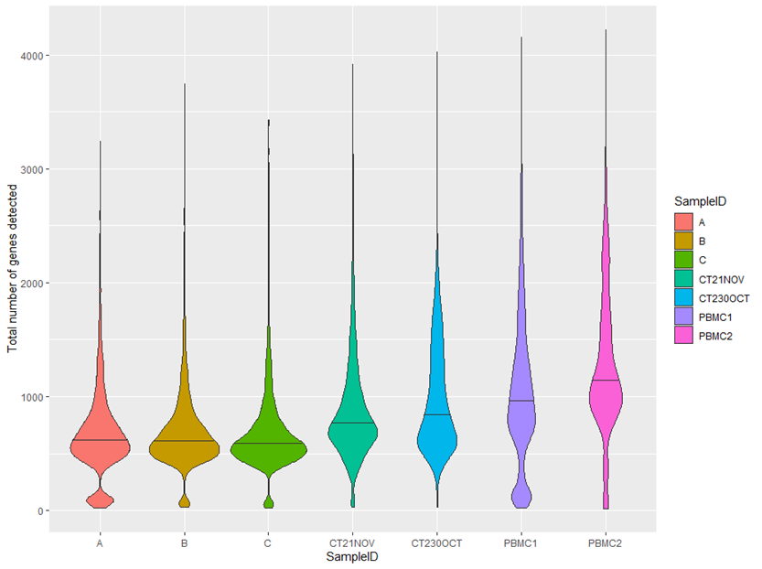
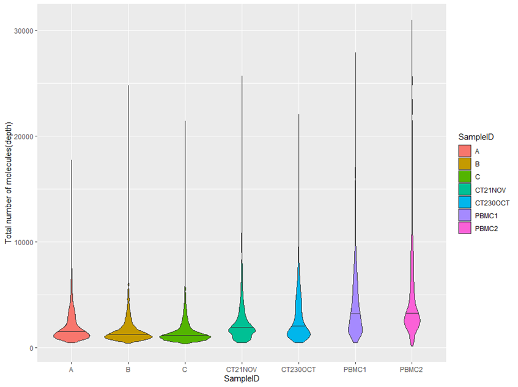
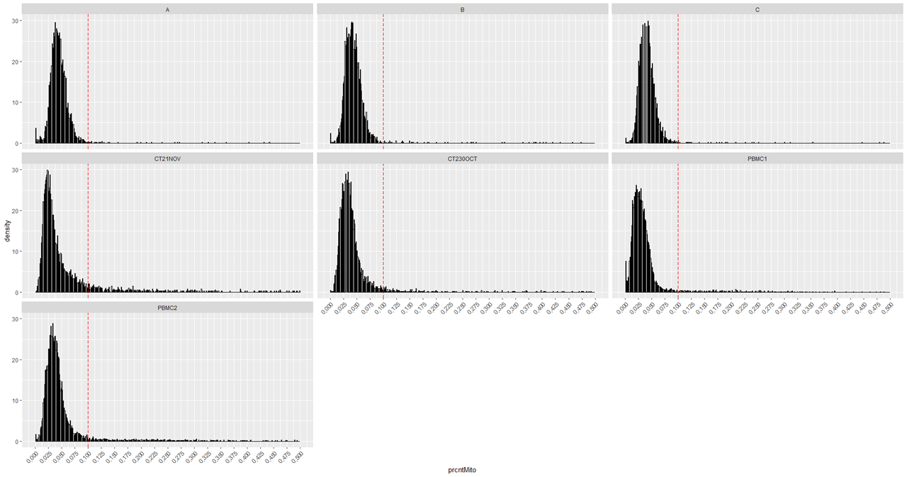
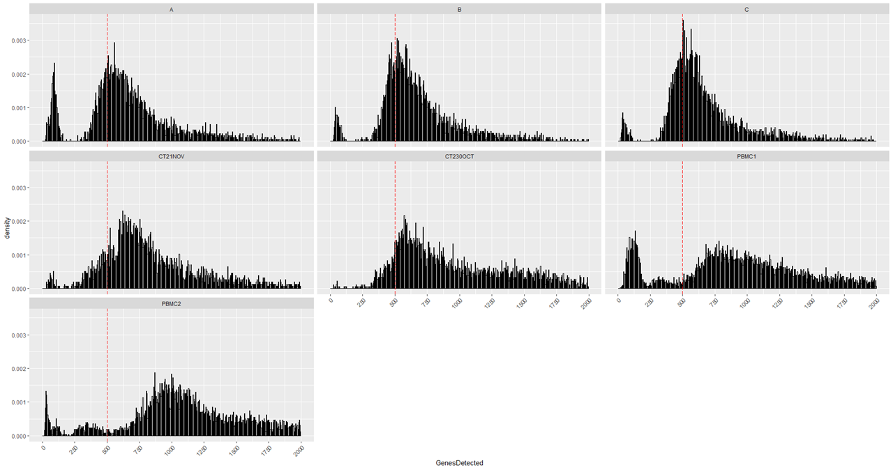
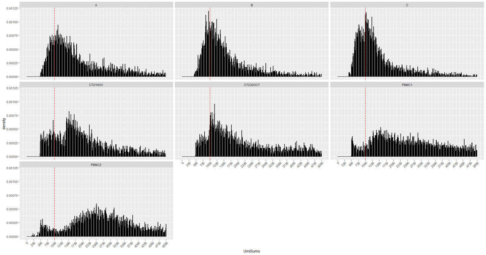

# Porcine Immune Single Cell Atlas

## Cell quality filtering

Load require package
```
pacman::p_load(dplyr, matrixStats, ggplot2, Rtsne, cowplot, Seurat, tidyr)
setwd ("C:/your/SoupX/output/location/")
```

Load data into R.
```
data_dir <- c(A = "SoupX/A", B = "SoupX/B", C = "SoupX/C", CT21NOV = "SoupX/CT21NOV",
			CT230OCT = "SoupX/CT230OCT", PBMC1 = "SoupX/PBMC1", PBMC2 = "SoupX/PBMC2")
lapply(data_dir, dir)
scRNA_data <- Read10X(data.dir = data_dir)
seurat_object = CreateSeuratObject(counts = scRNA_data)
```

Extract count matrix (cDat) from seurat dataset and Remove genes that are not expressed any of the cells from the matrix.
```
cDat <-  as.matrix(GetAssayData(object = seurat_object, slot = 'counts'))
keep <- rowSums(cDat) > 0
cDat <- cDat[keep,]
```

Create a dataframe with gene feature list (fDat).
```
fDat <- data.frame(ID = rownames(cDat)) # create a dataframe of the filtered genes
rownames(fDat) <- fDat$ID
con <- gzfile(file.path(data_dir[1], "features.tsv.gz"))
ssc_genes <- read.delim(con, sep = "\t", header = FALSE, as.is = TRUE)[, 1:2]
colnames(ssc_genes) <- c("CellRanger", "Dashed")
ssc_genes$Dashed<- gsub("_", "-", ssc_genes$Dashed, perl = TRUE); head(ssc_genes, n = 3)
ssc_genes$Symbol <- sub("_.*", "", ssc_genes$CellRanger)
ssc_genes$EnsemblID <- sub(".*_", "", ssc_genes$CellRanger)
ssc_genes$Duplicated <- duplicated(ssc_genes$Symbol) | duplicated(ssc_genes$Symbol, fromLast = TRUE)
ssc_genes$Name <- ifelse(ssc_genes$Duplicated == "TRUE", ssc_genes$EnsemblID, ssc_genes$Symbol)
fDat <- merge(fDat, ssc_genes, by.x ="row.names", by.y = "Dashed", all.x =TRUE, sort = FALSE)
rownames(fDat) <- fDat[, 1]; fDat <- fDat[, -1]
```

Add mitochondrial information into fDat.
```
mitoGenes <- read.table("MitoGenes.txt")
fDat$Mitochondrial <- fDat$EnsemblID %in% mitoGenes$V1
```

Modify count matrix (cDat) barcodes & gene names:
```
all(rownames(cDat) == rownames(fDat)); rownames(cDat) <- fDat$Name
all(colnames(cDat) == pDat$barcode); colnames(cDat) <- pDat$Loupe
```

```
## Assess single-cell sequencing depths and number of genes detected:
pDat$UmiSums<- colSums(cDat)
pDat$GenesDetected <- colSums(cDat!=0)
ggplot(pDat, aes(x=SampleID, y=GenesDetected, fill= SampleID)) +
  geom_violin(draw_quantiles=0.5)+
  ylab("Total number of genes detected")
```


```
ggplot(pDat, aes(x=SampleID,y=UmiSums, fill=SampleID)) +
  geom_violin(draw_quantiles=0.5)+
  ylab("Total number of molecules(depth)")
```



```
theme_set(theme_grey())
mMito <- cDat[fDat$Mitochondrial,]
idtop <- fDat[fDat$Name %in% names(freqOfExp)[1:50],"ID"]
mTop <- cDat[idtop,]!=0
pDat$prcntTop <- colSums(mTop)/50
pDat$prcntMito <- colSums(mMito)/colSums(cDat)
```

Check for barcode duplications:
```
pDat$DuplicatedBarcodes <- duplicated(rownames(pDat)) | duplicated(rownames(pDat), fromLast = TRUE)
table(pDat$DuplicatedBarcodes)
```

Make the histograms for mitochondrial percentage, number of gene detected and total number on UMIs detected each cells to determine if there are obvious cutoff values.
```
ggplot(pDat, aes(x=prcntMito,y=..density..)) + geom_histogram(fill="white",color="black",bins=500) +
  scale_x_continuous(breaks = seq(0, .5, .025), lim = c(0, .5)) + ylim(0,30) + facet_wrap(~SampleID) +
  geom_vline(aes(xintercept=.10),color="red",lty="longdash") + # move this cutoff line where you see fit; 12.5% mitochondrial reads seems like a good cutoff
  RotatedAxis()
```


```
ggplot(pDat, aes(x=GenesDetected,y=..density..)) + geom_histogram(fill="white",color="black",bins=500) +
  scale_x_continuous(breaks = seq(0, 2000, 250), lim = c(0, 2000)) + RotatedAxis() +
  geom_vline(aes(xintercept=500),color="red",lty="longdash") + # move this cutoff line where you see fit; 550 genes detected seems like a good cutoff
  facet_wrap(~SampleID)
```


```
ggplot(pDat, aes(x=UmiSums,y=..density..)) + geom_histogram(fill="white",color="black",bins=500) +
  scale_x_continuous(breaks = seq(0, 5000, 250), lim = c(0, 5000)) + RotatedAxis() +
  geom_vline(aes(xintercept=1000),color="red",lty="longdash") + # move this cutoff line where you see fit; 1250 UMIs seems like a good cutoff
  facet_wrap(~SampleID)
```


Now set the cutoff for each categories.
	Mitochondria - only include cells with total mitochondrial reads under 10.0%
	Gene detection - only consider cells with total genes detected more than 500
	UMI - only consider cells with greater than 1000 total UMIs
	Duplicated barcodes - only consider cells with non-repeated barcodes
```
pDat <- mutate(pDat, PassViability=prcntMito < 0.1, PassGenesDet=GenesDetected > 500, PassLibSize=UmiSums > 1000,
               PassBarcodeFreq=DuplicatedBarcodes==FALSE, PassAll= PassViability & PassGenesDet & PassLibSize & PassBarcodeFreq)
rownames(pDat) <- pDat$Loupe
```

Here we were saving the entire dataset as one RDS file for downstream analysis.
```
stopifnot(identical(as.character(rownames(pDat)),colnames(cDat)))
stopifnot(identical(as.character(fDat$Name),rownames(cDat)))
out <- list()
out[["counts"]] <- cDat
out[["phenoData"]] <- pDat
out[["featureData"]] <- fDat
saveRDS(out,file=file.path("Filtered/", "PBMCQC.rds")) # this saves all of our information before filtering out low quality cells
```

Now cells that failed in our filtering criteria were filtered from the dataset and stored separately according to sample names for doublet score estimation.  
```
cDat <- cDat[,pDat$PassAll]
pDat <- pDat[pDat$PassAll,]

## subset data & save filtered data in CellRanger formats:
All <- CreateSeuratObject(counts = cDat, meta.data = pDat) # create Seurat object of counts & pheno data
Idents(All) <- "SampleID"

A <- subset(All, ident = "A"); dim(A) # 16364  3141
write10xCounts(x = A@assays$RNA@counts, path = "Filtered/A", version = "3")

B <- subset(All, ident = "B"); dim(B) # 16364  2887
write10xCounts(x = B@assays$RNA@counts, path = "Filtered/B", version = "3")

C <- subset(All, ident = "C"); dim(C) # 16364  3192
write10xCounts(x = C@assays$RNA@counts, path = "Filtered/C", version = "3")

CT21NOV <- subset(All, ident = "CT21NOV"); dim(CT21NOV) # 16364  3140
write10xCounts(x = CT21NOV@assays$RNA@counts, path = "Filtered/CT21NOV", version = "3")

CT230OCT <- subset(All, ident = "CT230OCT"); dim(CT230OCT) # 16364  3912
write10xCounts(x = CT230OCT@assays$RNA@counts, path = "Filtered/CT230OCT", version = "3")

PBMC1 <- subset(All, ident = "PBMC1"); dim(PBMC1) # 16364  6679
write10xCounts(x = PBMC1@assays$RNA@counts, path = "Filtered/PBMC1", version = "3")

PBMC2 <- subset(All, ident = "PBMC2"); dim(PBMC2) # 16364  6711
write10xCounts(x = PBMC2@assays$RNA@counts, path = "Filtered/PBMC2", version = "3")
```
### Great We have finished cell quality filtering. now moving forward with doublet removal.
## ___END___
```
