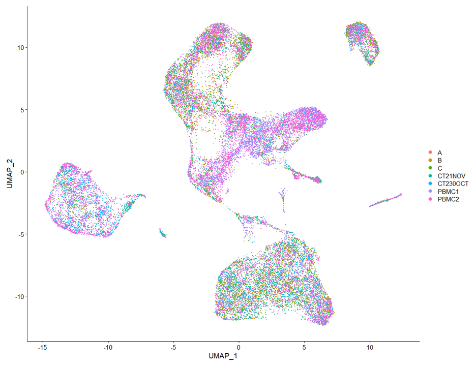
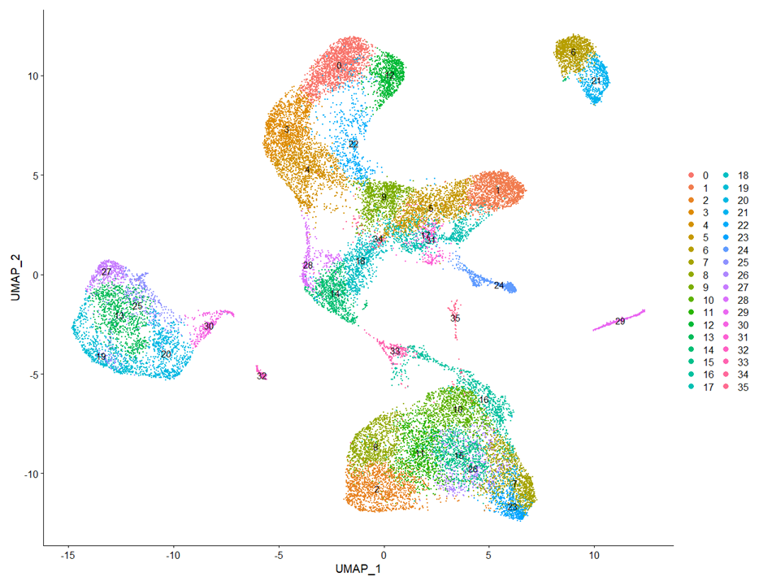
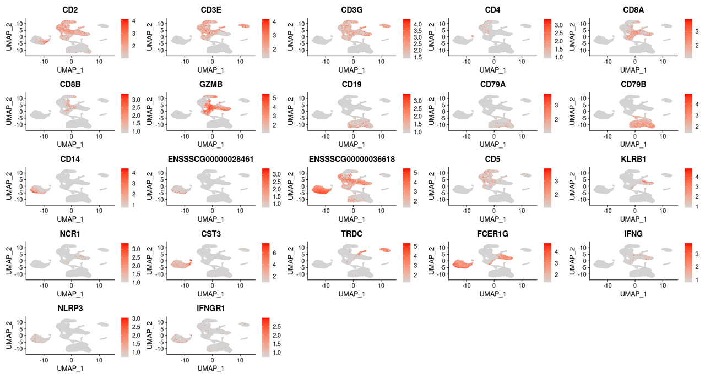

# Porcine Immune Single Cell Atlas

## sample Integration and clustering.

Load packages needed for the analysis into R.
```
pacman::p_load(dplyr, clustree, Seurat, ggplot2, cowplot, ape)
setwd ("Your/Scrublet/output/RDS/file/location/")
```

Load the filtered dataset.
```
All <- readRDS("PBMCScrubbedSeurat.rds")
All.list <- SplitObject(All, split.by = "SampleID") # split by sample IDs
All.list <- All.list[c("A", "B", "C", "CT21NOV", "CT230OCT", "PBMC1", "PBMC2")]
```

Perform SCTransform normalization of data from each sample.
```
for (i in 1:length(All.list)) { # normalize data using SCTransform method
  All.list[[i]] <- SCTransform(All.list[[i]], return.only.var.genes = FALSE, verbose = TRUE)
}
```

Integrate the data from different samples.
```
All.features <- SelectIntegrationFeatures(All.list, verbose = TRUE)
All.list <- PrepSCTIntegration(All.list, anchor.features = All.features, verbose = TRUE)
All.anchors <- FindIntegrationAnchors(All.list, normalization.method = "SCT", anchor.features = All.features, dims = 1:30)
All.integrated <- IntegrateData(All.anchors, normalization.method = "SCT", dims = 1:30)
```

Run principle component analyses on data and calculate number of principle components (PCs) needed for clustering.
```
All.integrated <- RunPCA(All.integrated, npcs = 100, verbose = TRUE)
ElbowPlot(All.integrated, ndims = 100)

pct <- All.integrated[["pca"]]@stdev / sum(All.integrated[["pca"]]@stdev)
cumu <- cumsum(pct) # find cumulative percentages for PCs
co1 <- which(cumu > 90 & pct < 5)[1]
co2 <- sort(which((pct[1:length(pct) - 1] - pct[2:length(pct)]) > 0.1), decreasing = T)[1] + 1
pcs <- min(co1, co2)
plot_df <- data.frame(pct = pct, cumu = cumu, rank = 1:length(pct))

ggplot(plot_df, aes(cumu, pct, label = rank, color = rank > pcs)) +
  geom_text() + geom_vline(xintercept = 90, color = "grey") +
  geom_hline(yintercept = min(pct[pct > 5]), color = "grey") + theme_bw()
```

Perform tSNE and UMAP and define clusters.
```
All.integrated <- RunUMAP(All.integrated, dims = 1:14, reduction = "pca", assay = "SCT")
All.integrated <- RunTSNE(All.integrated, dims = 1:14, reduction = "pca", assay = "SCT")
All.integrated <- FindNeighbors(All.integrated, dims = 1:14, verbose = TRUE)
saveRDS(All.integrated, file = "AllIntegrated_JustBeforeFindCluster.rds")
```

Define clusters.
```
All.integrated <- FindClusters(All.integrated, dims = 1:14, resolution = 1.85, verbose = TRUE)
DimPlot(object = All.integrated, reduction = "umap", group.by = "SampleID", pt.size =0.2)
```


```
DimPlot(object = All.integrated, reduction = "umap", label = TRUE, pt.size = 0.2)
```



Add normalized/scaled data to RNA assay for gene expression profiling.
```
DefaultAssay(All.integrated) <- "RNA"
All.integrated <- NormalizeData(All.integrated,  normalization.method = "LogNormalize", scale.factor = 10000, assay = "RNA")
All.integrated <- ScaleData(All.integrated, assay = "RNA")

FeaturePlot(object = NONIMP, features = c("CD2", "CD3E", "CD3G", "CD4", "CD8A", "CD8B", "GZMB", "CD19", "CD79A", "CD79B", "CD14", "ENSSSCG00000028461",
	"ENSSSCG00000036618", "CD5", "KLRB1", "NCR1", "CST3", "TRDC", "FCER1G", "IFNG", "NLRP3", "IFNGR1"),
	dims = c(1, 2), cells = NULL, cols = c("lightgrey", "red"), pt.size = 0.3, min.cutoff = "q9", max.cutoff = NA, reduction = "umap", split.by = NULL,
    shape.by = NULL, blend = FALSE, blend.threshold = 0.5, order = NULL, label = FALSE, label.size = 1, ncol = 5, combine = TRUE, coord.fixed = FALSE)
```



Calculate differentially expressed genes each cluster pairs.
```
DefaultAssay(All.integrated) <- "RNA"
Idents(All.integrated) <- All.integrated$seurat_clusters
clusters <- unique(Idents(All.integrated))
pairwise <- combn(clusters, 2)
p1 <- pairwise[1,]; p2 <- pairwise[2,]
comps1 <- data.frame(p1, p2); colnames(comps1) <- c('pop1', 'pop2')
comps2 <- data.frame(p2, p1); colnames(comps2) <- c('pop1', 'pop2')
comps <- rbind(comps1, comps2)
results <- list()
for(i in 1:nrow(comps)) {
  markers <- FindMarkers(All.integrated, ident.1 = comps[i,1], ident.2 = comps[i,2], assay = "RNA", only.pos = TRUE)
  markers$gene <- rownames(markers)
  markers$pop1 <- paste(comps[i,1])
  markers$pop2 <- paste(comps[i,2])
  markers$comparison <- paste(markers$pop1, markers$pop2, sep = 'v')
  results[[i]] <- markers
}
pwAll <- do.call(rbind, results)
pwAll <- pwAll[order(pwAll$comp, pwAll$p_val_adj),]
sig <- subset(pwAll, (avg_logFC >= 0.25 & p_val_adj <= 0.05) & (pct.1 >= 0.2 | pct.2 >= 0.2))
write.table(sig, file="ClustersPairwiseDE_LFC25FDR5_CellExpress20%inAtleast1Cluster.txt", sep="\t", quote = FALSE)
```
##___END___
