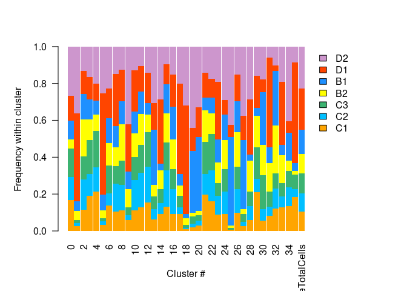
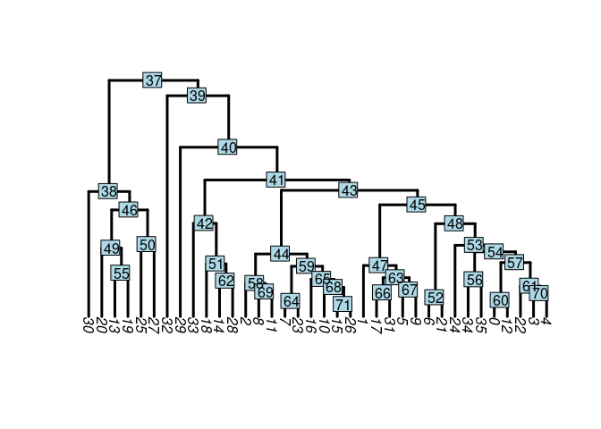
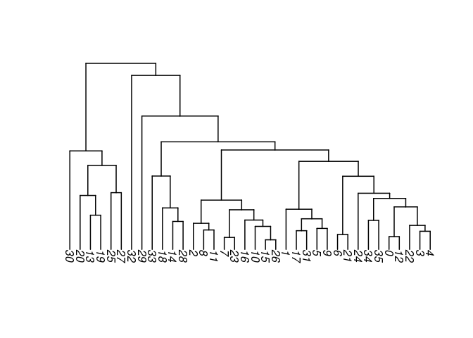
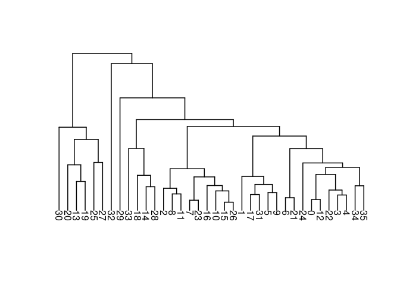
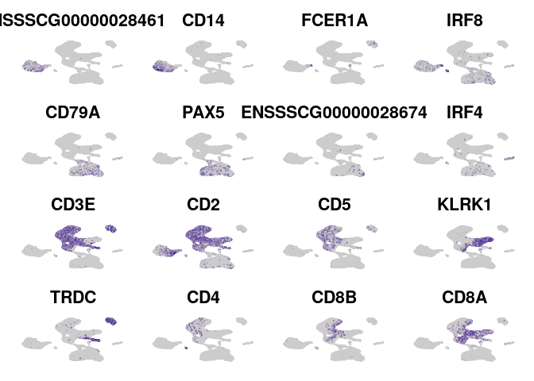
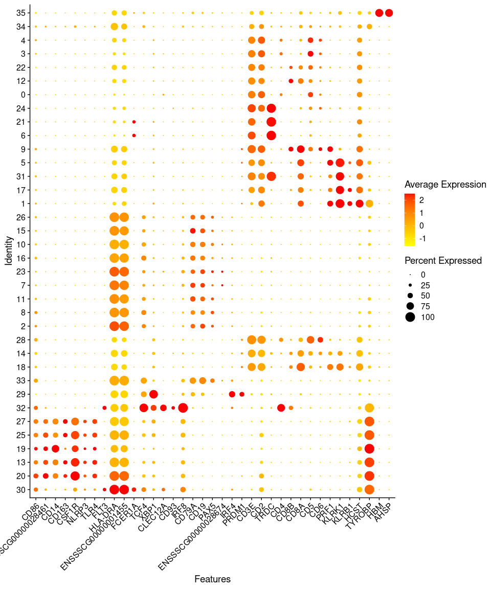
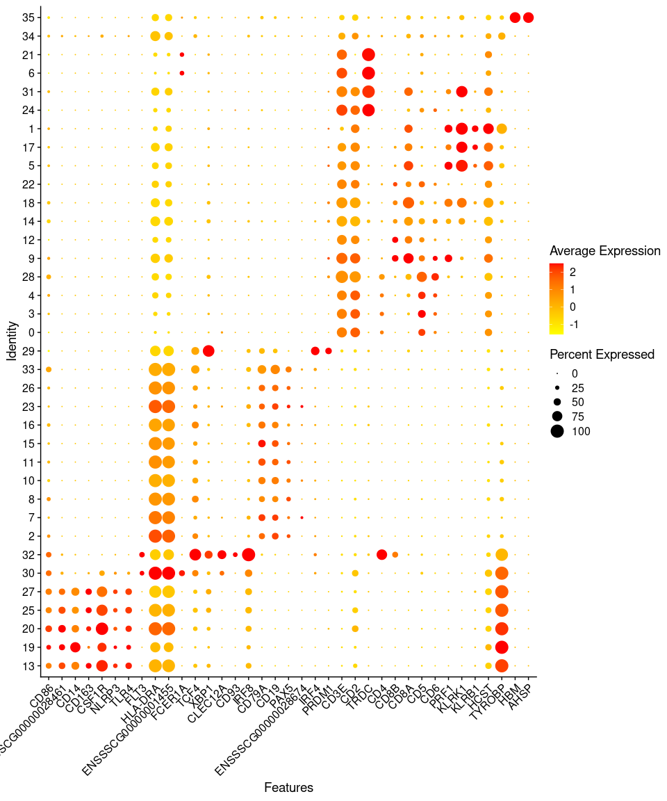
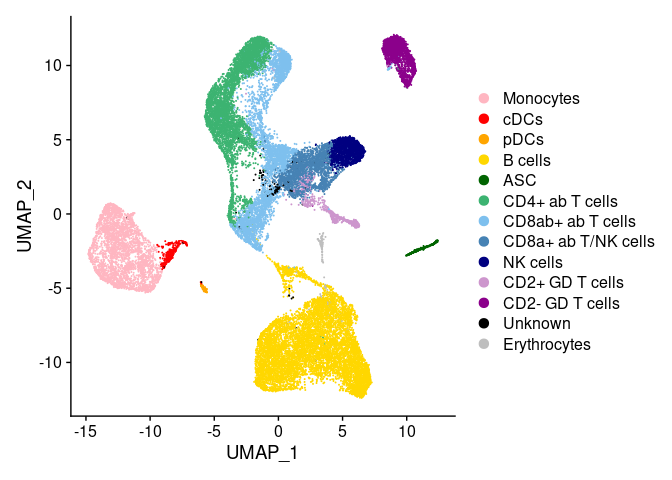

Characterization of PBMC Clusters
================

### Load required software packages

Refer to sessionInfo() at the bottom of the page for the R and package
versions used.

``` r
library(Seurat)
library(writexl)
library(dplyr)
library(ggplot2)
library(tidyr)
library(scales)
library(SeuratDisk)
```

### Import relevant data

Read in our Seurat object from previous analysis:

``` r
atlasR <- load("/ssd/scRNAseq_pig/PBMC7/PBMC7IntegratedNormalized_11042020.RData") # R data from previous analysis
pbmc <- All.integrated
DefaultAssay(pbmc) <- "RNA"
PCdims <- 1:14 # 'significant' PCdims found previously
Idents(pbmc) <- pbmc$seurat_clusters
```

## Determine what proportion of cells in each cluster are from each sample

Start by renaming our sample IDs into names used in the manuscript:

``` r
Idents(pbmc) <- pbmc$SampleID
PaperIDs <- c('C1', 'C2', 'C3', 'B2', 'B1', 'D1', 'D2')
pbmc$PaperIDs <-pbmc$SampleID
Idents(pbmc) <- pbmc$PaperIDs
names(PaperIDs) <- levels(pbmc) # assign PaperIDs to Sample IDs
pbmc <- RenameIdents(pbmc, PaperIDs) # change dataset identity to cell types in Seurat object
pbmc$PaperIDs <- Idents(pbmc)
```

Then create a stacked barplot:

``` r
Idents(pbmc) <- pbmc$seurat_clusters
SampleTotalCells <- prop.table(table(pbmc$PaperIDs)) # What percent of total cells are from each sample?
SamplePercents <- prop.table(table(Idents(pbmc),pbmc$PaperIDs), 
                                margin = 1) # What percent of cells from each cluster belong to each sample?
SamplePercents <- rbind(SamplePercents, SampleTotalCells) # add row of overall percentages to table
#rowSums(SamplePercents) # make sure all are equal to 1
SamplePercents <- t(SamplePercents) # transpose the table
par(mfrow=c(1, 1), mar=c(5, 5, 4, 8))
barplot(SamplePercents, # create stacked bar plot
        col = rev(c('plum3', 'orangered', 'dodgerblue', 'yellow', 'mediumseagreen', 'deepskyblue', 'orange')), 
        legend = rownames(SamplePercents),
        xlab = "Cluster #", 
        ylab = "Frequency within cluster", 
        las = 2,
        border = NA,
        space = 0.05,
        legend.text = TRUE, 
        args.legend = list(x = "topright", bty = "n", inset=c(-0.15, 0)))
```

<!-- -->

## Build a heirarchical tree to determine cluster relations

``` r
Idents(pbmc) <- pbmc$seurat_clusters
pbmc <- BuildClusterTree(pbmc, 
                         dims = PCdims, # elected to use same PCs as we used for clustering the entire dataset
                         assay = "PCA")
PlotClusterTree(pbmc, 
                edge.width = 3) # plot tree with node labels
```

<!-- -->

``` r
data.tree <- Tool(object = pbmc, 
                  slot = "BuildClusterTree") # pull the tree
ape::plot.phylo(x = data.tree, 
                direction = "downwards", # plot the tree without node labels
                edge.width = 1.5)
```

<!-- -->

Rotate around some of the nodes/branches (but still maintain the
phylogenetic structuring):

``` r
data.tree <- ape::rotateConstr(data.tree, c('30', '20', '13', '19', '25', '27', '32', '29','33', '18', '14', '28',
                                            '2', '8', '11', '7', '23','16', '10', '15', '26',
                                            '1', '17', '31', '5','9', '6', '21', '24', 
                                            '0', '12', '22', '3', '4','34', '35'))
plot(data.tree, direction = 'downwards', edge.width = 1.5, font = 1)
```

<!-- -->

Add new phylo order of clusters to our metadata:

``` r
Idents(pbmc) <- pbmc$seurat_clusters
levels(pbmc) <- c('30', '20', '13', '19', '25', '27', '32', '29','33', '18', '14', '28',
                  '2', '8', '11', '7', '23','16', '10', '15', '26',
                  '1', '17', '31', '5','9', '6', '21', '24', 
                  '0', '12', '22', '3', '4','34', '35') # Reorder the clusters based on phylo order from hierarchical tree
pbmc$phyloorder <- Idents(pbmc)
```

## Perform DGE analysis & visualize results in heatmap:

Perform DGE tests:

``` r
Idents(pbmc) <- pbmc$phyloorder
DE <- FindAllMarkers(pbmc,
                     logfc.threshold = 0.25,
                     min.pct = 0.2,
                     only.pos = FALSE,
                     assay = "RNA")
DE <- subset(DE, p_val_adj < 0.05) # take only those with adjusted p value < 0.05 since original DE takes genes with uncorrected p value < 0.05
```

Save DGE results:

``` r
write.table(DE, 
            file = "/home/Jayne.Wiarda/PBMCscRNAseq/AllClusters_FindAllMarkersDE.txt") 
write_xlsx(x = DE, 
           path = "/home/Jayne.Wiarda/PBMCscRNAseq/AllClusters_FindAllMarkersDE.xlsx",
           col_names = TRUE) # this is the file used for cluster-specific cell type 
```

Plot top DE genes:

``` r
topgenes <- subset(DE, avg_logFC >= 0)
topgenes <- topgenes %>% group_by(cluster) %>% top_n(10, avg_logFC) # to use top 10 genes per cluster 
DoHeatmap(subset(pbmc, downsample = 100), # take only 100 cells per cluster for plotting 
          ### FYI, DoHeatmap won't run on datasets with >30,000 cells, so must downsample large datasets for heatmap visualization
          features = as.character(topgenes$gene), 
          assay = "RNA", 
          disp.min = -1.5, 
          disp.max = 3) +
  scale_fill_gradientn(colors = c("dodgerblue", "beige", "indianred1", "red"))
```

## Assess canonical gene expression

Look at expression of cell type-specific genes from porcine literature
in order to classify cell clusters into general cell types.

Plot gene expression overlayed onto UMAP:

``` r
FeaturePlot(pbmc,
            features = c('ENSSSCG00000028461', 'CD14', 'FCER1A', 'IRF8',
                         'CD79A', 'PAX5', 'ENSSSCG00000028674', 'IRF4', 
                         'CD3E', 'CD2', 'CD5', 'KLRK1',
                         'TRDC', 'CD4', 'CD8B', 'CD8A'),
            #cols = c('beige', 'red'),
            #cols = c('grey85', 'red'),
            #cols = c('grey85', 'darkmagenta'),
            cols = c('grey80', 'navy'),
            ncol = 4) & NoLegend() & NoAxes()
```

<!-- -->

Plot gene expression summarized at cluster level in a dot plot:

``` r
Idents(pbmc) <- pbmc$phyloorder
DotPlot(pbmc, features = c('CD86', 'ENSSSCG00000028461', 'CD14', 'CD163', 'CSF1R', 'NLRP3', 'TLR4', 
                           'FLT3', 'HLA-DRA', 'ENSSSCG00000001455', 'FCER1A', 
                           'TCF4', 'XBP1', 'CLEC12A', 'CD93', 'IRF8',
                           'CD79A', 'CD19', 'PAX5', 'ENSSSCG00000028674', 'IRF4', 'PRDM1', 
                           'CD3E', 'CD2', 'TRDC', 'CD4', 'CD8B', 
                           'CD8A', 'CD5', 'CD6', 'PRF1', 'KLRK1', 'KLRB1', 'HCST', 'TYROBP', 
                           'HBM', 'AHSP'), 
        cols = c('yellow', 'red')) + RotatedAxis()
```

<!-- -->

## Classify clusters into major cell types

Based on previous plots, we can classify cells as follows and store
under new metadata slot called ‘celltypes’:

``` r
Idents(pbmc) <- pbmc$seurat_clusters
levels(pbmc) <- c('13', '19', '20', '25', '27', #monocytes
                  '30', #cDCs
                  '32', #pDCs
                  '2', '7', '8', '10', '11', '15', '16', '23', '26', '33', #B
                  '29', #antibody-secreting cells
                  '0', '3', '4', '28', #CD4 T
                  '9', '12', '14', '18', '22', #CD8AB T
                  '5', '17', #innate CD8/NK
                  '1', #NK
                  '24', '31', #CD2+ GD T
                  '6', '21', #CD2- GD T
                  '34', #activated/mixed T
                  '35') #RBCs
pbmc$neworder <- Idents(pbmc) # Reorder the clusters based on putative cell type IDs we came up with from looking at the data
Idents(pbmc) <- pbmc$neworder
Mono <- rep('Monocytes', 5)
cDC <- 'cDCs'
pDC <- 'pDCs'
B <- rep('B cells', 10)
ASC <- 'ASC'
CD4T <- rep('CD4+ ab T cells', 4)
CD8T <- rep('CD8ab+ ab T cells', 5)
CD8TNK <- rep('CD8a+ ab T/NK cells', 2)
NK <- 'NK cells'
CD2posGD <- rep('CD2+ GD T cells', 2)
CD2negGD <- rep('CD2- GD T cells', 2)
Misc <- 'Unknown'
RBC <- 'Erythrocytes'
CellTypes <- c(Mono, cDC, pDC, B, ASC, CD4T, CD8T, CD8TNK, NK, CD2posGD, CD2negGD, Misc, RBC)
length(CellTypes)
```

    ## [1] 36

``` r
pbmc$celltypes <-pbmc$neworder
Idents(pbmc) <- pbmc$celltypes
names(CellTypes) <- levels(pbmc) # assign CellTypes to cluster numbers
pbmc <- RenameIdents(pbmc, CellTypes) # change dataset identity to cell types in Seurat object
pbmc$celltypes <- Idents(pbmc)
```

Now we can remake our dot plot with re-ordering of clusters based on
cell types:

``` r
Idents(pbmc) <- pbmc$neworder
DotPlot(pbmc, features = c('CD86', 'ENSSSCG00000028461', 'CD14', 'CD163', 'CSF1R', 'NLRP3', 'TLR4', 
                           'FLT3', 'HLA-DRA', 'ENSSSCG00000001455', 'FCER1A', 
                           'TCF4', 'XBP1', 'CLEC12A', 'CD93', 'IRF8',
                           'CD79A', 'CD19', 'PAX5', 'ENSSSCG00000028674', 'IRF4', 'PRDM1', 
                           'CD3E', 'CD2', 'TRDC', 'CD4', 'CD8B', 
                           'CD8A', 'CD5', 'CD6', 'PRF1', 'KLRK1', 'KLRB1', 'HCST', 'TYROBP', 
                           'HBM', 'AHSP'), 
        cols = c('yellow', 'red')) + RotatedAxis()
```

<!-- -->

And we can visualize our 13 cell types on UMAP as well:

``` r
Idents(pbmc) <- pbmc$celltypes
cols <- c('lightpink', 'red', 'orange', 'gold', 'darkgreen', 'mediumseagreen', 'skyblue2', 'steelblue', 'navy', 'plum3', 'darkmagenta', 'black', 'grey')
DimPlot(pbmc, cols = cols)
```

<!-- -->

### Save data

Lastly, let’s save data in .rds file and in .h5Seurat formats:

``` r
Idents(pbmc) <- pbmc$seurat_clusters
saveRDS(pbmc, '/home/Jayne.Wiarda/PBMCscRNAseq/PBMC7_AllCells.rds')
SaveH5Seurat(pbmc, filename = "/home/Jayne.Wiarda/PBMCscRNAseq/PBMC7_AllCells.h5Seurat") # .h5Seurat is about half the file size of .rds
```

### View session information

``` r
sessionInfo()
```

    ## R version 4.0.2 (2020-06-22)
    ## Platform: x86_64-pc-linux-gnu (64-bit)
    ## Running under: Red Hat Enterprise Linux
    ## 
    ## Matrix products: default
    ## BLAS/LAPACK: /usr/lib64/libopenblasp-r0.3.3.so
    ## 
    ## locale:
    ##  [1] LC_CTYPE=en_US.UTF-8       LC_NUMERIC=C              
    ##  [3] LC_TIME=en_US.UTF-8        LC_COLLATE=en_US.UTF-8    
    ##  [5] LC_MONETARY=en_US.UTF-8    LC_MESSAGES=en_US.UTF-8   
    ##  [7] LC_PAPER=en_US.UTF-8       LC_NAME=C                 
    ##  [9] LC_ADDRESS=C               LC_TELEPHONE=C            
    ## [11] LC_MEASUREMENT=en_US.UTF-8 LC_IDENTIFICATION=C       
    ## 
    ## attached base packages:
    ## [1] stats     graphics  grDevices utils     datasets  methods   base     
    ## 
    ## other attached packages:
    ## [1] SeuratDisk_0.0.0.9013 scales_1.1.1          tidyr_1.1.2          
    ## [4] ggplot2_3.3.2         dplyr_1.0.2           writexl_1.3.1        
    ## [7] Seurat_3.2.2         
    ## 
    ## loaded via a namespace (and not attached):
    ##   [1] Rtsne_0.15            colorspace_2.0-0      deldir_0.2-3         
    ##   [4] ellipsis_0.3.1        ggridges_0.5.2        spatstat.data_1.5-2  
    ##   [7] leiden_0.3.6          listenv_0.8.0         farver_2.0.3         
    ##  [10] ggrepel_0.9.1         bit64_4.0.5           fansi_0.4.1          
    ##  [13] codetools_0.2-16      splines_4.0.2         knitr_1.30           
    ##  [16] polyclip_1.10-0       jsonlite_1.7.2        ica_1.0-2            
    ##  [19] cluster_2.1.0         png_0.1-7             uwot_0.1.9           
    ##  [22] shiny_1.5.0           sctransform_0.3.1     compiler_4.0.2       
    ##  [25] httr_1.4.2            assertthat_0.2.1      Matrix_1.2-18        
    ##  [28] fastmap_1.0.1         lazyeval_0.2.2        limma_3.44.3         
    ##  [31] cli_2.2.0             later_1.1.0.1         htmltools_0.5.0      
    ##  [34] tools_4.0.2           rsvd_1.0.3            igraph_1.2.6         
    ##  [37] gtable_0.3.0          glue_1.4.2            RANN_2.6.1           
    ##  [40] reshape2_1.4.4        Rcpp_1.0.5            spatstat_1.64-1      
    ##  [43] vctrs_0.3.5           ape_5.4-1             nlme_3.1-148         
    ##  [46] lmtest_0.9-38         xfun_0.19             stringr_1.4.0        
    ##  [49] globals_0.14.0        mime_0.9              miniUI_0.1.1.1       
    ##  [52] lifecycle_0.2.0       irlba_2.3.3           goftest_1.2-2        
    ##  [55] future_1.21.0         MASS_7.3-51.6         zoo_1.8-8            
    ##  [58] promises_1.1.1        spatstat.utils_1.17-0 parallel_4.0.2       
    ##  [61] RColorBrewer_1.1-2    yaml_2.2.1            reticulate_1.18      
    ##  [64] pbapply_1.4-3         gridExtra_2.3         rpart_4.1-15         
    ##  [67] stringi_1.5.3         rlang_0.4.9           pkgconfig_2.0.3      
    ##  [70] matrixStats_0.57.0    evaluate_0.14         lattice_0.20-41      
    ##  [73] ROCR_1.0-11           purrr_0.3.4           tensor_1.5           
    ##  [76] patchwork_1.1.0       htmlwidgets_1.5.3     labeling_0.4.2       
    ##  [79] cowplot_1.1.0         bit_4.0.4             tidyselect_1.1.0     
    ##  [82] parallelly_1.21.0     RcppAnnoy_0.0.17      plyr_1.8.6           
    ##  [85] magrittr_2.0.1        R6_2.5.0              generics_0.1.0       
    ##  [88] pillar_1.4.7          withr_2.3.0           mgcv_1.8-31          
    ##  [91] fitdistrplus_1.1-3    survival_3.2-7        abind_1.4-5          
    ##  [94] tibble_3.0.4          future.apply_1.6.0    crayon_1.3.4         
    ##  [97] hdf5r_1.3.3           KernSmooth_2.23-17    plotly_4.9.2.1       
    ## [100] rmarkdown_2.7         grid_4.0.2            data.table_1.13.4    
    ## [103] digest_0.6.27         xtable_1.8-4          httpuv_1.5.4         
    ## [106] munsell_0.5.0         viridisLite_0.3.0
