Subset Analysis of CD4 T Cells
================

### Load required software packages

Refer to sessionInfo() at the bottom of the page for the R and package
versions used.

``` r
library(Seurat)
library(writexl)
library(dplyr)
library(ggplot2)
library(tidyr)
library(scales)
library(SeuratDisk)
library(AUCell)
```

### Import relevant data

Read in our Seurat object from previous analysis:

``` r
pbmc <- readRDS('/home/Jayne.Wiarda/PBMCscRNAseq/PBMC7_AllCells.rds')
DefaultAssay(pbmc) <- "RNA"
PCdims <- 1:14 # 'significant' PCdims found previously
```

## Create new Seurat object of only CD4 T cells

Subset to only CD4 T cells:

``` r
Idents(pbmc) <- pbmc$celltypes
CD4 <- subset(pbmc, idents = 'CD4+ ab T cells')
```

Slim down the new Seurat object by removing non-expressed genes, scaled
data, and dimensionality reductions:

``` r
counts <- as.data.frame(CD4[['RNA']]@counts) # extract counts matrix
genes <- subset(rownames(counts), rowSums(counts) > 0) # identify genes expressed in dataset
CD4 <- DietSeurat(CD4,
                  features = genes, # remove all genes that aren't expressed by any of the cells
                  counts = TRUE,
                  data = TRUE,
                  scale.data = FALSE, # remove the scaled data
                  dimreducs = c('pca','tsne','umap')) 
```

Rescale the data in the context of just the subsetted cells:

``` r
CD4 <- ScaleData(CD4, # scale the RNA counts data relative to other cells
                 assay = "RNA")
```

    ## Centering and scaling data matrix

``` r
dim(CD4[["RNA"]]@scale.data) # see that all genes are scaled in RNA assay now
```

    ## [1] 13376  5082

Rerun multidimensional visualization but keep the same clustering as
before:

``` r
Idents(CD4) <- CD4$seurat_clusters
CD4 <- RunUMAP(CD4,
               dims = PCdims,
               reduction = "pca", 
               assay = "SCT") # create UMAP
CD4 <- RunTSNE(CD4,
               dims = PCdims,
               reduction = "pca", 
               assay = "SCT") # create UMAP
DimPlot(CD4, 
        label = TRUE,
        reduction = 'umap')
```

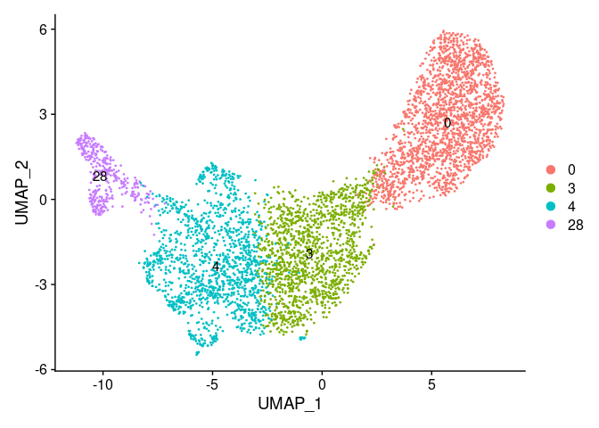<!-- -->

``` r
DimPlot(CD4, 
        label = TRUE,
        reduction = 'tsne')
```

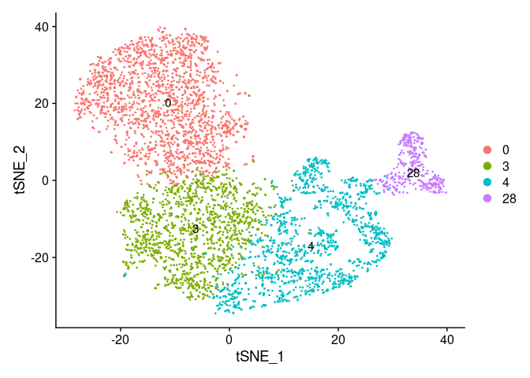<!-- -->

## Perform hierarchical clustering

``` r
Idents(CD4) <- CD4$seurat_clusters
CD4 <- BuildClusterTree(CD4, 
                        dims = PCdims, # elected to use same PCs as we used for clustering the entire dataset
                        assay = "PCA")
PlotClusterTree(CD4, 
                edge.width = 3) # plot tree with node labels
```

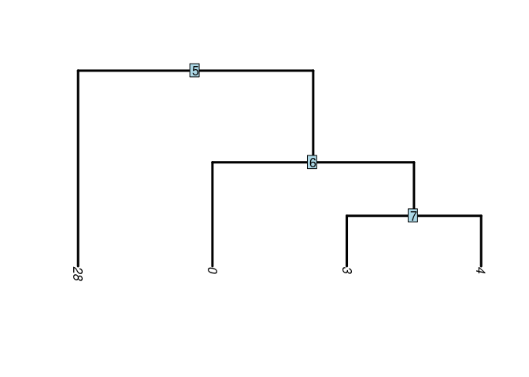<!-- -->

``` r
data.tree <- Tool(object = CD4, 
                  slot = "BuildClusterTree") # pull the tree
ape::plot.phylo(x = data.tree, 
                direction = "downwards", # plot the tree without node labels
                edge.width = 1.5)
```

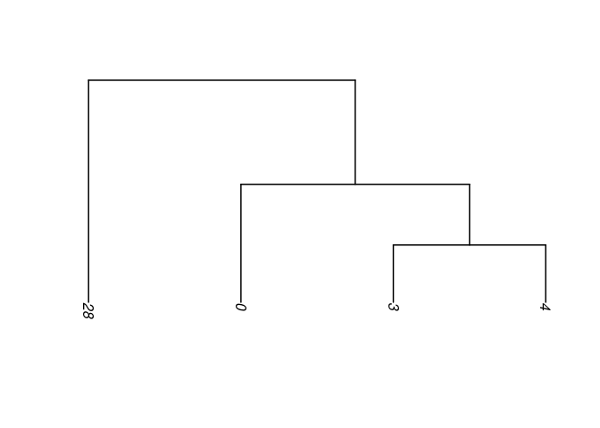<!-- -->

``` r
# If you would like to rotate around some of the nodes/branches (but still maintain the phylogenetic structuring)
data.tree <- ape::rotateConstr(data.tree, c('0', '3', '4', '28'))
plot(data.tree, direction = 'downwards', edge.width = 1.5, font = 1)
```

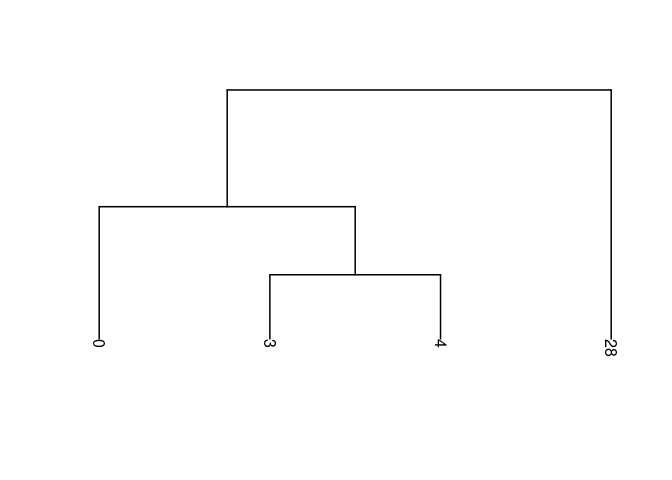<!-- -->

## Perform DGE analysis

Perform DGE analysis:

``` r
DefaultAssay(CD4) <- "RNA"
CD4DE <- FindAllMarkers(CD4, 
                        only.pos = FALSE, 
                        logfc.threshold = 0.25, # minimum logFC of 0.25
                        min.pct = 0.2, # expressed in at least 20% of all cells in the cluster
                        assay = "RNA") # this will find genes that are enriched
CD4DE <- subset(CD4DE, p_val_adj < 0.05)
```

Save DE genes:

``` r
write_xlsx(x = CD4DE, 
           path = "/home/Jayne.Wiarda/CD4DE_PBMCsub.xlsx",
           col_names = TRUE) # this is the file used for cluster-specific cell type 
```

Plot top DE genes in heatmap:

``` r
CD4DE <- subset(CD4DE, avg_logFC > 0)
topgenes <- CD4DE %>% group_by(cluster) %>% top_n(20, avg_logFC) # to use top 20 genes per cluster 
#topgenes <- subset(CD4D4DE., avg_logFC >= 1) # all genes with logFC > 1 instead
DoHeatmap(CD4,
          features = as.character(topgenes$gene), 
          assay = "RNA", 
          disp.min = -2, 
          disp.max = 2) +
  scale_fill_gradientn(colors = c("dodgerblue", "beige", "red"))
```

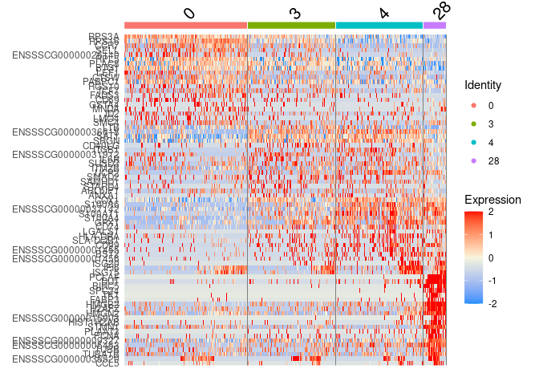<!-- -->

Plot top DE genes in dot plot:

``` r
DotPlot(CD4, 
        features = unique(as.character(topgenes$gene)), 
        cols = c('yellow', 'red')) + RotatedAxis()
```

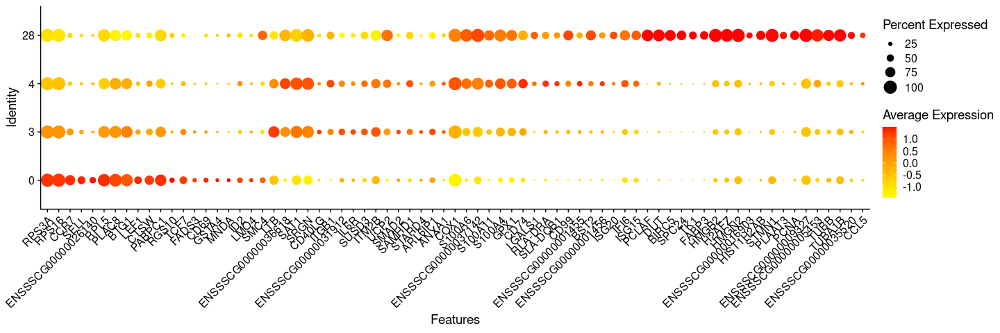<!-- -->

## Assess expression of CD8A

From plot below, we see that CD8A expression is sparse, so hard to
determine if CD4 T cell clusters are CD8a+ (corresponding to CD4CD8T
phenotype in our bulk analysis) or CD8a- (corresponding to CD4T
phenotype in our bulk analysis)…

``` r
FeaturePlot(CD4,
            features = 'CD8A',
            cols = c('grey80', 'navy'),
            reduction = 'tsne') & NoLegend() & NoAxes()
```

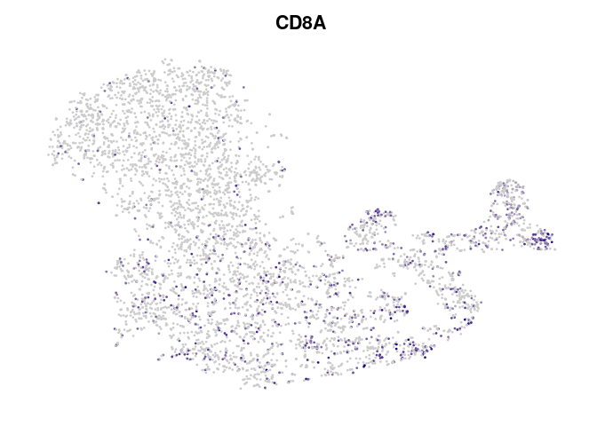<!-- -->

## Perform gene set enrichment analysis (GSEA)

Because it was hard to determine if CD4 clusters were largely CD4T vs
CD4CD8T cells based solely on CD8A gene expression, we want to perform
GSEA using gene sets based on pairwise comparison of CD4 and CD4CD8T
cells from our bulk RNA-seq analysis.

### Create gene sets from DGE results of bulk RNA-seq analysis in our manuscript

Load in other relevant gene lists:

``` r
scPigGenes <- read.table("/home/Jayne.Wiarda/scRNAseqIleumAtlas/QC/UnfilteredGeneInfo.txt", 
                         header = TRUE) # read in the gene information for the unfiltered gene list from scRNA-seq QC analysis
```

Select and filter enriched genes for each sorted cell population. For
each population, take DE genes with adjusted p value \< 0.05 and log2FC
\> 1:

``` r
CD4PWDE <- read.delim2("/home/Jayne.Wiarda/scRNAseqIleumAtlas/Datasets_BulkRNA/Pairwise_DESEQ2_CD4PCD8P_CD4PCD8N.txt", header = TRUE)
CD4PWDE$padj_CD8.CD4..CD8.CD4. <- as.numeric(CD4PWDE$padj_CD8.CD4..CD8.CD4.)
CD4PWDE <- subset(CD4PWDE, CD4PWDE$padj_CD8.CD4..CD8.CD4. < .05)
CD4PWDE$log2FoldChange_CD8.CD4..CD8.CD4. <- as.numeric(CD4PWDE$log2FoldChange_CD8.CD4..CD8.CD4.)

CD4PCD8Pgenes <- subset(CD4PWDE$EnsemblID, CD4PWDE$log2FoldChange_CD8.CD4..CD8.CD4. > 1)
CD4PCD8Pgenes <- as.data.frame(CD4PCD8Pgenes)
CD4PCD8Pgenes <- merge(scPigGenes, CD4PCD8Pgenes, by.x = "EnsemblID", by.y = "CD4PCD8Pgenes")
CD4PCD8Pgenes <- CD4PCD8Pgenes$Name

CD4PCD8Ngenes <- subset(CD4PWDE$EnsemblID, CD4PWDE$log2FoldChange_CD8.CD4..CD8.CD4. < -1)
CD4PCD8Ngenes <- as.data.frame(CD4PCD8Ngenes)
CD4PCD8Ngenes <- merge(scPigGenes, CD4PCD8Ngenes, by.x = "EnsemblID", by.y = "CD4PCD8Ngenes")
CD4PCD8Ngenes <- CD4PCD8Ngenes$Name
```

Create a list of all the gene sets:

``` r
geneSets <- list(CD4PCD8Pgenes = CD4PCD8Pgenes,
                 CD4PCD8Ngenes = CD4PCD8Ngenes) 
```

Save our gene lists:

``` r
m1 <- max(lengths(geneSets))
df <- as.data.frame(t(as.data.frame(do.call(rbind, lapply(geneSets, `length<-`, m1)), stringsAsFactors= FALSE)))
write_xlsx(x = df, 
           path = "/home/Jayne.Wiarda/PBMCscRNAseq/CD4vCD4CD8_PW_AUCell_GeneLists.xlsx",
           col_names = TRUE) # this is the file used for cluster-specific cell type 
```

### Perform GSEA

Create experimental matrix from raw counts data:

``` r
exprMatrix <- as.matrix(CD4[["RNA"]]@counts)
```

Calculate gene rankings within each cell…this can be used to calculate
enrichment scores for any gene sets:

``` r
cells_rankings <- AUCell_buildRankings(exprMatrix, nCores=1, plotStats=TRUE)
```

    ## Quantiles for the number of genes detected by cell: 
    ## (Non-detected genes are shuffled at the end of the ranking. Keep it in mind when choosing the threshold for calculating the AUC).

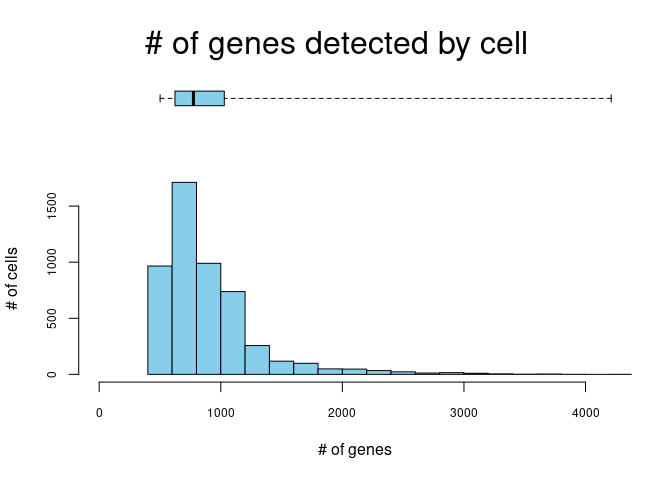<!-- -->

    ##  min   1%   5%  10%  50% 100% 
    ##  501  509  537  563  775 4211

Calculate AUC scores for each cell with each gene set… we use the
default top 5% of expressed genes to calculate our AUC score:

``` r
cells_AUC <- AUCell_calcAUC(geneSets, cells_rankings) # calculate cell signature AUC score for each gene set in each cell
```

    ## Genes in the gene sets NOT available in the dataset: 
    ##  CD4PCD8Pgenes:  1 (5% of 19)

Collate results:

``` r
clusterID <- as.data.frame(CD4[["seurat_clusters"]])
clusterID <- t(clusterID)
AUCs <- as.data.frame(getAUC(cells_AUC))
AUCs <- rbind(AUCs, clusterID)
AUCs <- t(AUCs)
AUCs <- as.data.frame(AUCs)
AUCs <- mutate_all(AUCs, function(x) as.numeric(as.character(x)))
head(AUCs)
```

    ##   CD4PCD8Pgenes CD4PCD8Ngenes seurat_clusters
    ## 1    0.00000000             0               3
    ## 2    0.00000000             0               3
    ## 3    0.00000000             0               0
    ## 4    0.04338303             0               3
    ## 5    0.00000000             0               3
    ## 6    0.03007329             0               4

### Overlay AUC scores onto UMAP:

CD4T:

``` r
# Find the threshold:
geneSetName <- rownames(cells_AUC)[grep("CD4PCD8Ngenes", rownames(cells_AUC))]
thres = 0.001
AUCell_plotHist(cells_AUC[geneSetName,], aucThr=thres)
```

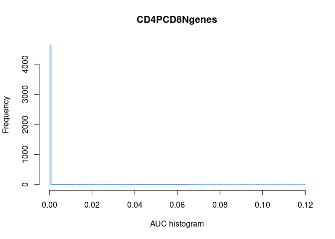<!-- -->

``` r
# plot umap with threshold
coords <- Embeddings(CD4[["tsne"]])
coords <- as.data.frame(coords)
coords <- cbind(coords, AUCs$CD4PCD8Ngenes)
less <- filter(coords, AUCs$CD4PCD8Ngenes < thres)
more <- filter(coords, AUCs$CD4PCD8Ngenes >= thres)
ggplot() + # make a t-SNE plot
  geom_point(data=less, aes(x=tSNE_1, y=tSNE_2), color = "dodgerblue4") +
  geom_point(data=more, aes(x=tSNE_1, y=tSNE_2, color=more[,3])) +
  scale_color_gradientn(colors = c('slateblue4', 'violetred', 'orange', 'gold')) +
  theme_void()
```

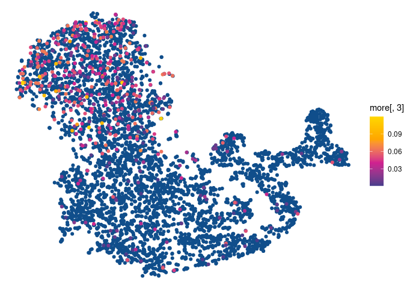<!-- -->

CD4CD8T:

``` r
# Find the threshold:
geneSetName <- rownames(cells_AUC)[grep("CD4PCD8Pgenes", rownames(cells_AUC))]
thres = 0.001
AUCell_plotHist(cells_AUC[geneSetName,], aucThr=thres)
```

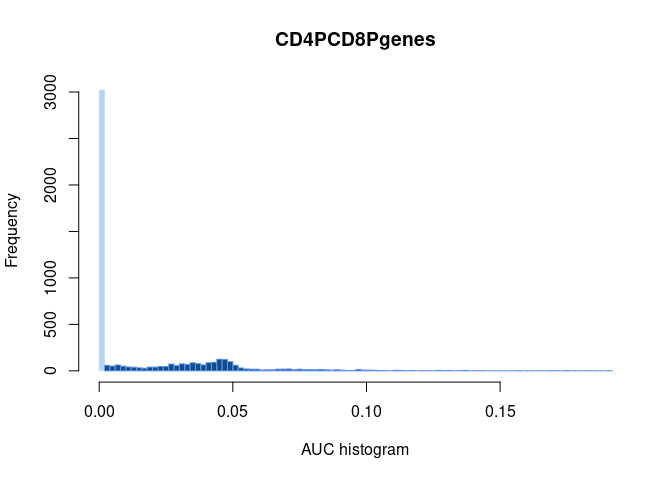<!-- -->

``` r
# plot umap with threshold
coords <- Embeddings(CD4[["tsne"]])
coords <- as.data.frame(coords)
coords <- cbind(coords, AUCs$CD4PCD8Pgenes)
less <- filter(coords, AUCs$CD4PCD8Pgenes < thres)
more <- filter(coords, AUCs$CD4PCD8Pgenes >= thres)
ggplot() + # make a t-SNE plot
  geom_point(data=less, aes(x=tSNE_1, y=tSNE_2), color = "dodgerblue4") +
  geom_point(data=more, aes(x=tSNE_1, y=tSNE_2, color=more[,3])) +
  scale_color_gradientn(colors = c('slateblue4', 'violetred', 'orange', 'gold')) +
  theme_void()
```

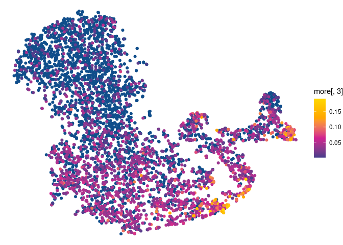<!-- -->

### Make a heatmap with scaled AUC score averages per cluster

First calculate and store average AUC scores per cluster with their
standard deviations:

``` r
avs <- aggregate(AUCs[, 1:(ncol(AUCs) - 1)], list(AUCs$seurat_clusters), mean) # to just calculate average scores in each cluster
avsSD <- aggregate(AUCs[, 1:(ncol(AUCs) - 1)], list(AUCs$seurat_clusters), sd) # to just calculate SD in each cluster
names(avs)[1] <- "Cluster"
names(avsSD)[1] <- "Cluster"
write_xlsx(avs, 
           path = "/home/Jayne.Wiarda/PBMCscRNAseq/CD4pw_AUCell_AverageScores.xlsx",
           col_names = TRUE)
write_xlsx(avsSD, 
           path = "/home/Jayne.Wiarda/PBMCscRNAseq/CD4pw_AUCell_AverageScoresSD.xlsx",
           col_names = TRUE)
```

Now calculate and store scaled AUC scores per cluster with standard
deviations:

``` r
scaledAUCs <- scale(AUCs[,1:(ncol(AUCs) - 1)])
scaledAUCs <- as.data.frame(scaledAUCs)
clusterID <- as.data.frame(CD4[["seurat_clusters"]])
scaledAUCs <- cbind(scaledAUCs, clusterID)
head(scaledAUCs)
```

    ##                    CD4PCD8Pgenes CD4PCD8Ngenes seurat_clusters
    ## AAACCTGAGAAACGCC-1    -0.6228076    -0.2563487               3
    ## AAACCTGTCCTTGACC-1    -0.6228076    -0.2563487               3
    ## AAAGTAGTCCACGCAG-1    -0.6228076    -0.2563487               0
    ## AAATGCCAGACGACGT-1     0.9601723    -0.2563487               3
    ## AAATGCCGTGTAAGTA-1    -0.6228076    -0.2563487               3
    ## AACACGTCATAGTAAG-1     0.4745202    -0.2563487               4

``` r
gsAvsScaled <- aggregate(scaledAUCs[, 1:(ncol(AUCs) - 1)], list(scaledAUCs$seurat_clusters), mean)
names(gsAvsScaled)[1] <- "Cluster"
gsAvsScaledSD <- aggregate(scaledAUCs[, 1:(ncol(AUCs) - 1)], list(scaledAUCs$seurat_clusters), sd)
names(gsAvsScaledSD)[1] <- "Cluster"
write_xlsx(gsAvsScaled, 
           path = "/home/Jayne.Wiarda/PBMCscRNAseq/CD4pw_AUCell_AverageRelativeScores.xlsx",
           col_names = TRUE)
write_xlsx(gsAvsScaledSD, 
           path = "/home/Jayne.Wiarda/PBMCscRNAseq/CD4pw_AUCell_AverageRelativeScoresSD.xlsx",
           col_names = TRUE)
```

Now create the heatmap based off scales AUC scores per cluster:

``` r
gsAvsScaled <- gsAvsScaled %>% 
  pivot_longer(c(colnames(gsAvsScaled[2:(ncol(AUCs))])), names_to = "geneSet", values_to = "AUC_relative")
gsAvsScaled$Cluster <- factor(gsAvsScaled$Cluster,levels = levels(CD4$neworder))
ggplot(gsAvsScaled, aes(Cluster, geneSet, fill = AUC_relative))+ 
  geom_tile()+
  scale_fill_gradientn(colors = c("dodgerblue", "beige", "red"), limits = c(-1,1), oob=squish) + 
  theme_classic()
```

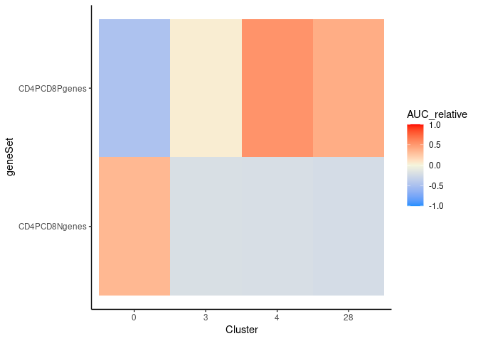<!-- -->

### Save data

Lastly, let’s save data in .rds file and in .h5Seurat formats:

``` r
Idents(CD4) <- CD4$seurat_clusters
saveRDS(CD4, '/home/Jayne.Wiarda/PBMCscRNAseq/PBMC7_CD4only.rds')
SaveH5Seurat(CD4, filename = "/home/Jayne.Wiarda/PBMCscRNAseq/PBMC7_CD4only.h5Seurat") # .h5Seurat is about half the file size of .rds
```

### View session information

``` r
sessionInfo()
```

    ## R version 4.0.2 (2020-06-22)
    ## Platform: x86_64-pc-linux-gnu (64-bit)
    ## Running under: Red Hat Enterprise Linux
    ## 
    ## Matrix products: default
    ## BLAS/LAPACK: /usr/lib64/libopenblasp-r0.3.3.so
    ## 
    ## locale:
    ##  [1] LC_CTYPE=en_US.UTF-8       LC_NUMERIC=C              
    ##  [3] LC_TIME=en_US.UTF-8        LC_COLLATE=en_US.UTF-8    
    ##  [5] LC_MONETARY=en_US.UTF-8    LC_MESSAGES=en_US.UTF-8   
    ##  [7] LC_PAPER=en_US.UTF-8       LC_NAME=C                 
    ##  [9] LC_ADDRESS=C               LC_TELEPHONE=C            
    ## [11] LC_MEASUREMENT=en_US.UTF-8 LC_IDENTIFICATION=C       
    ## 
    ## attached base packages:
    ## [1] stats     graphics  grDevices utils     datasets  methods   base     
    ## 
    ## other attached packages:
    ## [1] AUCell_1.10.0         SeuratDisk_0.0.0.9013 scales_1.1.1         
    ## [4] tidyr_1.1.2           ggplot2_3.3.2         dplyr_1.0.2          
    ## [7] writexl_1.3.1         Seurat_3.2.2         
    ## 
    ## loaded via a namespace (and not attached):
    ##   [1] plyr_1.8.6                  igraph_1.2.6               
    ##   [3] lazyeval_0.2.2              GSEABase_1.50.1            
    ##   [5] splines_4.0.2               listenv_0.8.0              
    ##   [7] GenomeInfoDb_1.24.2         digest_0.6.27              
    ##   [9] htmltools_0.5.0             fansi_0.4.1                
    ##  [11] magrittr_2.0.1              memoise_1.1.0              
    ##  [13] tensor_1.5                  cluster_2.1.0              
    ##  [15] ROCR_1.0-11                 limma_3.44.3               
    ##  [17] globals_0.14.0              annotate_1.66.0            
    ##  [19] matrixStats_0.57.0          R.utils_2.10.1             
    ##  [21] colorspace_2.0-0            blob_1.2.1                 
    ##  [23] ggrepel_0.9.1               xfun_0.19                  
    ##  [25] crayon_1.3.4                RCurl_1.98-1.2             
    ##  [27] jsonlite_1.7.2              graph_1.66.0               
    ##  [29] spatstat_1.64-1             spatstat.data_1.5-2        
    ##  [31] ape_5.4-1                   survival_3.2-7             
    ##  [33] zoo_1.8-8                   glue_1.4.2                 
    ##  [35] polyclip_1.10-0             gtable_0.3.0               
    ##  [37] zlibbioc_1.34.0             XVector_0.28.0             
    ##  [39] leiden_0.3.6                DelayedArray_0.14.1        
    ##  [41] future.apply_1.6.0          BiocGenerics_0.34.0        
    ##  [43] abind_1.4-5                 DBI_1.1.0                  
    ##  [45] miniUI_0.1.1.1              Rcpp_1.0.5                 
    ##  [47] viridisLite_0.3.0           xtable_1.8-4               
    ##  [49] reticulate_1.18             bit_4.0.4                  
    ##  [51] rsvd_1.0.3                  stats4_4.0.2               
    ##  [53] htmlwidgets_1.5.3           httr_1.4.2                 
    ##  [55] RColorBrewer_1.1-2          ellipsis_0.3.1             
    ##  [57] ica_1.0-2                   farver_2.0.3               
    ##  [59] pkgconfig_2.0.3             XML_3.99-0.5               
    ##  [61] R.methodsS3_1.8.1           uwot_0.1.9                 
    ##  [63] deldir_0.2-3                tidyselect_1.1.0           
    ##  [65] labeling_0.4.2              rlang_0.4.9                
    ##  [67] reshape2_1.4.4              later_1.1.0.1              
    ##  [69] AnnotationDbi_1.50.3        munsell_0.5.0              
    ##  [71] tools_4.0.2                 cli_2.2.0                  
    ##  [73] generics_0.1.0              RSQLite_2.2.1              
    ##  [75] ggridges_0.5.2              evaluate_0.14              
    ##  [77] stringr_1.4.0               fastmap_1.0.1              
    ##  [79] yaml_2.2.1                  goftest_1.2-2              
    ##  [81] knitr_1.30                  bit64_4.0.5                
    ##  [83] fitdistrplus_1.1-3          purrr_0.3.4                
    ##  [85] RANN_2.6.1                  pbapply_1.4-3              
    ##  [87] future_1.21.0               nlme_3.1-148               
    ##  [89] mime_0.9                    R.oo_1.24.0                
    ##  [91] hdf5r_1.3.3                 compiler_4.0.2             
    ##  [93] plotly_4.9.2.1              png_0.1-7                  
    ##  [95] spatstat.utils_1.17-0       tibble_3.0.4               
    ##  [97] stringi_1.5.3               RSpectra_0.16-0            
    ##  [99] lattice_0.20-41             Matrix_1.2-18              
    ## [101] vctrs_0.3.5                 pillar_1.4.7               
    ## [103] lifecycle_0.2.0             lmtest_0.9-38              
    ## [105] RcppAnnoy_0.0.17            data.table_1.13.4          
    ## [107] cowplot_1.1.0               bitops_1.0-6               
    ## [109] irlba_2.3.3                 httpuv_1.5.4               
    ## [111] patchwork_1.1.0             GenomicRanges_1.40.0       
    ## [113] R6_2.5.0                    promises_1.1.1             
    ## [115] KernSmooth_2.23-17          gridExtra_2.3              
    ## [117] IRanges_2.22.2              parallelly_1.21.0          
    ## [119] codetools_0.2-16            MASS_7.3-51.6              
    ## [121] assertthat_0.2.1            SummarizedExperiment_1.18.2
    ## [123] withr_2.3.0                 sctransform_0.3.1          
    ## [125] S4Vectors_0.26.1            GenomeInfoDbData_1.2.3     
    ## [127] mgcv_1.8-31                 parallel_4.0.2             
    ## [129] grid_4.0.2                  rpart_4.1-15               
    ## [131] rmarkdown_2.7               Rtsne_0.15                 
    ## [133] Biobase_2.48.0              shiny_1.5.0
