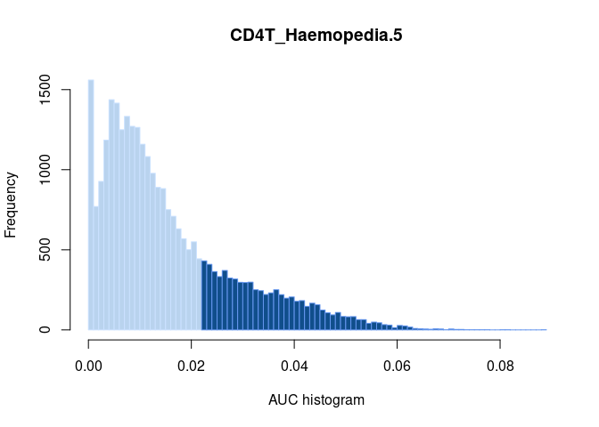
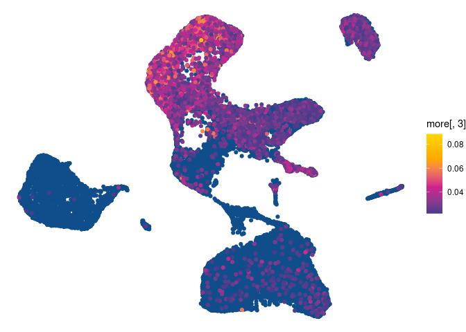
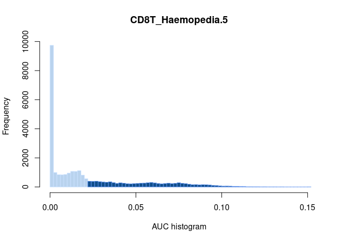
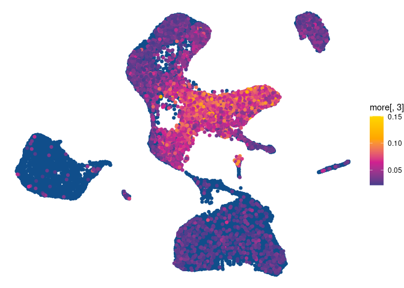
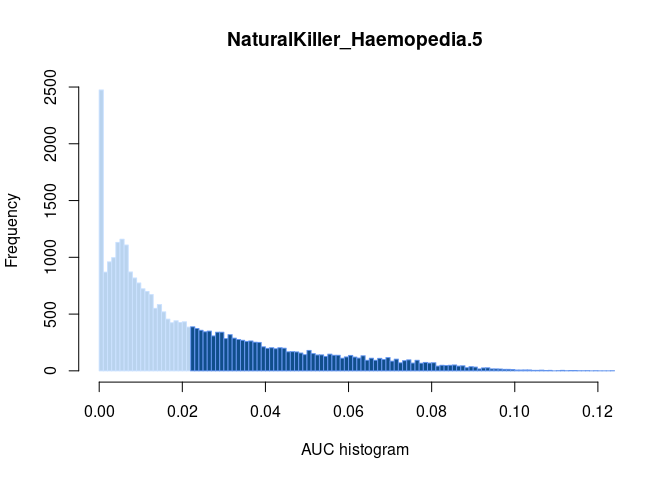
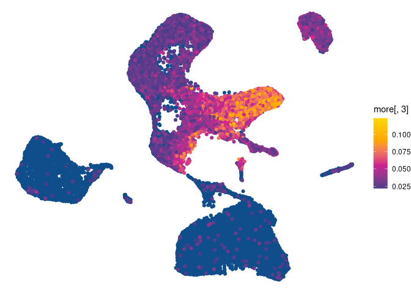
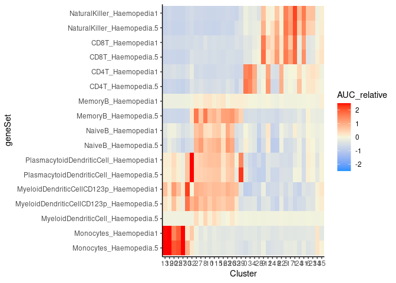

Gene Set Enrichment Analysis (GSEA) of Single-cell Data
================

### Load required software packages

Refer to sessionInfo() at the bottom of the page for the R and package
versions used.

``` r
library(Seurat)
library(AUCell)
library(dplyr)
library(ggplot2)
library(tidyr)
library(scales)
library(writexl)
```

### Import relevant data

Read in our Seurat object from previous analysis:

``` r
pbmc <- readRDS('/home/Jayne.Wiarda/PBMCscRNAseq/PBMC7_AllCells.rds')
DefaultAssay(pbmc) <- "RNA"
Idents(pbmc) <- pbmc$neworder
```

## AUCell analysis of porcine bulk RNA-seq signatures from sorted cells vs scRNA-seq data

### Create gene sets from DGE results of bulk RNA-seq analysis in our manuscript

Load in DGE and other relevant gene lists:

``` r
BulkGeneIDs <- read.delim2("/home/Jayne.Wiarda/scRNAseqIleumAtlas/Datasets_BulkRNA/Juber_EnrichedGenes.txt", header = TRUE) # enriched genes from bulk RNA-seq
BulkGeneIDs <- BulkGeneIDs[,1:2]
BulkGeneIDs <- distinct(BulkGeneIDs)
scPigGenes <- read.table("/home/Jayne.Wiarda/scRNAseqIleumAtlas/QC/UnfilteredGeneInfo.txt", 
                         header = TRUE) # read in the gene information for unfiltered gene list from scRNA-seq dataset
```

Select and filter enriched genes for each sorted cell population. For
each population, we take the top 25%, 20%, 15%, 10%, 5%, and 1% of
genes, based on fold-change values.

CD4CD8T cells:

``` r
CD4CD8_Herrera_top25 <- read.delim2("/home/Jayne.Wiarda/scRNAseqIleumAtlas/Datasets_BulkRNA/Herrera_CD8PCD4P_Top25.txt", header = TRUE)
# convert to EnsemblIDs:
CD4CD8_Herrera_top25 <- as.data.frame(CD4CD8_Herrera_top25)
CD4CD8_Herrera_top25 <- merge(BulkGeneIDs, CD4CD8_Herrera_top25, by.x = "Symbol", by.y = "Symbol")
# now convert EnsemblIDs back to names used for scRNAseq analysis:
CD4CD8_Herrera_top25 <- merge(scPigGenes, CD4CD8_Herrera_top25, by.x = "EnsemblID", by.y = "EnsemblID")
CD4CD8_Herrera_top25[,8] <- as.numeric(CD4CD8_Herrera_top25[,8])
CD4CD8_Herrera_top20 <- CD4CD8_Herrera_top25 %>% slice_max(CD4CD8_Herrera_top25[,8], prop = (20/25))
CD4CD8_Herrera_top15 <- CD4CD8_Herrera_top25 %>% slice_max(CD4CD8_Herrera_top25[,8], prop = (15/25))
CD4CD8_Herrera_top10 <- CD4CD8_Herrera_top25 %>% slice_max(CD4CD8_Herrera_top25[,8], prop = (10/25))
CD4CD8_Herrera_top5 <- CD4CD8_Herrera_top25 %>% slice_max(CD4CD8_Herrera_top25[,8], prop = (5/25))
CD4CD8_Herrera_top1 <- CD4CD8_Herrera_top25 %>% slice_max(CD4CD8_Herrera_top25[,8], prop = (1/25))
CD4CD8_Herrera_top25 <- CD4CD8_Herrera_top25$Name
CD4CD8_Herrera_top20 <- CD4CD8_Herrera_top20$Name
CD4CD8_Herrera_top15 <- CD4CD8_Herrera_top15$Name
CD4CD8_Herrera_top10 <- CD4CD8_Herrera_top10$Name
CD4CD8_Herrera_top5 <- CD4CD8_Herrera_top5$Name
CD4CD8_Herrera_top1 <- CD4CD8_Herrera_top1$Name
```

Monocytes:

``` r
Monocytes_Herrera_top25 <- read.delim2("/home/Jayne.Wiarda/scRNAseqIleumAtlas/Datasets_BulkRNA/Herrera_Monocytes_Top25.txt", header = TRUE)
# convert to EnsemblIDs:
Monocytes_Herrera_top25 <- as.data.frame(Monocytes_Herrera_top25)
Monocytes_Herrera_top25 <- merge(BulkGeneIDs, Monocytes_Herrera_top25, by.x = "Symbol", by.y = "Symbol")
# now convert EnsemblIDs back to names used for scRNAseq analysis:
Monocytes_Herrera_top25 <- merge(scPigGenes, Monocytes_Herrera_top25, by.x = "EnsemblID", by.y = "EnsemblID")
Monocytes_Herrera_top25[,8] <- as.numeric(Monocytes_Herrera_top25[,8])
Monocytes_Herrera_top20 <- Monocytes_Herrera_top25 %>% slice_max(Monocytes_Herrera_top25[,8], prop = (20/25))
Monocytes_Herrera_top15 <- Monocytes_Herrera_top25 %>% slice_max(Monocytes_Herrera_top25[,8], prop = (15/25))
Monocytes_Herrera_top10 <- Monocytes_Herrera_top25 %>% slice_max(Monocytes_Herrera_top25[,8], prop = (10/25))
Monocytes_Herrera_top5 <- Monocytes_Herrera_top25 %>% slice_max(Monocytes_Herrera_top25[,8], prop = (5/25))
Monocytes_Herrera_top1 <- Monocytes_Herrera_top25 %>% slice_max(Monocytes_Herrera_top25[,8], prop = (1/25))
Monocytes_Herrera_top25 <- Monocytes_Herrera_top25$Name
Monocytes_Herrera_top20 <- Monocytes_Herrera_top20$Name
Monocytes_Herrera_top15 <- Monocytes_Herrera_top15$Name
Monocytes_Herrera_top10 <- Monocytes_Herrera_top10$Name
Monocytes_Herrera_top5 <- Monocytes_Herrera_top5$Name
Monocytes_Herrera_top1 <- Monocytes_Herrera_top1$Name
```

CD4 T cells:

``` r
CD4_Herrera_top25 <- read.delim2("/home/Jayne.Wiarda/scRNAseqIleumAtlas/Datasets_BulkRNA/Herrera_Top25P_CD8NCD4P_2.txt", header = TRUE)
# convert to EnsemblIDs:
CD4_Herrera_top25 <- as.data.frame(CD4_Herrera_top25)
CD4_Herrera_top25 <- merge(BulkGeneIDs, CD4_Herrera_top25, by.x = "Symbol", by.y = "Symbol")
# now convert EnsemblIDs back to names used for scRNAseq analysis:
CD4_Herrera_top25 <- merge(scPigGenes, CD4_Herrera_top25, by.x = "EnsemblID", by.y = "EnsemblID")
CD4_Herrera_top25[,8] <- as.numeric(CD4_Herrera_top25[,8])
CD4_Herrera_top20 <- CD4_Herrera_top25 %>% slice_max(CD4_Herrera_top25[,8], prop = (20/25))
CD4_Herrera_top15 <- CD4_Herrera_top25 %>% slice_max(CD4_Herrera_top25[,8], prop = (15/25))
CD4_Herrera_top10 <- CD4_Herrera_top25 %>% slice_max(CD4_Herrera_top25[,8], prop = (10/25))
CD4_Herrera_top5 <- CD4_Herrera_top25 %>% slice_max(CD4_Herrera_top25[,8], prop = (5/25))
CD4_Herrera_top1 <- CD4_Herrera_top25 %>% slice_max(CD4_Herrera_top25[,8], prop = (1/25))
CD4_Herrera_top25 <- CD4_Herrera_top25$Name
CD4_Herrera_top20 <- CD4_Herrera_top20$Name
CD4_Herrera_top15 <- CD4_Herrera_top15$Name
CD4_Herrera_top10 <- CD4_Herrera_top10$Name
CD4_Herrera_top5 <- CD4_Herrera_top5$Name
CD4_Herrera_top1 <- CD4_Herrera_top1$Name
```

NK cells:

``` r
NK_Herrera_top25 <- read.delim2("/home/Jayne.Wiarda/scRNAseqIleumAtlas/Datasets_BulkRNA/Herrera_Top25P_NK_2.txt", header = TRUE)
# convert to EnsemblIDs:
NK_Herrera_top25 <- as.data.frame(NK_Herrera_top25)
NK_Herrera_top25 <- merge(BulkGeneIDs, NK_Herrera_top25, by.x = "Symbol", by.y = "Symbol")
# now convert EnsemblIDs back to names used for scRNAseq analysis:
NK_Herrera_top25 <- merge(scPigGenes, NK_Herrera_top25, by.x = "EnsemblID", by.y = "EnsemblID")
NK_Herrera_top25[,8] <- as.numeric(NK_Herrera_top25[,8])
NK_Herrera_top20 <- NK_Herrera_top25 %>% slice_max(NK_Herrera_top25[,8], prop = (20/25))
NK_Herrera_top15 <- NK_Herrera_top25 %>% slice_max(NK_Herrera_top25[,8], prop = (15/25))
NK_Herrera_top10 <- NK_Herrera_top25 %>% slice_max(NK_Herrera_top25[,8], prop = (10/25))
NK_Herrera_top5 <- NK_Herrera_top25 %>% slice_max(NK_Herrera_top25[,8], prop = (5/25))
NK_Herrera_top1 <- NK_Herrera_top25 %>% slice_max(NK_Herrera_top25[,8], prop = (1/25))
NK_Herrera_top25 <- NK_Herrera_top25$Name
NK_Herrera_top20 <- NK_Herrera_top20$Name
NK_Herrera_top15 <- NK_Herrera_top15$Name
NK_Herrera_top10 <- NK_Herrera_top10$Name
NK_Herrera_top5 <- NK_Herrera_top5$Name
NK_Herrera_top1 <- NK_Herrera_top1$Name
```

CD8 T cells:

``` r
CD8_Herrera_top25 <- read.delim2("/home/Jayne.Wiarda/scRNAseqIleumAtlas/Datasets_BulkRNA/Herrera_CD8PCD4N_Top25.txt", header = TRUE)
# convert to EnsemblIDs:
CD8_Herrera_top25 <- as.data.frame(CD8_Herrera_top25)
CD8_Herrera_top25 <- merge(BulkGeneIDs, CD8_Herrera_top25, by.x = "Symbol", by.y = "Symbol")
# now convert EnsemblIDs back to names used for scRNAseq analysis:
CD8_Herrera_top25 <- merge(scPigGenes, CD8_Herrera_top25, by.x = "EnsemblID", by.y = "EnsemblID")
CD8_Herrera_top25[,8] <- as.numeric(CD8_Herrera_top25[,8])
CD8_Herrera_top20 <- CD8_Herrera_top25 %>% slice_max(CD8_Herrera_top25[,8], prop = (20/25))
CD8_Herrera_top15 <- CD8_Herrera_top25 %>% slice_max(CD8_Herrera_top25[,8], prop = (15/25))
CD8_Herrera_top10 <- CD8_Herrera_top25 %>% slice_max(CD8_Herrera_top25[,8], prop = (10/25))
CD8_Herrera_top5 <- CD8_Herrera_top25 %>% slice_max(CD8_Herrera_top25[,8], prop = (5/25))
CD8_Herrera_top1 <- CD8_Herrera_top25 %>% slice_max(CD8_Herrera_top25[,8], prop = (1/25))
CD8_Herrera_top25 <- CD8_Herrera_top25$Name
CD8_Herrera_top20 <- CD8_Herrera_top20$Name
CD8_Herrera_top15 <- CD8_Herrera_top15$Name
CD8_Herrera_top10 <- CD8_Herrera_top10$Name
CD8_Herrera_top5 <- CD8_Herrera_top5$Name
CD8_Herrera_top1 <- CD8_Herrera_top1$Name
```

CD21+ cells:

``` r
CD21P_Herrera_top25 <- read.delim2("/home/Jayne.Wiarda/scRNAseqIleumAtlas/Datasets_BulkRNA/Herrera_CD21P_Top25.txt", header = TRUE)
# convert to EnsemblIDs:
CD21P_Herrera_top25 <- as.data.frame(CD21P_Herrera_top25)
CD21P_Herrera_top25 <- merge(BulkGeneIDs, CD21P_Herrera_top25, by.x = "Symbol", by.y = "Symbol")
# now convert EnsemblIDs back to names used for scRNAseq analysis:
CD21P_Herrera_top25 <- merge(scPigGenes, CD21P_Herrera_top25, by.x = "EnsemblID", by.y = "EnsemblID")
CD21P_Herrera_top25[,8] <- as.numeric(CD21P_Herrera_top25[,8])
CD21P_Herrera_top20 <- CD21P_Herrera_top25 %>% slice_max(CD21P_Herrera_top25[,8], prop = (20/25))
CD21P_Herrera_top15 <- CD21P_Herrera_top25 %>% slice_max(CD21P_Herrera_top25[,8], prop = (15/25))
CD21P_Herrera_top10 <- CD21P_Herrera_top25 %>% slice_max(CD21P_Herrera_top25[,8], prop = (10/25))
CD21P_Herrera_top5 <- CD21P_Herrera_top25 %>% slice_max(CD21P_Herrera_top25[,8], prop = (5/25))
CD21P_Herrera_top1 <- CD21P_Herrera_top25 %>% slice_max(CD21P_Herrera_top25[,8], prop = (1/25))
CD21P_Herrera_top25 <- CD21P_Herrera_top25$Name
CD21P_Herrera_top20 <- CD21P_Herrera_top20$Name
CD21P_Herrera_top15 <- CD21P_Herrera_top15$Name
CD21P_Herrera_top10 <- CD21P_Herrera_top10$Name
CD21P_Herrera_top5 <- CD21P_Herrera_top5$Name
CD21P_Herrera_top1 <- CD21P_Herrera_top1$Name
```

CD21- cells:

``` r
CD21N_Herrera_top25 <- read.delim2("/home/Jayne.Wiarda/scRNAseqIleumAtlas/Datasets_BulkRNA/Herrera_Top25P_CD21N_2.txt", header = TRUE)
# convert to EnsemblIDs:
CD21N_Herrera_top25 <- as.data.frame(CD21N_Herrera_top25)
CD21N_Herrera_top25 <- merge(BulkGeneIDs, CD21N_Herrera_top25, by.x = "Symbol", by.y = "Symbol")
# now convert EnsemblIDs back to names used for scRNAseq analysis:
CD21N_Herrera_top25 <- merge(scPigGenes, CD21N_Herrera_top25, by.x = "EnsemblID", by.y = "EnsemblID")
CD21N_Herrera_top25[,8] <- as.numeric(CD21N_Herrera_top25[,8])
CD21N_Herrera_top20 <- CD21N_Herrera_top25 %>% slice_max(CD21N_Herrera_top25[,8], prop = (20/25))
CD21N_Herrera_top15 <- CD21N_Herrera_top25 %>% slice_max(CD21N_Herrera_top25[,8], prop = (15/25))
CD21N_Herrera_top10 <- CD21N_Herrera_top25 %>% slice_max(CD21N_Herrera_top25[,8], prop = (10/25))
CD21N_Herrera_top5 <- CD21N_Herrera_top25 %>% slice_max(CD21N_Herrera_top25[,8], prop = (5/25))
CD21N_Herrera_top1 <- CD21N_Herrera_top25 %>% slice_max(CD21N_Herrera_top25[,8], prop = (1/25))
CD21N_Herrera_top25 <- CD21N_Herrera_top25$Name
CD21N_Herrera_top20 <- CD21N_Herrera_top20$Name
CD21N_Herrera_top15 <- CD21N_Herrera_top15$Name
CD21N_Herrera_top10 <- CD21N_Herrera_top10$Name
CD21N_Herrera_top5 <- CD21N_Herrera_top5$Name
CD21N_Herrera_top1 <- CD21N_Herrera_top1$Name
```

SWC6+ gd T cells:

``` r
GDTCR_Herrera_top25 <- read.delim2("/home/Jayne.Wiarda/scRNAseqIleumAtlas/Datasets_BulkRNA/Herrera_GDTCR_Top25.txt", header = TRUE)
# convert to EnsemblIDs:
GDTCR_Herrera_top25 <- as.data.frame(GDTCR_Herrera_top25)
GDTCR_Herrera_top25 <- merge(BulkGeneIDs, GDTCR_Herrera_top25, by.x = "Symbol", by.y = "Symbol")
# now convert EnsemblIDs back to names used for scRNAseq analysis:
GDTCR_Herrera_top25 <- merge(scPigGenes, GDTCR_Herrera_top25, by.x = "EnsemblID", by.y = "EnsemblID")
GDTCR_Herrera_top25[,8] <- as.numeric(GDTCR_Herrera_top25[,8])
GDTCR_Herrera_top20 <- GDTCR_Herrera_top25 %>% slice_max(GDTCR_Herrera_top25[,8], prop = (20/25))
GDTCR_Herrera_top15 <- GDTCR_Herrera_top25 %>% slice_max(GDTCR_Herrera_top25[,8], prop = (15/25))
GDTCR_Herrera_top10 <- GDTCR_Herrera_top25 %>% slice_max(GDTCR_Herrera_top25[,8], prop = (10/25))
GDTCR_Herrera_top5 <- GDTCR_Herrera_top25 %>% slice_max(GDTCR_Herrera_top25[,8], prop = (5/25))
GDTCR_Herrera_top1 <- GDTCR_Herrera_top25 %>% slice_max(GDTCR_Herrera_top25[,8], prop = (1/25))
GDTCR_Herrera_top25 <- GDTCR_Herrera_top25$Name
GDTCR_Herrera_top20 <- GDTCR_Herrera_top20$Name
GDTCR_Herrera_top15 <- GDTCR_Herrera_top15$Name
GDTCR_Herrera_top10 <- GDTCR_Herrera_top10$Name
GDTCR_Herrera_top5 <- GDTCR_Herrera_top5$Name
GDTCR_Herrera_top1 <- GDTCR_Herrera_top1$Name
```

Create a list of all the gene sets:

``` r
geneSets <- list(CD4CD8_Herrera_top25 = CD4CD8_Herrera_top25,
                 CD4CD8_Herrera_top20 = CD4CD8_Herrera_top20,
                 CD4CD8_Herrera_top15 = CD4CD8_Herrera_top15,
                 CD4CD8_Herrera_top10 = CD4CD8_Herrera_top10,
                 CD4CD8_Herrera_top5 = CD4CD8_Herrera_top5,
                 CD4CD8_Herrera_top1 = CD4CD8_Herrera_top1,
                 Monocytes_Herrera_top25 =  Monocytes_Herrera_top25,
                 Monocytes_Herrera_top20 = Monocytes_Herrera_top20,
                 Monocytes_Herrera_top15 = Monocytes_Herrera_top15,
                 Monocytes_Herrera_top10 = Monocytes_Herrera_top10,
                 Monocytes_Herrera_top5 = Monocytes_Herrera_top5,
                 Monocytes_Herrera_top1 = Monocytes_Herrera_top1,
                 CD4_Herrera_top25 = CD4_Herrera_top25,
                 CD4_Herrera_top20 = CD4_Herrera_top20,
                 CD4_Herrera_top15 = CD4_Herrera_top15,
                 CD4_Herrera_top10 = CD4_Herrera_top10,
                 CD4_Herrera_top5 = CD4_Herrera_top5,
                 CD4_Herrera_top1 = CD4_Herrera_top1,
                 NK_Herrera_top25 = NK_Herrera_top25,
                 NK_Herrera_top20 = NK_Herrera_top20,
                 NK_Herrera_top15 = NK_Herrera_top15,
                 NK_Herrera_top10 = NK_Herrera_top10,
                 NK_Herrera_top5 = NK_Herrera_top5,
                 NK_Herrera_top1 = NK_Herrera_top1,
                 CD8_Herrera_top25 = CD8_Herrera_top25,
                 CD8_Herrera_top20 = CD8_Herrera_top20,
                 CD8_Herrera_top15 = CD8_Herrera_top15,
                 CD8_Herrera_top10 = CD8_Herrera_top10,
                 CD8_Herrera_top5 = CD8_Herrera_top5,
                 CD8_Herrera_top1 = CD8_Herrera_top1,
                 CD21P_Herrera_top25 = CD21P_Herrera_top25,
                 CD21P_Herrera_top20 = CD21P_Herrera_top20,
                 CD21P_Herrera_top15 = CD21P_Herrera_top15,
                 CD21P_Herrera_top10 = CD21P_Herrera_top10,
                 CD21P_Herrera_top5 = CD21P_Herrera_top5,
                 CD21P_Herrera_top1 = CD21P_Herrera_top1,
                 CD21N_Herrera_top25 = CD21N_Herrera_top25,
                 CD21N_Herrera_top20 = CD21N_Herrera_top20,
                 CD21N_Herrera_top15 = CD21N_Herrera_top15,
                 CD21N_Herrera_top10 = CD21N_Herrera_top10,
                 CD21N_Herrera_top5 = CD21N_Herrera_top5,
                 CD21N_Herrera_top1 = CD21N_Herrera_top1,
                 SWC6pos_Herrera_top25 = GDTCR_Herrera_top25,
                 SWC6pos_Herrera_top20 = GDTCR_Herrera_top20,
                 SWC6pos_Herrera_top15 = GDTCR_Herrera_top15,
                 SWC6pos_Herrera_top10 = GDTCR_Herrera_top10,
                 SWC6pos_Herrera_top5 = GDTCR_Herrera_top5,
                 SWC6pos_Herrera_top1 = GDTCR_Herrera_top1)
```

Save our gene lists:

``` r
m1 <- max(lengths(geneSets))
df <- as.data.frame(t(as.data.frame(do.call(rbind, lapply(geneSets, `length<-`, m1)), stringsAsFactors= FALSE)))
write_xlsx(x = df, 
           path = "/home/Jayne.Wiarda/PBMCscRNAseq/Herrera_AUCell_GeneLists.xlsx",
           col_names = TRUE) 
```

### Perform GSEA

Create experimental matrix from raw counts data:

``` r
exprMatrix <- as.matrix(pbmc[["RNA"]]@counts) 
```

Calculate gene rankings within each cell…this can be used to calculate
enrichment scores for any gene sets:

``` r
cells_rankings <- AUCell_buildRankings(exprMatrix, nCores=1, plotStats=TRUE) 
```

    ## Quantiles for the number of genes detected by cell: 
    ## (Non-detected genes are shuffled at the end of the ranking. Keep it in mind when choosing the threshold for calculating the AUC).

<!-- -->

    ##  min   1%   5%  10%  50% 100% 
    ##  501  518  559  596  927 4219

Calculate AUC scores for each cell with each gene set… we use the
default top 5% of expressed genes to calculate our AUC score:

``` r
cells_AUC <- AUCell_calcAUC(geneSets, cells_rankings) # calculate cell signature AUC score for each gene set in each cell
```

    ## Genes in the gene sets NOT available in the dataset: 
    ##  CD4CD8_Herrera_top25:   15 (3% of 568)
    ##  CD4CD8_Herrera_top20:   14 (3% of 454)
    ##  CD4CD8_Herrera_top15:   14 (4% of 340)
    ##  CD4CD8_Herrera_top10:   14 (6% of 227)
    ##  CD4CD8_Herrera_top5:    11 (10% of 113)
    ##  CD4CD8_Herrera_top1:    3 (14% of 22)
    ##  Monocytes_Herrera_top25:    8 (1% of 860)
    ##  Monocytes_Herrera_top20:    5 (1% of 688)
    ##  Monocytes_Herrera_top15:    1 (0% of 516)
    ##  Monocytes_Herrera_top10:    1 (0% of 344)
    ##  CD4_Herrera_top25:  19 (3% of 550)
    ##  CD4_Herrera_top20:  19 (4% of 440)
    ##  CD4_Herrera_top15:  19 (6% of 330)
    ##  CD4_Herrera_top10:  17 (8% of 220)
    ##  CD4_Herrera_top5:   10 (9% of 110)
    ##  CD4_Herrera_top1:   3 (14% of 22)
    ##  NK_Herrera_top25:   11 (2% of 464)
    ##  NK_Herrera_top20:   10 (3% of 371)
    ##  NK_Herrera_top15:   10 (4% of 278)
    ##  NK_Herrera_top10:   9 (5% of 185)
    ##  NK_Herrera_top5:    1 (1% of 92)
    ##  CD8_Herrera_top25:  17 (2% of 830)
    ##  CD8_Herrera_top20:  16 (2% of 664)
    ##  CD8_Herrera_top15:  15 (3% of 498)
    ##  CD8_Herrera_top10:  14 (4% of 332)
    ##  CD8_Herrera_top5:   11 (7% of 166)
    ##  CD8_Herrera_top1:   3 (9% of 33)
    ##  CD21P_Herrera_top25:    15 (3% of 596)
    ##  CD21P_Herrera_top20:    15 (3% of 476)
    ##  CD21P_Herrera_top15:    14 (4% of 357)
    ##  CD21P_Herrera_top10:    13 (5% of 238)
    ##  CD21P_Herrera_top5:     10 (8% of 119)
    ##  CD21P_Herrera_top1:     2 (9% of 23)
    ##  CD21N_Herrera_top25:    18 (3% of 612)
    ##  CD21N_Herrera_top20:    17 (3% of 489)
    ##  CD21N_Herrera_top15:    16 (4% of 367)
    ##  CD21N_Herrera_top10:    15 (6% of 244)
    ##  CD21N_Herrera_top5:     10 (8% of 122)
    ##  CD21N_Herrera_top1:     2 (8% of 24)
    ##  SWC6pos_Herrera_top25:  24 (3% of 898)
    ##  SWC6pos_Herrera_top20:  21 (3% of 718)
    ##  SWC6pos_Herrera_top15:  20 (4% of 538)
    ##  SWC6pos_Herrera_top10:  20 (6% of 359)
    ##  SWC6pos_Herrera_top5:   14 (8% of 179)
    ##  SWC6pos_Herrera_top1:   3 (9% of 35)

``` r
#cells_AUC <- AUCell_calcAUC(geneSets, cells_rankings, aucMaxRank = ceiling(0.1 * nrow(cells_rankings))) # to change top % of expressed genes used to caluclate AUC to 10%
#cells_AUC <- AUCell_calcAUC(geneSets, cells_rankings, aucMaxRank = ceiling(0.2 * nrow(cells_rankings))) # to change top % of expressed genes used to caluclate AUC to 20%
#cells_AUC <- AUCell_calcAUC(geneSets, cells_rankings, aucMaxRank = ceiling(0.5 * nrow(cells_rankings))) # to change top % of expressed genes used to caluclate AUC to 50%
```

Collate results:

``` r
clusterID <- as.data.frame(pbmc[["seurat_clusters"]])
clusterID <- t(clusterID)
AUCs <- as.data.frame(getAUC(cells_AUC))
AUCs <- rbind(AUCs, clusterID)
AUCs <- t(AUCs)
AUCs <- as.data.frame(AUCs)
AUCs <- mutate_all(AUCs, function(x) as.numeric(as.character(x)))
head(AUCs)
```

    ##   CD4CD8_Herrera_top25 CD4CD8_Herrera_top20 CD4CD8_Herrera_top15
    ## 1           0.09589887          0.066027280          0.068528608
    ## 2           0.03275444          0.012787724          0.011016250
    ## 3           0.02718278          0.009412540          0.006073000
    ## 4           0.04125013          0.023971169          0.023991687
    ## 5           0.09561909          0.062667597          0.059423875
    ## 6           0.02528916          0.006207859          0.004552367
    ##   CD4CD8_Herrera_top10 CD4CD8_Herrera_top5 CD4CD8_Herrera_top1
    ## 1         0.0608249497        0.0608478997         0.000000000
    ## 2         0.0075922200        0.0104332931         0.000000000
    ## 3         0.0051777331        0.0019984168         0.000000000
    ## 4         0.0207847082        0.0105111535         0.039490193
    ## 5         0.0482629108        0.0426804739         0.000000000
    ## 6         0.0006706908        0.0004541856         0.002311299
    ##   Monocytes_Herrera_top25 Monocytes_Herrera_top20 Monocytes_Herrera_top15
    ## 1             0.005257963             0.002188322             0.001747219
    ## 2             0.017996993             0.013167714             0.011017384
    ## 3             0.027719612             0.020245911             0.010854687
    ## 4             0.020733593             0.010170185             0.008414239
    ## 5             0.006097392             0.002348903             0.001110581
    ## 6             0.039828301             0.028813426             0.020786249
    ##   Monocytes_Herrera_top10 Monocytes_Herrera_top5 Monocytes_Herrera_top1
    ## 1            0.0004958564           0.0006939625            0.000000000
    ## 2            0.0035077248           0.0042363991            0.000000000
    ## 3            0.0045728978           0.0043332311            0.000000000
    ## 4            0.0019926081           0.0032519407            0.003092054
    ## 5            0.0000000000           0.0000000000            0.000000000
    ## 6            0.0083377333           0.0045672417            0.000000000
    ##   CD4_Herrera_top25 CD4_Herrera_top20 CD4_Herrera_top15 CD4_Herrera_top10
    ## 1        0.09345531       0.069210413       0.061359966      0.0601614087
    ## 2        0.02864194       0.016276363       0.008544856      0.0056178598
    ## 3        0.02243178       0.008664254       0.004469997      0.0028159173
    ## 4        0.03863599       0.027180411       0.024824534      0.0157425846
    ## 5        0.10270441       0.081290153       0.067835287      0.0567166265
    ## 6        0.02221248       0.011039551       0.003417942      0.0002445586
    ##   CD4_Herrera_top5 CD4_Herrera_top1 NK_Herrera_top25 NK_Herrera_top20
    ## 1      0.061229346      0.000000000       0.03291847      0.025899835
    ## 2      0.010627892      0.000000000       0.02538631      0.016762100
    ## 3      0.000000000      0.000000000       0.01383116      0.008801430
    ## 4      0.012967614      0.000000000       0.01021162      0.008934182
    ## 5      0.058612029      0.000000000       0.01964299      0.016394821
    ## 6      0.000462657      0.002311299       0.01068737      0.010022745
    ##   NK_Herrera_top15 NK_Herrera_top10 NK_Herrera_top5 NK_Herrera_top1
    ## 1      0.008017533      0.000996394     0.000000000               0
    ## 2      0.017899351      0.020378630     0.010079277               0
    ## 3      0.011035899      0.015206870     0.006324818               0
    ## 4      0.011202353      0.005788575     0.001010816               0
    ## 5      0.005271043      0.000000000     0.000000000               0
    ## 6      0.006203185      0.008714494     0.004317627               0
    ##   CD8_Herrera_top25 CD8_Herrera_top20 CD8_Herrera_top15 CD8_Herrera_top10
    ## 1         0.3392032         0.2880093         0.1784826        0.06085331
    ## 2         0.2980189         0.2472078         0.1401858        0.01947986
    ## 3         0.2509309         0.2097038         0.1208597        0.01487094
    ## 4         0.2745302         0.2443901         0.1515308        0.03953279
    ## 5         0.3336347         0.2807299         0.1722787        0.05023190
    ## 6         0.2484864         0.2107081         0.1247843        0.01472038
    ##   CD8_Herrera_top5 CD8_Herrera_top1 CD21P_Herrera_top25 CD21P_Herrera_top20
    ## 1      0.057515819                0         0.005397003         0.003280158
    ## 2      0.007115359                0         0.066755394         0.058425223
    ## 3      0.003522280                0         0.069820811         0.067124608
    ## 4      0.025691402                0         0.011541181         0.007083785
    ## 5      0.040860215                0         0.010814020         0.011685798
    ## 6      0.000000000                0         0.089053890         0.080260304
    ##   CD21P_Herrera_top15 CD21P_Herrera_top10 CD21P_Herrera_top5 CD21P_Herrera_top1
    ## 1         0.003470995         0.003323727        0.000000000         0.00000000
    ## 2         0.057321916         0.060979827        0.068770740         0.03445800
    ## 3         0.070884507         0.073627922        0.075029280         0.04654223
    ## 4         0.007520489         0.006372078        0.005550947         0.00000000
    ## 5         0.005422281         0.005718860        0.000000000         0.00000000
    ## 6         0.085934666         0.093634326        0.050287917         0.03709021
    ##   CD21N_Herrera_top25 CD21N_Herrera_top20 CD21N_Herrera_top15
    ## 1         0.007523716         0.008147774         0.009653198
    ## 2         0.052246376         0.048637829         0.053214497
    ## 3         0.064941201         0.064959373         0.069080418
    ## 4         0.024834541         0.023496338         0.019658571
    ## 5         0.006810004         0.006027273         0.007327942
    ## 6         0.078422432         0.073842452         0.079112881
    ##   CD21N_Herrera_top10 CD21N_Herrera_top5 CD21N_Herrera_top1
    ## 1         0.009301562        0.017060055         0.08193817
    ## 2         0.059734457        0.071690302         0.13382092
    ## 3         0.063085292        0.086180641         0.08165248
    ## 4         0.016653204        0.023865042         0.07925261
    ## 5         0.007957443        0.008756067         0.04205474
    ## 6         0.062548906        0.064361854         0.06045369
    ##   SWC6pos_Herrera_top25 SWC6pos_Herrera_top20 SWC6pos_Herrera_top15
    ## 1            0.07382365            0.06352239           0.048937783
    ## 2            0.02785183            0.01816268           0.008550625
    ## 3            0.03393692            0.02367288           0.009703637
    ## 4            0.09640521            0.08397186           0.074064280
    ## 5            0.07706759            0.05815629           0.039241198
    ## 6            0.03730079            0.02168370           0.014946845
    ##   SWC6pos_Herrera_top10 SWC6pos_Herrera_top5 SWC6pos_Herrera_top1
    ## 1           0.036602252          0.017662816            0.0000000
    ## 2           0.004408571          0.000000000            0.0000000
    ## 3           0.005052259          0.001364473            0.0000000
    ## 4           0.066563862          0.055767621            0.1091082
    ## 5           0.015351273          0.011786372            0.0000000
    ## 6           0.007844663          0.003222836            0.0000000
    ##   seurat_clusters
    ## 1               3
    ## 2              16
    ## 3              11
    ## 4              21
    ## 5               3
    ## 6               2

### Overlay AUC scores onto UMAP:

Performed only for the top 25% gene sets. For each gene set, we manually
set a threshold for visualization by looking at histogram distribution
of AUC scores.

SWC6+ gd T cells:

``` r
# Find the threshold:
geneSetName <- rownames(cells_AUC)[grep("SWC6pos_Herrera_top25", rownames(cells_AUC))]
thres = 0.054
AUCell_plotHist(cells_AUC[geneSetName,], aucThr=thres)
```

<!-- -->

``` r
# plot umap with threshold
coords <- Embeddings(pbmc[["umap"]])
coords <- as.data.frame(coords)
coords <- cbind(coords, AUCs$SWC6pos_Herrera_top25)
less <- filter(coords, AUCs$SWC6pos_Herrera_top25 < thres)
more <- filter(coords, AUCs$SWC6pos_Herrera_top25 >= thres)
ggplot() + # make a UMAP plot
  geom_point(data=less, aes(x=UMAP_1, y=UMAP_2), color = "dodgerblue4") +
  geom_point(data=more, aes(x=UMAP_1, y=UMAP_2, color=more[,3])) +
  scale_color_gradientn(colors = c('slateblue4', 'violetred', 'orange', 'gold')) +
  theme_void()
```

<!-- -->

CD21- cells:

``` r
# Find the threshold:
geneSetName <- rownames(cells_AUC)[grep("CD21N_Herrera_top25", rownames(cells_AUC))]
thres = 0.035
AUCell_plotHist(cells_AUC[geneSetName,], aucThr=thres)
```

<!-- -->

``` r
# plot umap with threshold
coords <- Embeddings(pbmc[["umap"]])
coords <- as.data.frame(coords)
coords <- cbind(coords, AUCs$CD21N_Herrera_top25)
less <- filter(coords, AUCs$CD21N_Herrera_top25 < thres)
more <- filter(coords, AUCs$CD21N_Herrera_top25 >= thres)
ggplot() + # make a UMAP plot
  geom_point(data=less, aes(x=UMAP_1, y=UMAP_2), color = "dodgerblue4") +
  geom_point(data=more, aes(x=UMAP_1, y=UMAP_2, color=more[,3])) +
  scale_color_gradientn(colors = c('slateblue4', 'violetred', 'orange', 'gold')) +
  theme_void()
```

<!-- -->

CD21+ cells:

``` r
# Find the threshold:
geneSetName <- rownames(cells_AUC)[grep("CD21P_Herrera_top25", rownames(cells_AUC))]
thres = 0.028
AUCell_plotHist(cells_AUC[geneSetName,], aucThr=thres)
```

<!-- -->

``` r
# plot umap with threshold
coords <- Embeddings(pbmc[["umap"]])
coords <- as.data.frame(coords)
coords <- cbind(coords, AUCs$CD21P_Herrera_top25)
less <- filter(coords, AUCs$CD21P_Herrera_top25 < thres)
more <- filter(coords, AUCs$CD21P_Herrera_top25 >= thres)
ggplot() + # make a UMAP plot
  geom_point(data=less, aes(x=UMAP_1, y=UMAP_2), color = "dodgerblue4") +
  geom_point(data=more, aes(x=UMAP_1, y=UMAP_2, color=more[,3])) +
  scale_color_gradientn(colors = c('slateblue4', 'violetred', 'orange', 'gold')) +
  theme_void()
```

<!-- -->

CD8 T cells:

``` r
# Find the threshold:
geneSetName <- rownames(cells_AUC)[grep("CD8_Herrera_top25", rownames(cells_AUC))]
thres = 0.3
AUCell_plotHist(cells_AUC[geneSetName,], aucThr=thres)
```

<!-- --><!-- -->

``` r
# plot umap with threshold
coords <- Embeddings(pbmc[["umap"]])
coords <- as.data.frame(coords)
coords <- cbind(coords, AUCs$CD8_Herrera_top25)
less <- filter(coords, AUCs$CD8_Herrera_top25 < thres)
more <- filter(coords, AUCs$CD8_Herrera_top25 >= thres)
ggplot() + # make a UMAP plot
  geom_point(data=less, aes(x=UMAP_1, y=UMAP_2), color = "dodgerblue4") +
  geom_point(data=more, aes(x=UMAP_1, y=UMAP_2, color=more[,3])) +
  scale_color_gradientn(colors = c('slateblue4', 'violetred', 'orange', 'gold')) +
  theme_void()
```

<!-- -->

NK cells:

``` r
# Find the threshold:
geneSetName <- rownames(cells_AUC)[grep("NK_Herrera_top25", rownames(cells_AUC))]
thres = 0.038
AUCell_plotHist(cells_AUC[geneSetName,], aucThr=thres)
```

<!-- -->

``` r
# plot umap with threshold
coords <- Embeddings(pbmc[["umap"]])
coords <- as.data.frame(coords)
coords <- cbind(coords, AUCs$NK_Herrera_top25)
less <- filter(coords, AUCs$NK_Herrera_top25 < thres)
more <- filter(coords, AUCs$NK_Herrera_top25 >= thres)
ggplot() + # make a UMAP plot
  geom_point(data=less, aes(x=UMAP_1, y=UMAP_2), color = "dodgerblue4") +
  geom_point(data=more, aes(x=UMAP_1, y=UMAP_2, color=more[,3])) +
  scale_color_gradientn(colors = c('slateblue4', 'violetred', 'orange', 'gold')) +
  theme_void()
```

<!-- -->

CD4 T cells:

``` r
# Find the threshold:
geneSetName <- rownames(cells_AUC)[grep("CD4_Herrera_top25", rownames(cells_AUC))]
thres = 0.04
AUCell_plotHist(cells_AUC[geneSetName,], aucThr=thres)
```

<!-- -->

``` r
# plot umap with threshold
coords <- Embeddings(pbmc[["umap"]])
coords <- as.data.frame(coords)
coords <- cbind(coords, AUCs$CD4_Herrera_top25)
less <- filter(coords, AUCs$CD4_Herrera_top25 < thres)
more <- filter(coords, AUCs$CD4_Herrera_top25 >= thres)
ggplot() + # make a UMAP plot
  geom_point(data=less, aes(x=UMAP_1, y=UMAP_2), color = "dodgerblue4") +
  geom_point(data=more, aes(x=UMAP_1, y=UMAP_2, color=more[,3])) +
  scale_color_gradientn(colors = c('slateblue4', 'violetred', 'orange', 'gold')) +
  theme_void()
```

<!-- -->

CD4CD8 T cells:

``` r
# Find the threshold:
geneSetName <- rownames(cells_AUC)[grep("CD4CD8_Herrera_top25", rownames(cells_AUC))]
thres = 0.046
AUCell_plotHist(cells_AUC[geneSetName,], aucThr=thres)
```

<!-- -->

``` r
# plot umap with threshold
coords <- Embeddings(pbmc[["umap"]])
coords <- as.data.frame(coords)
coords <- cbind(coords, AUCs$CD4CD8_Herrera_top25)
less <- filter(coords, AUCs$CD4CD8_Herrera_top25 < thres)
more <- filter(coords, AUCs$CD4CD8_Herrera_top25 >= thres)
ggplot() + # make a UMAP plot
  geom_point(data=less, aes(x=UMAP_1, y=UMAP_2), color = "dodgerblue4") +
  geom_point(data=more, aes(x=UMAP_1, y=UMAP_2, color=more[,3])) +
  scale_color_gradientn(colors = c('slateblue4', 'violetred', 'orange', 'gold')) +
  theme_void()
```

<!-- -->

Monocytes:

``` r
# Find the threshold:
geneSetName <- rownames(cells_AUC)[grep("Monocytes_Herrera_top25", rownames(cells_AUC))]
thres = 0.026
AUCell_plotHist(cells_AUC[geneSetName,], aucThr=thres)
```

<!-- -->

``` r
# plot umap with threshold
coords <- Embeddings(pbmc[["umap"]])
coords <- as.data.frame(coords)
coords <- cbind(coords, AUCs$Monocytes_Herrera_top25)
less <- filter(coords, AUCs$Monocytes_Herrera_top25 < thres)
more <- filter(coords, AUCs$Monocytes_Herrera_top25 >= thres)
ggplot() + # make a UMAP plot
  geom_point(data=less, aes(x=UMAP_1, y=UMAP_2), color = "dodgerblue4") +
  geom_point(data=more, aes(x=UMAP_1, y=UMAP_2, color=more[,3])) +
  scale_color_gradientn(colors = c('slateblue4', 'violetred', 'orange', 'gold')) +
  theme_void()
```

<!-- -->

### Make a violin plot of AUC results

For top 25% gene sets only.

``` r
pbmc$SWC6pos_Herrera_top25 <- AUCs$SWC6pos_Herrera_top25
pbmc$CD21N_Herrera_top25 <- AUCs$CD21N_Herrera_top25
pbmc$CD21P_Herrera_top25 <- AUCs$CD21P_Herrera_top25
pbmc$CD8_Herrera_top25 <- AUCs$CD8_Herrera_top25
pbmc$NK_Herrera_top25 <- AUCs$NK_Herrera_top25
pbmc$CD4_Herrera_top25 <- AUCs$CD4_Herrera_top25
pbmc$CD4CD8_Herrera_top25 <- AUCs$CD4CD8_Herrera_top25
pbmc$Monocytes_Herrera_top25 <- AUCs$Monocytes_Herrera_top25

VlnPlot(pbmc, features = c("SWC6pos_Herrera_top25", "CD21N_Herrera_top25", "CD21P_Herrera_top25", 
                           "CD8_Herrera_top25", "NK_Herrera_top25", "Monocytes_Herrera_top25",
                           "CD4_Herrera_top25", "CD4CD8_Herrera_top25", "CD79B", "JCHAIN", "CD3G", "CD3E", 
                           "CD4", "CD8A", "CD8B", "TRDC", "CD2", "CD14", "CST3", "HBM"), pt.size = 0, stack = TRUE)
```

<!-- -->

``` r
VlnPlot(pbmc, 
        features = c("SWC6pos_Herrera_top25", "CD21N_Herrera_top25", "CD21P_Herrera_top25", 
                     "CD8_Herrera_top25", "NK_Herrera_top25", "Monocytes_Herrera_top25",
                     "CD4_Herrera_top25", "CD4CD8_Herrera_top25"),
        pt.size = 0,
        stack = TRUE)+
  stat_summary(fun = mean, geom='point', size = 5, colour = "red", shape = 124)+
  scale_fill_manual(values=rep(c('black'), times = 36))
```

<!-- -->

### Make a heatmap with scaled AUC score averages per cluster

First calculate and store average AUC scores per cluster with their
standard deviations:

``` r
avs <- aggregate(AUCs[, 1:(ncol(AUCs) - 1)], list(AUCs$seurat_clusters), mean) # to just calculate average scores in each cluster
avsSD <- aggregate(AUCs[, 1:(ncol(AUCs) - 1)], list(AUCs$seurat_clusters), sd) # to just calculate average standard deviations in each cluster
names(avs)[1] <- "Cluster"
names(avsSD)[1] <- "Cluster"
write_xlsx(avs, 
           path = "/home/Jayne.Wiarda/PBMCscRNAseq/Herrera_AUCell_AverageScores.xlsx",
           col_names = TRUE)
write_xlsx(avsSD, 
           path = "/home/Jayne.Wiarda/PBMCscRNAseq/Herrera_AUCell_AverageScoresSD.xlsx",
           col_names = TRUE)
```

Now calculate and store scaled AUC scores per cluster with standard
deviations:

``` r
scaledAUCs <- scale(AUCs[,1:(ncol(AUCs) - 1)])
scaledAUCs <- as.data.frame(scaledAUCs)
clusterID <- as.data.frame(pbmc[["seurat_clusters"]])
scaledAUCs <- cbind(scaledAUCs, clusterID)
head(scaledAUCs)
```

    ##                    CD4CD8_Herrera_top25 CD4CD8_Herrera_top20
    ## AAACCTGAGAAACGCC-1            1.4629040            1.2054905
    ## AAACCTGAGCGTCAAG-1           -0.8783037           -0.9301538
    ## AAACCTGCAGCTGTTA-1           -1.0848846           -1.0655454
    ## AAACCTGCATGCATGT-1           -0.5633090           -0.4815426
    ## AAACCTGTCCTTGACC-1            1.4525307            1.0707206
    ## AAACGGGTCAATACCG-1           -1.1550943           -1.1940976
    ##                    CD4CD8_Herrera_top15 CD4CD8_Herrera_top10
    ## AAACCTGAGAAACGCC-1            1.5991663            1.5092758
    ## AAACCTGAGCGTCAAG-1           -0.8373134           -0.7588596
    ## AAACCTGCAGCTGTTA-1           -1.0467315           -0.8617358
    ## AAACCTGCATGCATGT-1           -0.2876161           -0.1967552
    ## AAACCTGTCCTTGACC-1            1.2134492            0.9740336
    ## AAACGGGTCAATACCG-1           -1.1111523           -1.0537715
    ##                    CD4CD8_Herrera_top5 CD4CD8_Herrera_top1
    ## AAACCTGAGAAACGCC-1           1.3890926          -0.3861366
    ## AAACCTGAGCGTCAAG-1          -0.5597577          -0.3861366
    ## AAACCTGCAGCTGTTA-1          -0.8858201          -0.3861366
    ## AAACCTGCATGCATGT-1          -0.5567479           2.0683520
    ## AAACCTGTCCTTGACC-1           0.6868042          -0.3861366
    ## AAACGGGTCAATACCG-1          -0.9455146          -0.2424793
    ##                    Monocytes_Herrera_top25 Monocytes_Herrera_top20
    ## AAACCTGAGAAACGCC-1             -0.75053535             -0.67573766
    ## AAACCTGAGCGTCAAG-1             -0.48281280             -0.39160579
    ## AAACCTGCAGCTGTTA-1             -0.27848292             -0.20843158
    ## AAACCTGCATGCATGT-1             -0.42530059             -0.46917778
    ## AAACCTGTCCTTGACC-1             -0.73289396             -0.67158202
    ## AAACGGGTCAATACCG-1             -0.02400756              0.01328417
    ##                    Monocytes_Herrera_top15 Monocytes_Herrera_top10
    ## AAACCTGAGAAACGCC-1             -0.55946509              -0.4693732
    ## AAACCTGAGCGTCAAG-1             -0.28269114              -0.3695533
    ## AAACCTGCAGCTGTTA-1             -0.28754867              -0.3342511
    ## AAACCTGCATGCATGT-1             -0.36041171              -0.4197676
    ## AAACCTGTCCTTGACC-1             -0.57847284              -0.4858069
    ## AAACGGGTCAATACCG-1              0.00897222              -0.2094762
    ##                    Monocytes_Herrera_top5 Monocytes_Herrera_top1
    ## AAACCTGAGAAACGCC-1             -0.4063640             -0.3663296
    ## AAACCTGAGCGTCAAG-1             -0.3043302             -0.3663296
    ## AAACCTGCAGCTGTTA-1             -0.3015411             -0.3663296
    ## AAACCTGCATGCATGT-1             -0.3326858             -0.2921298
    ## AAACCTGTCCTTGACC-1             -0.4263524             -0.3663296
    ## AAACGGGTCAATACCG-1             -0.2948009             -0.3663296
    ##                    CD4_Herrera_top25 CD4_Herrera_top20 CD4_Herrera_top15
    ## AAACCTGAGAAACGCC-1         1.5860362         1.1970816         1.3026803
    ## AAACCTGAGCGTCAAG-1        -0.7860476        -0.8134227        -0.7668063
    ## AAACCTGCAGCTGTTA-1        -1.0133314        -1.1025405        -0.9264739
    ## AAACCTGCATGCATGT-1        -0.4202786        -0.3992727        -0.1289097
    ## AAACCTGTCCTTGACC-1         1.9245413         1.6558858         1.5564068
    ## AAACGGGTCAATACCG-1        -1.0213577        -1.0123237        -0.9676972
    ##                    CD4_Herrera_top10 CD4_Herrera_top5 CD4_Herrera_top1
    ## AAACCTGAGAAACGCC-1         1.5645705        1.2173297       -0.3577621
    ## AAACCTGAGCGTCAAG-1        -0.7398795       -0.5501359       -0.3577621
    ## AAACCTGCAGCTGTTA-1        -0.8582608       -0.9213591       -0.3577621
    ## AAACCTGCATGCATGT-1        -0.3121127       -0.4684114       -0.3577621
    ## AAACCTGTCCTTGACC-1         1.4190294        1.1259090       -0.3577621
    ## AAACGGGTCAATACCG-1        -0.9669000       -0.9051989       -0.2078457
    ##                    NK_Herrera_top25 NK_Herrera_top20 NK_Herrera_top15
    ## AAACCTGAGAAACGCC-1      -0.02220769       -0.1483130       -0.6348945
    ## AAACCTGAGCGTCAAG-1      -0.27539303       -0.4614081       -0.2911250
    ## AAACCTGCAGCTGTTA-1      -0.66380673       -0.7341723       -0.5298913
    ## AAACCTGCATGCATGT-1      -0.78547387       -0.7296237       -0.5241007
    ## AAACCTGTCCTTGACC-1      -0.46844846       -0.4739926       -0.7304396
    ## AAACGGGTCAATACCG-1      -0.76948187       -0.6923252       -0.6980122
    ##                    NK_Herrera_top10 NK_Herrera_top5 NK_Herrera_top1
    ## AAACCTGAGAAACGCC-1       -0.8191642      -0.6502091      -0.5462349
    ## AAACCTGAGCGTCAAG-1       -0.2107087      -0.4022306      -0.5462349
    ## AAACCTGCAGCTGTTA-1       -0.3730628      -0.4946008      -0.5462349
    ## AAACCTGCATGCATGT-1       -0.6687260      -0.6253402      -0.5462349
    ## AAACCTGTCCTTGACC-1       -0.8504435      -0.6502091      -0.5462349
    ## AAACGGGTCAATACCG-1       -0.5768743      -0.5439834      -0.5462349
    ##                    CD8_Herrera_top25 CD8_Herrera_top20 CD8_Herrera_top15
    ## AAACCTGAGAAACGCC-1        0.98521586         0.8371414         0.5337368
    ## AAACCTGAGCGTCAAG-1       -0.08646146        -0.3351387        -0.6901002
    ## AAACCTGCAGCTGTTA-1       -1.31176133        -1.4126771        -1.3076982
    ## AAACCTGCATGCATGT-1       -0.69767119        -0.4160965        -0.3275512
    ## AAACCTGTCCTTGACC-1        0.84031459         0.6279927         0.3354825
    ## AAACGGGTCAATACCG-1       -1.37537067        -1.3838226        -1.1822816
    ##                    CD8_Herrera_top10 CD8_Herrera_top5 CD8_Herrera_top1
    ## AAACCTGAGAAACGCC-1        0.36557113       0.44360052        -0.653623
    ## AAACCTGAGCGTCAAG-1       -0.88439236      -0.86353001        -0.653623
    ## AAACCTGCAGCTGTTA-1       -1.02363585      -0.95671614        -0.653623
    ## AAACCTGCATGCATGT-1       -0.27855843      -0.38176232        -0.653623
    ## AAACCTGTCCTTGACC-1        0.04468016       0.01163921        -0.653623
    ## AAACGGGTCAATACCG-1       -1.02818438      -1.04806609        -0.653623
    ##                    CD21P_Herrera_top25 CD21P_Herrera_top20 CD21P_Herrera_top15
    ## AAACCTGAGAAACGCC-1          -0.9927652          -0.9110950          -0.8532998
    ## AAACCTGAGCGTCAAG-1           0.5678374           0.5500010           0.4846023
    ## AAACCTGCAGCTGTTA-1           0.6458039           0.7804956           0.8215589
    ## AAACCTGCATGCATGT-1          -0.8364929          -0.8103160          -0.7526919
    ## AAACCTGTCCTTGACC-1          -0.8549876          -0.6883834          -0.8048210
    ## AAACGGGTCAATACCG-1           1.1349822           1.1285324           1.1954734
    ##                    CD21P_Herrera_top10 CD21P_Herrera_top5 CD21P_Herrera_top1
    ## AAACCTGAGAAACGCC-1          -0.8137705         -0.7176681         -0.5950844
    ## AAACCTGAGCGTCAAG-1           0.6070216          1.5031655          0.5706665
    ## AAACCTGCAGCTGTTA-1           0.9187026          1.7052743          0.9794889
    ## AAACCTGCATGCATGT-1          -0.7386514         -0.5384097         -0.5950844
    ## AAACCTGTCCTTGACC-1          -0.7547484         -0.7176681         -0.5950844
    ## AAACGGGTCAATACCG-1           1.4117110          0.9062943          0.6597169
    ##                    CD21N_Herrera_top25 CD21N_Herrera_top20 CD21N_Herrera_top15
    ## AAACCTGAGAAACGCC-1          -1.0496889          -0.8762325          -0.7745262
    ## AAACCTGAGCGTCAAG-1           0.4351812           0.4893461           0.6137011
    ## AAACCTGCAGCTGTTA-1           0.8566714           1.0398110           1.1193221
    ## AAACCTGCATGCATGT-1          -0.4749394          -0.3585827          -0.4556713
    ## AAACCTGTCCTTGACC-1          -1.0733854          -0.9477491          -0.8486283
    ## AAACGGGTCAATACCG-1           1.3042717           1.3394042           1.4390402
    ##                    CD21N_Herrera_top10 CD21N_Herrera_top5 CD21N_Herrera_top1
    ## AAACCTGAGAAACGCC-1          -0.6122977       -0.245752731          1.7678627
    ## AAACCTGAGCGTCAAG-1           1.2344468        1.790938889          3.3632195
    ## AAACCTGCAGCTGTTA-1           1.3571472        2.331158922          1.7590777
    ## AAACCTGCATGCATGT-1          -0.3430964        0.007946661          1.6852837
    ## AAACCTGTCCTTGACC-1          -0.6615165       -0.555336953          0.5414761
    ## AAACGGGTCAATACCG-1           1.3375059        1.517724159          1.1072304
    ##                    SWC6pos_Herrera_top25 SWC6pos_Herrera_top20
    ## AAACCTGAGAAACGCC-1             0.5803163             0.8232658
    ## AAACCTGAGCGTCAAG-1            -1.1137204            -1.0523716
    ## AAACCTGCAGCTGTTA-1            -0.8894880            -0.8245231
    ## AAACCTGCATGCATGT-1             1.4124350             1.6688571
    ## AAACCTGTCCTTGACC-1             0.6998541             0.6013759
    ## AAACGGGTCAATACCG-1            -0.7655314            -0.9067765
    ##                    SWC6pos_Herrera_top15 SWC6pos_Herrera_top10
    ## AAACCTGAGAAACGCC-1             0.9106305             0.8056174
    ## AAACCTGAGCGTCAAG-1            -1.0581955            -0.9751074
    ## AAACCTGCAGCTGTTA-1            -1.0019876            -0.9395032
    ## AAACCTGCATGCATGT-1             2.1355174             2.4628800
    ## AAACCTGTCCTTGACC-1             0.4379335            -0.3698352
    ## AAACGGGTCAATACCG-1            -0.7463874            -0.7850473
    ##                    SWC6pos_Herrera_top5 SWC6pos_Herrera_top1 seurat_clusters
    ## AAACCTGAGAAACGCC-1           0.01660794           -0.3273397               3
    ## AAACCTGAGCGTCAAG-1          -0.86717759           -0.3273397              16
    ## AAACCTGCAGCTGTTA-1          -0.79890411           -0.3273397              11
    ## AAACCTGCATGCATGT-1           1.92323910            3.4156172              21
    ## AAACCTGTCCTTGACC-1          -0.27742876           -0.3273397               3
    ## AAACGGGTCAATACCG-1          -0.70591815           -0.3273397               2

``` r
gsAvsScaled <- aggregate(scaledAUCs[, 1:(ncol(AUCs) - 1)], list(scaledAUCs$seurat_clusters), mean)
names(gsAvsScaled)[1] <- "Cluster"
gsAvsScaledSD <- aggregate(scaledAUCs[, 1:(ncol(AUCs) - 1)], list(scaledAUCs$seurat_clusters), sd)
names(gsAvsScaledSD)[1] <- "Cluster"
write_xlsx(gsAvsScaled, 
           path = "/home/Jayne.Wiarda/PBMCscRNAseq/Herrera_AUCell_AverageRelativeScores.xlsx",
           col_names = TRUE)
write_xlsx(gsAvsScaledSD, 
           path = "/home/Jayne.Wiarda/PBMCscRNAseq/Herrera_AUCell_AverageRelativeScoresSD.xlsx",
           col_names = TRUE)
```

Now create the heatmap based off scales AUC scores per cluster:

``` r
gsAvsScaled <- gsAvsScaled %>% 
  pivot_longer(c(colnames(gsAvsScaled[2:(ncol(AUCs))])), names_to = "geneSet", values_to = "AUC_relative")
gsAvsScaled$Cluster <- factor(gsAvsScaled$Cluster,levels = levels(pbmc$neworder))
gsAvsScaled$geneSet <- factor(gsAvsScaled$geneSet,levels = c('Monocytes_Herrera_top25',
                                                             'Monocytes_Herrera_top20',
                                                             'Monocytes_Herrera_top15',
                                                             'Monocytes_Herrera_top10',
                                                             'Monocytes_Herrera_top5',
                                                             'Monocytes_Herrera_top1',
                                                             'CD21N_Herrera_top25' ,
                                                             'CD21N_Herrera_top20' ,
                                                             'CD21N_Herrera_top15' ,
                                                             'CD21N_Herrera_top10' ,
                                                             'CD21N_Herrera_top5',
                                                             'CD21N_Herrera_top1' ,
                                                             'CD21P_Herrera_top25',
                                                             'CD21P_Herrera_top20' ,
                                                             'CD21P_Herrera_top15' ,
                                                             'CD21P_Herrera_top10' ,
                                                             'CD21P_Herrera_top5' ,
                                                             'CD21P_Herrera_top1' ,
                                                             'CD4_Herrera_top25',
                                                             'CD4_Herrera_top20',
                                                             'CD4_Herrera_top15',
                                                             'CD4_Herrera_top10',
                                                             'CD4_Herrera_top5' ,
                                                             'CD4_Herrera_top1',
                                                             'CD4CD8_Herrera_top25',
                                                             'CD4CD8_Herrera_top20',
                                                             'CD4CD8_Herrera_top15',
                                                             'CD4CD8_Herrera_top10',
                                                             'CD4CD8_Herrera_top5',
                                                             'CD4CD8_Herrera_top1',
                                                             'CD8_Herrera_top25',
                                                             'CD8_Herrera_top20',
                                                             'CD8_Herrera_top15',
                                                             'CD8_Herrera_top10',
                                                             'CD8_Herrera_top5',
                                                             'CD8_Herrera_top1',
                                                             'NK_Herrera_top25',
                                                             'NK_Herrera_top20',
                                                             'NK_Herrera_top15',
                                                             'NK_Herrera_top10',
                                                             'NK_Herrera_top5',
                                                             'NK_Herrera_top1',
                                                             'SWC6pos_Herrera_top25' ,
                                                             'SWC6pos_Herrera_top20' ,
                                                             'SWC6pos_Herrera_top15' ,
                                                             'SWC6pos_Herrera_top10' ,
                                                             'SWC6pos_Herrera_top5' ,
                                                             'SWC6pos_Herrera_top1'))
ggplot(gsAvsScaled, aes(Cluster, geneSet, fill = AUC_relative))+ 
  geom_tile()+
  scale_fill_gradientn(colors = c("dodgerblue", "beige", "red"), limits = c(-2.5,2.5), oob=squish) + 
  theme_classic()
```

<!-- -->

## AUCell analysis of Haemopedia human bulk gene sets vs porcine scRNA-seq data

### Create gene sets from Haemopedia results of bulk RNA-seq analysis based on enrichment scores

### Create gene sets from DGE results of bulk RNA-seq analysis in our manuscript

Load in other relevant gene lists:

``` r
pigGenes <- read.delim("/home/Jayne.Wiarda/scRNAseqIleumAtlas/QC/UnfilteredGeneInfo.txt", header = TRUE, sep = " ") # load in scRNA-seq gene info
orthoGenes <- read.delim("/home/Jayne.Wiarda/scRNAseqIleumAtlas/Datasets_BulkRNA/PIGvsHUMAN_GeneOrtholog_06022020.txt", header = TRUE, sep = "\t") # load pig/human orthologue gene info
colnames(orthoGenes) <- orthoGenes[1,]
orthoGenes <- orthoGenes[-c(1), ] 
orthoGenes <- subset(orthoGenes, `Human homology type` == 'ortholog_one2one') # select only genes that are one-to-one orthologues
```

Select and filter enriched genes for each sorted cell population. For
each population, we take genes with enrichment values either \> 0.5 or
\> 1.

CD4 T cells:

``` r
CD4T_Haemopedia_all <- read.delim2("/home/Jayne.Wiarda/scRNAseqIleumAtlas/Datasets_BulkRNA/Haemopedia_CD4TCellType.txt", header = TRUE)
CD4T_Haemopedia_all <- subset(CD4T_Haemopedia_all, score >= .5)
CD4T_Haemopedia.5 <- merge(CD4T_Haemopedia_all, orthoGenes, by.x = "GeneId", by.y = "Human gene stable ID")
CD4T_Haemopedia.5 <- merge(CD4T_Haemopedia.5, pigGenes, by.x = "Gene stable ID", by.y = "EnsemblID")
CD4T_Haemopedia.5 <- CD4T_Haemopedia.5$Name
CD4T_Haemopedia_all <- subset(CD4T_Haemopedia_all, score >= 1)
CD4T_Haemopedia1 <- merge(CD4T_Haemopedia_all, orthoGenes, by.x = "GeneId", by.y = "Human gene stable ID")
CD4T_Haemopedia1 <- merge(CD4T_Haemopedia1, pigGenes, by.x = "Gene stable ID", by.y = "EnsemblID")
CD4T_Haemopedia1 <- CD4T_Haemopedia1$Name
```

CD8 T cells:

``` r
CD8T_Haemopedia_all <- read.delim2("/home/Jayne.Wiarda/scRNAseqIleumAtlas/Datasets_BulkRNA/Haemopedia_CD8TCellType.txt", header = TRUE)
CD8T_Haemopedia_all <- subset(CD8T_Haemopedia_all, score >= .5)
CD8T_Haemopedia.5 <- merge(CD8T_Haemopedia_all, orthoGenes, by.x = "GeneId", by.y = "Human gene stable ID")
CD8T_Haemopedia.5 <- merge(CD8T_Haemopedia.5, pigGenes, by.x = "Gene stable ID", by.y = "EnsemblID")
CD8T_Haemopedia.5 <- CD8T_Haemopedia.5$Name
CD8T_Haemopedia_all <- subset(CD8T_Haemopedia_all, score >= 1)
CD8T_Haemopedia1 <- merge(CD8T_Haemopedia_all, orthoGenes, by.x = "GeneId", by.y = "Human gene stable ID")
CD8T_Haemopedia1 <- merge(CD8T_Haemopedia1, pigGenes, by.x = "Gene stable ID", by.y = "EnsemblID")
CD8T_Haemopedia1 <- CD8T_Haemopedia1$Name
```

Memory B cells:

``` r
MemoryB_Haemopedia_all <- read.delim2("/home/Jayne.Wiarda/scRNAseqIleumAtlas/Datasets_BulkRNA/Haemopedia_MemoryBCellType.txt", header = TRUE)
MemoryB_Haemopedia_all <- subset(MemoryB_Haemopedia_all, score >= .5)
MemoryB_Haemopedia.5 <- merge(MemoryB_Haemopedia_all, orthoGenes, by.x = "GeneId", by.y = "Human gene stable ID")
MemoryB_Haemopedia.5 <- merge(MemoryB_Haemopedia.5, pigGenes, by.x = "Gene stable ID", by.y = "EnsemblID")
MemoryB_Haemopedia.5 <- MemoryB_Haemopedia.5$Name
MemoryB_Haemopedia_all <- subset(MemoryB_Haemopedia_all, score >= 1)
MemoryB_Haemopedia1 <- merge(MemoryB_Haemopedia_all, orthoGenes, by.x = "GeneId", by.y = "Human gene stable ID")
MemoryB_Haemopedia1 <- merge(MemoryB_Haemopedia1, pigGenes, by.x = "Gene stable ID", by.y = "EnsemblID")
MemoryB_Haemopedia1 <- MemoryB_Haemopedia1$Name
```

Monocytes:

``` r
Monocyte_Haemopedia_all <- read.delim2("/home/Jayne.Wiarda/scRNAseqIleumAtlas/Datasets_BulkRNA/Haemopedia_MonocyteCellType.txt", header = TRUE)
Monocyte_Haemopedia_all <- subset(Monocyte_Haemopedia_all, score >= .5)
Monocyte_Haemopedia.5 <- merge(Monocyte_Haemopedia_all, orthoGenes, by.x = "GeneId", by.y = "Human gene stable ID")
Monocyte_Haemopedia.5 <- merge(Monocyte_Haemopedia.5, pigGenes, by.x = "Gene stable ID", by.y = "EnsemblID")
Monocyte_Haemopedia.5 <- Monocyte_Haemopedia.5$Name
Monocyte_Haemopedia_all <- subset(Monocyte_Haemopedia_all, score >= 1)
Monocyte_Haemopedia1 <- merge(Monocyte_Haemopedia_all, orthoGenes, by.x = "GeneId", by.y = "Human gene stable ID")
Monocyte_Haemopedia1 <- merge(Monocyte_Haemopedia1, pigGenes, by.x = "Gene stable ID", by.y = "EnsemblID")
Monocyte_Haemopedia1 <- Monocyte_Haemopedia1$Name
```

CD123+ mDCs:

``` r
MyeloidDendriticCellCD123p_Haemopedia_all <- read.delim2("/home/Jayne.Wiarda/scRNAseqIleumAtlas/Datasets_BulkRNA/Haemopedia_MyeloidDendriticCellCD123+CellType.txt", header = TRUE)
MyeloidDendriticCellCD123p_Haemopedia_all <- subset(MyeloidDendriticCellCD123p_Haemopedia_all, score >= .5)
MyeloidDendriticCellCD123p_Haemopedia.5 <- merge(MyeloidDendriticCellCD123p_Haemopedia_all, orthoGenes, by.x = "GeneId", by.y = "Human gene stable ID")
MyeloidDendriticCellCD123p_Haemopedia.5 <- merge(MyeloidDendriticCellCD123p_Haemopedia.5, pigGenes, by.x = "Gene stable ID", by.y = "EnsemblID")
MyeloidDendriticCellCD123p_Haemopedia.5 <- MyeloidDendriticCellCD123p_Haemopedia.5$Name
MyeloidDendriticCellCD123p_Haemopedia_all <- subset(MyeloidDendriticCellCD123p_Haemopedia_all, score >= 1)
MyeloidDendriticCellCD123p_Haemopedia1 <- merge(MyeloidDendriticCellCD123p_Haemopedia_all, orthoGenes, by.x = "GeneId", by.y = "Human gene stable ID")
MyeloidDendriticCellCD123p_Haemopedia1 <- merge(MyeloidDendriticCellCD123p_Haemopedia1, pigGenes, by.x = "Gene stable ID", by.y = "EnsemblID")
MyeloidDendriticCellCD123p_Haemopedia1 <- MyeloidDendriticCellCD123p_Haemopedia1$Name
```

mDCs:

``` r
MyeloidDendriticCell_Haemopedia_all <- read.delim2("/home/Jayne.Wiarda/scRNAseqIleumAtlas/Datasets_BulkRNA/Haemopedia_MyeloidDendriticCellType.txt", header = TRUE)
MyeloidDendriticCell_Haemopedia_all <- subset(MyeloidDendriticCell_Haemopedia_all, score >= .5)
MyeloidDendriticCell_Haemopedia.5 <- merge(MyeloidDendriticCell_Haemopedia_all, orthoGenes, by.x = "GeneId", by.y = "Human gene stable ID")
MyeloidDendriticCell_Haemopedia.5 <- merge(MyeloidDendriticCell_Haemopedia.5, pigGenes, by.x = "Gene stable ID", by.y = "EnsemblID")
MyeloidDendriticCell_Haemopedia.5 <- MyeloidDendriticCell_Haemopedia.5$Name
MyeloidDendriticCell_Haemopedia_all <- subset(MyeloidDendriticCell_Haemopedia_all, score >= 1)
MyeloidDendriticCell_Haemopedia1 <- merge(MyeloidDendriticCell_Haemopedia_all, orthoGenes, by.x = "GeneId", by.y = "Human gene stable ID")
MyeloidDendriticCell_Haemopedia1 <- merge(MyeloidDendriticCell_Haemopedia1, pigGenes, by.x = "Gene stable ID", by.y = "EnsemblID")
MyeloidDendriticCell_Haemopedia1 <- MyeloidDendriticCell_Haemopedia1$Name
```

Naive B cells:

``` r
NaiveB_Haemopedia_all <- read.delim2("/home/Jayne.Wiarda/scRNAseqIleumAtlas/Datasets_BulkRNA/Haemopedia_NaiveBCellType.txt", header = TRUE)
NaiveB_Haemopedia_all <- subset(NaiveB_Haemopedia_all, score >= .5)
NaiveB_Haemopedia.5 <- merge(NaiveB_Haemopedia_all, orthoGenes, by.x = "GeneId", by.y = "Human gene stable ID")
NaiveB_Haemopedia.5 <- merge(NaiveB_Haemopedia.5, pigGenes, by.x = "Gene stable ID", by.y = "EnsemblID")
NaiveB_Haemopedia.5 <- NaiveB_Haemopedia.5$Name
NaiveB_Haemopedia_all <- subset(NaiveB_Haemopedia_all, score >= 1)
NaiveB_Haemopedia1 <- merge(NaiveB_Haemopedia_all, orthoGenes, by.x = "GeneId", by.y = "Human gene stable ID")
NaiveB_Haemopedia1 <- merge(NaiveB_Haemopedia1, pigGenes, by.x = "Gene stable ID", by.y = "EnsemblID")
NaiveB_Haemopedia1 <- NaiveB_Haemopedia1$Name
```

NK cells:

``` r
NaturalKiller_Haemopedia_all <- read.delim2("/home/Jayne.Wiarda/scRNAseqIleumAtlas/Datasets_BulkRNA/Haemopedia_NaturalKillerCellType.txt", header = TRUE)
NaturalKiller_Haemopedia_all <- subset(NaturalKiller_Haemopedia_all, score >= .5)
NaturalKiller_Haemopedia.5 <- merge(NaturalKiller_Haemopedia_all, orthoGenes, by.x = "GeneId", by.y = "Human gene stable ID")
NaturalKiller_Haemopedia.5 <- merge(NaturalKiller_Haemopedia.5, pigGenes, by.x = "Gene stable ID", by.y = "EnsemblID")
NaturalKiller_Haemopedia.5 <- NaturalKiller_Haemopedia.5$Name
NaturalKiller_Haemopedia_all <- subset(NaturalKiller_Haemopedia_all, score >= 1)
NaturalKiller_Haemopedia1 <- merge(NaturalKiller_Haemopedia_all, orthoGenes, by.x = "GeneId", by.y = "Human gene stable ID")
NaturalKiller_Haemopedia1 <- merge(NaturalKiller_Haemopedia1, pigGenes, by.x = "Gene stable ID", by.y = "EnsemblID")
NaturalKiller_Haemopedia1 <- NaturalKiller_Haemopedia1$Name
```

pDCs:

``` r
PlasmacytoidDendriticCell_Haemopedia_all <- read.delim2("/home/Jayne.Wiarda/scRNAseqIleumAtlas/Datasets_BulkRNA/Haemopedia_PlasmacytoidDendriticCellType.txt", header = TRUE)
PlasmacytoidDendriticCell_Haemopedia_all <- subset(PlasmacytoidDendriticCell_Haemopedia_all, score >= .5)
PlasmacytoidDendriticCell_Haemopedia.5 <- merge(PlasmacytoidDendriticCell_Haemopedia_all, orthoGenes, by.x = "GeneId", by.y = "Human gene stable ID")
PlasmacytoidDendriticCell_Haemopedia.5 <- merge(PlasmacytoidDendriticCell_Haemopedia.5, pigGenes, by.x = "Gene stable ID", by.y = "EnsemblID")
PlasmacytoidDendriticCell_Haemopedia.5 <- PlasmacytoidDendriticCell_Haemopedia.5$Name
PlasmacytoidDendriticCell_Haemopedia_all <- subset(PlasmacytoidDendriticCell_Haemopedia_all, score >= 1)
PlasmacytoidDendriticCell_Haemopedia1 <- merge(PlasmacytoidDendriticCell_Haemopedia_all, orthoGenes, by.x = "GeneId", by.y = "Human gene stable ID")
PlasmacytoidDendriticCell_Haemopedia1 <- merge(PlasmacytoidDendriticCell_Haemopedia1, pigGenes, by.x = "Gene stable ID", by.y = "EnsemblID")
PlasmacytoidDendriticCell_Haemopedia1 <- PlasmacytoidDendriticCell_Haemopedia1$Name
```

Create a list of all the gene sets:

``` r
geneSets <- list(CD4T_Haemopedia1 = CD4T_Haemopedia1,
                 CD8T_Haemopedia1 = CD8T_Haemopedia1,
                 MemoryB_Haemopedia1 = MemoryB_Haemopedia1,
                 Monocytes_Haemopedia1 = Monocyte_Haemopedia1,
                 MyeloidDendriticCellCD123p_Haemopedia1 = MyeloidDendriticCellCD123p_Haemopedia1,
                 MyeloidDendriticCell_Haemopedia1 = MyeloidDendriticCell_Haemopedia1,
                 NaiveB_Haemopedia1 = NaiveB_Haemopedia1,
                 NaturalKiller_Haemopedia1 = NaturalKiller_Haemopedia1,
                 PlasmacytoidDendriticCell_Haemopedia1 = PlasmacytoidDendriticCell_Haemopedia1,
                 CD4T_Haemopedia.5 = CD4T_Haemopedia.5,
                 CD8T_Haemopedia.5 = CD8T_Haemopedia.5,
                 MemoryB_Haemopedia.5 = MemoryB_Haemopedia.5,
                 Monocytes_Haemopedia.5 = Monocyte_Haemopedia.5,
                 MyeloidDendriticCellCD123p_Haemopedia.5 = MyeloidDendriticCellCD123p_Haemopedia.5,
                 MyeloidDendriticCell_Haemopedia.5 = MyeloidDendriticCell_Haemopedia.5,
                 NaiveB_Haemopedia.5 = NaiveB_Haemopedia.5,
                 NaturalKiller_Haemopedia.5 = NaturalKiller_Haemopedia.5,
                 PlasmacytoidDendriticCell_Haemopedia.5 = PlasmacytoidDendriticCell_Haemopedia.5) # make a list of the gene sets to look at
```

Save our gene lists:

``` r
m1 <- max(lengths(geneSets))
df <- as.data.frame(t(as.data.frame(do.call(rbind, lapply(geneSets, `length<-`, m1)), stringsAsFactors= FALSE)))
write_xlsx(x = df, 
           path = "/home/Jayne.Wiarda/PBMCscRNAseq/Haemopedia_AUCell_GeneLists.xlsx",
           col_names = TRUE)
```

### Perform GSEA

exprMatrix & cells\_rankings already created above and used for this
analysis.

Calculate AUC scores for each cell with each gene set… we use the
default top 5% of expressed genes to calculate our AUC score:

``` r
cells_AUC <- AUCell_calcAUC(geneSets, cells_rankings) # calculate cell signature AUC score for each gene set in each cell
```

    ## Genes in the gene sets NOT available in the dataset: 
    ##  CD4T_Haemopedia1:   11 (17% of 64)
    ##  CD8T_Haemopedia1:   3 (12% of 26)
    ##  MemoryB_Haemopedia1:    2 (18% of 11)
    ##  Monocytes_Haemopedia1:  6 (12% of 49)
    ##  MyeloidDendriticCellCD123p_Haemopedia1:     2 (6% of 31)
    ##  NaiveB_Haemopedia1:     7 (15% of 47)
    ##  NaturalKiller_Haemopedia1:  7 (10% of 72)
    ##  PlasmacytoidDendriticCell_Haemopedia1:  31 (10% of 323)
    ##  CD4T_Haemopedia.5:  19 (11% of 168)
    ##  CD8T_Haemopedia.5:  6 (11% of 53)
    ##  MemoryB_Haemopedia.5:   5 (16% of 32)
    ##  Monocytes_Haemopedia.5:     11 (9% of 120)
    ##  MyeloidDendriticCellCD123p_Haemopedia.5:    4 (5% of 75)
    ##  NaiveB_Haemopedia.5:    9 (7% of 137)
    ##  NaturalKiller_Haemopedia.5:     14 (10% of 138)
    ##  PlasmacytoidDendriticCell_Haemopedia.5:     34 (7% of 483)

``` r
#cells_AUC <- AUCell_calcAUC(geneSets, cells_rankings, aucMaxRank = ceiling(0.1 * nrow(cells_rankings))) # to change top % of expressed genes used to caluclate AUC to 10%
#cells_AUC <- AUCell_calcAUC(geneSets, cells_rankings, aucMaxRank = ceiling(0.2 * nrow(cells_rankings))) # to change top % of expressed genes used to caluclate AUC to 20%
#cells_AUC <- AUCell_calcAUC(geneSets, cells_rankings, aucMaxRank = ceiling(0.5 * nrow(cells_rankings))) # to change top % of expressed genes used to caluclate AUC to 50%
```

Collate results:

``` r
clusterID <- as.data.frame(pbmc[["seurat_clusters"]])
clusterID <- t(clusterID)
AUCs <- as.data.frame(getAUC(cells_AUC))
AUCs <- rbind(AUCs, clusterID)
AUCs <- t(AUCs)
AUCs <- as.data.frame(AUCs)
AUCs <- mutate_all(AUCs, function(x) as.numeric(as.character(x)))
head(AUCs)
```

    ##   CD4T_Haemopedia1 CD8T_Haemopedia1 MemoryB_Haemopedia1 Monocytes_Haemopedia1
    ## 1      0.016231253      0.000000000                   0          0.0000000000
    ## 2      0.005853895      0.000000000                   0          0.0000000000
    ## 3      0.012699565      0.004976757                   0          0.0003851281
    ## 4      0.005055636      0.000000000                   0          0.0000000000
    ## 5      0.034784712      0.000000000                   0          0.0000000000
    ## 6      0.000000000      0.000000000                   0          0.0000000000
    ##   MyeloidDendriticCellCD123p_Haemopedia1 NaiveB_Haemopedia1
    ## 1                             0.00000000         0.02326764
    ## 2                             0.02455590         0.00546726
    ## 3                             0.03160920         0.01137953
    ## 4                             0.02799547         0.01764145
    ## 5                             0.00000000         0.02314050
    ## 6                             0.03396029         0.00000000
    ##   NaturalKiller_Haemopedia1 PlasmacytoidDendriticCell_Haemopedia1
    ## 1               0.009421586                            0.01423268
    ## 2               0.000000000                            0.04334097
    ## 3               0.007255019                            0.02152790
    ## 4               0.023772610                            0.03054971
    ## 5               0.006936991                            0.01449711
    ## 6               0.000000000                            0.01343938
    ##   CD4T_Haemopedia.5 CD8T_Haemopedia.5 MemoryB_Haemopedia.5
    ## 1       0.016356768       0.000000000           0.00000000
    ## 2       0.002218799       0.000000000           0.04138060
    ## 3       0.009920417       0.003369474           0.06197749
    ## 4       0.015834159       0.020325535           0.01134931
    ## 5       0.040085085       0.000000000           0.00000000
    ## 6       0.011332380       0.000000000           0.06048293
    ##   Monocytes_Haemopedia.5 MyeloidDendriticCellCD123p_Haemopedia.5
    ## 1            0.000000000                              0.02051479
    ## 2            0.009101113                              0.02405875
    ## 3            0.009418310                              0.02743830
    ## 4            0.002171579                              0.02508175
    ## 5            0.002061780                              0.02292614
    ## 6            0.009174312                              0.04170549
    ##   MyeloidDendriticCell_Haemopedia.5 NaiveB_Haemopedia.5
    ## 1                                 0         0.007702020
    ## 2                                 0         0.003409091
    ## 3                                 0         0.012226431
    ## 4                                 0         0.019318182
    ## 5                                 0         0.028451178
    ## 6                                 0         0.007554714
    ##   NaturalKiller_Haemopedia.5 PlasmacytoidDendriticCell_Haemopedia.5
    ## 1                0.005134427                             0.01620248
    ## 2                0.005015273                             0.04313901
    ## 3                0.012186139                             0.02372971
    ## 4                0.020505210                             0.03483113
    ## 5                0.010669642                             0.01648949
    ## 6                0.000000000                             0.01764899
    ##   seurat_clusters
    ## 1               3
    ## 2              16
    ## 3              11
    ## 4              21
    ## 5               3
    ## 6               2

### Overlay AUC scores onto UMAP:

Performed only for enrichment score \> 0.5 gene sets. For each gene set,
we manually set a threshold for visualization by looking at histogram
distribution of AUC scores.

Monocytes:

``` r
# Find the threshold:
geneSetName <- rownames(cells_AUC)[grep("Monocytes_Haemopedia.5", rownames(cells_AUC))]
thres = 0.034
AUCell_plotHist(cells_AUC[geneSetName,], aucThr=thres)
```

<!-- -->

``` r
# plot umap with threshold
coords <- Embeddings(pbmc[["umap"]])
coords <- as.data.frame(coords)
coords <- cbind(coords, AUCs$Monocytes_Haemopedia.5)
less <- filter(coords, AUCs$Monocytes_Haemopedia.5 < thres)
more <- filter(coords, AUCs$Monocytes_Haemopedia.5 >= thres)
ggplot() + # make a t-SNE plot
  geom_point(data=less, aes(x=UMAP_1, y=UMAP_2), color = "dodgerblue4") +
  geom_point(data=more, aes(x=UMAP_1, y=UMAP_2, color=more[,3])) +
  scale_color_gradientn(colors = c('slateblue4', 'violetred', 'orange', 'gold')) +
  theme_void()
```

<!-- -->

mDCs:

``` r
# Find the threshold:
geneSetName <- rownames(cells_AUC)[grep("MyeloidDendriticCell_Haemopedia.5", rownames(cells_AUC))]
thres = 0.001
AUCell_plotHist(cells_AUC[geneSetName,], aucThr=thres)
```

<!-- -->

``` r
# plot umap with threshold
coords <- Embeddings(pbmc[["umap"]])
coords <- as.data.frame(coords)
coords <- cbind(coords, AUCs$MyeloidDendriticCell_Haemopedia.5)
less <- filter(coords, AUCs$MyeloidDendriticCell_Haemopedia.5 < thres)
more <- filter(coords, AUCs$MyeloidDendriticCell_Haemopedia.5 >= thres)
ggplot() + # make a t-SNE plot
  geom_point(data=less, aes(x=UMAP_1, y=UMAP_2), color = "dodgerblue4") +
  geom_point(data=more, aes(x=UMAP_1, y=UMAP_2, color=more[,3])) +
  scale_color_gradientn(colors = c('slateblue4', 'violetred', 'orange', 'gold')) +
  theme_void()
```

<!-- -->

CD123+ mDCs:

``` r
# Find the threshold:
geneSetName <- rownames(cells_AUC)[grep("MyeloidDendriticCellCD123p_Haemopedia.5", rownames(cells_AUC))]
thres = 0.031
AUCell_plotHist(cells_AUC[geneSetName,], aucThr=thres)
```

<!-- -->

``` r
# plot umap with threshold
coords <- Embeddings(pbmc[["umap"]])
coords <- as.data.frame(coords)
coords <- cbind(coords, AUCs$MyeloidDendriticCellCD123p_Haemopedia.5)
less <- filter(coords, AUCs$MyeloidDendriticCellCD123p_Haemopedia.5 < thres)
more <- filter(coords, AUCs$MyeloidDendriticCellCD123p_Haemopedia.5 >= thres)
ggplot() + # make a t-SNE plot
  geom_point(data=less, aes(x=UMAP_1, y=UMAP_2), color = "dodgerblue4") +
  geom_point(data=more, aes(x=UMAP_1, y=UMAP_2, color=more[,3])) +
  scale_color_gradientn(colors = c('slateblue4', 'violetred', 'orange', 'gold')) +
  theme_void()
```

<!-- -->

pDCs:

``` r
# Find the threshold:
geneSetName <- rownames(cells_AUC)[grep("PlasmacytoidDendriticCell_Haemopedia.5", rownames(cells_AUC))]
thres = 0.044
AUCell_plotHist(cells_AUC[geneSetName,], aucThr=thres)
```

<!-- -->

``` r
# plot umap with threshold
coords <- Embeddings(pbmc[["umap"]])
coords <- as.data.frame(coords)
coords <- cbind(coords, AUCs$PlasmacytoidDendriticCell_Haemopedia.5)
less <- filter(coords, AUCs$PlasmacytoidDendriticCell_Haemopedia.5 < thres)
more <- filter(coords, AUCs$PlasmacytoidDendriticCell_Haemopedia.5 >= thres)
ggplot() + # make a t-SNE plot
  geom_point(data=less, aes(x=UMAP_1, y=UMAP_2), color = "dodgerblue4") +
  geom_point(data=more, aes(x=UMAP_1, y=UMAP_2, color=more[,3])) +
  scale_color_gradientn(colors = c('slateblue4', 'violetred', 'orange', 'gold')) +
  theme_void()
```

<!-- -->

Naive B cells:

``` r
# Find the threshold:
geneSetName <- rownames(cells_AUC)[grep("NaiveB_Haemopedia.5", rownames(cells_AUC))]
thres = 0.035
AUCell_plotHist(cells_AUC[geneSetName,], aucThr=thres)
```

<!-- -->

``` r
# plot umap with threshold
coords <- Embeddings(pbmc[["umap"]])
coords <- as.data.frame(coords)
coords <- cbind(coords, AUCs$NaiveB_Haemopedia.5)
less <- filter(coords, AUCs$NaiveB_Haemopedia.5 < thres)
more <- filter(coords, AUCs$NaiveB_Haemopedia.5 >= thres)
ggplot() + # make a t-SNE plot
  geom_point(data=less, aes(x=UMAP_1, y=UMAP_2), color = "dodgerblue4") +
  geom_point(data=more, aes(x=UMAP_1, y=UMAP_2, color=more[,3])) +
  scale_color_gradientn(colors = c('slateblue4', 'violetred', 'orange', 'gold')) +
  theme_void()
```

<!-- -->

Memory B cells:

``` r
# Find the threshold:
geneSetName <- rownames(cells_AUC)[grep("MemoryB_Haemopedia.5", rownames(cells_AUC))]
thres = 0.038
AUCell_plotHist(cells_AUC[geneSetName,], aucThr=thres)
```

<!-- -->

``` r
# plot umap with threshold
coords <- Embeddings(pbmc[["umap"]])
coords <- as.data.frame(coords)
coords <- cbind(coords, AUCs$MemoryB_Haemopedia.5)
less <- filter(coords, AUCs$MemoryB_Haemopedia.5 < thres)
more <- filter(coords, AUCs$MemoryB_Haemopedia.5 >= thres)
ggplot() + # make a t-SNE plot
  geom_point(data=less, aes(x=UMAP_1, y=UMAP_2), color = "dodgerblue4") +
  geom_point(data=more, aes(x=UMAP_1, y=UMAP_2, color=more[,3])) +
  scale_color_gradientn(colors = c('slateblue4', 'violetred', 'orange', 'gold')) +
  theme_void()
```

<!-- -->

CD4 T cells:

``` r
# Find the threshold:
geneSetName <- rownames(cells_AUC)[grep("CD4T_Haemopedia.5", rownames(cells_AUC))]
thres = 0.022
AUCell_plotHist(cells_AUC[geneSetName,], aucThr=thres)
```

<!-- -->

``` r
# plot umap with threshold
coords <- Embeddings(pbmc[["umap"]])
coords <- as.data.frame(coords)
coords <- cbind(coords, AUCs$CD4T_Haemopedia.5)
less <- filter(coords, AUCs$CD4T_Haemopedia.5 < thres)
more <- filter(coords, AUCs$CD4T_Haemopedia.5 >= thres)
ggplot() + # make a t-SNE plot
  geom_point(data=less, aes(x=UMAP_1, y=UMAP_2), color = "dodgerblue4") +
  geom_point(data=more, aes(x=UMAP_1, y=UMAP_2, color=more[,3])) +
  scale_color_gradientn(colors = c('slateblue4', 'violetred', 'orange', 'gold')) +
  theme_void()
```

<!-- -->

CD8 T cells:

``` r
# Find the threshold:
geneSetName <- rownames(cells_AUC)[grep("CD8T_Haemopedia.5", rownames(cells_AUC))]
thres = 0.022
AUCell_plotHist(cells_AUC[geneSetName,], aucThr=thres)
```

<!-- -->

``` r
# plot umap with threshold
coords <- Embeddings(pbmc[["umap"]])
coords <- as.data.frame(coords)
coords <- cbind(coords, AUCs$CD8T_Haemopedia.5)
less <- filter(coords, AUCs$CD8T_Haemopedia.5 < thres)
more <- filter(coords, AUCs$CD8T_Haemopedia.5 >= thres)
ggplot() + # make a t-SNE plot
  geom_point(data=less, aes(x=UMAP_1, y=UMAP_2), color = "dodgerblue4") +
  geom_point(data=more, aes(x=UMAP_1, y=UMAP_2, color=more[,3])) +
  scale_color_gradientn(colors = c('slateblue4', 'violetred', 'orange', 'gold')) +
  theme_void()
```

<!-- -->

NK cells:

``` r
# Find the threshold:
geneSetName <- rownames(cells_AUC)[grep("NaturalKiller_Haemopedia.5", rownames(cells_AUC))]
thres = 0.022
AUCell_plotHist(cells_AUC[geneSetName,], aucThr=thres)
```

<!-- -->

``` r
# plot umap with threshold
coords <- Embeddings(pbmc[["umap"]])
coords <- as.data.frame(coords)
coords <- cbind(coords, AUCs$NaturalKiller_Haemopedia.5)
less <- filter(coords, AUCs$NaturalKiller_Haemopedia.5 < thres)
more <- filter(coords, AUCs$NaturalKiller_Haemopedia.5 >= thres)
ggplot() + # make a t-SNE plot
  geom_point(data=less, aes(x=UMAP_1, y=UMAP_2), color = "dodgerblue4") +
  geom_point(data=more, aes(x=UMAP_1, y=UMAP_2, color=more[,3])) +
  scale_color_gradientn(colors = c('slateblue4', 'violetred', 'orange', 'gold')) +
  theme_void()
```

<!-- -->

### Make a heatmap with scaled AUC score averages per cluster

First calculate and store average AUC scores per cluster with their
standard deviations:

``` r
avs <- aggregate(AUCs[, 1:(ncol(AUCs) - 1)], list(AUCs$seurat_clusters), mean) # to just calculate average scores in each cluster
avsSD <- aggregate(AUCs[, 1:(ncol(AUCs) - 1)], list(AUCs$seurat_clusters), sd) # to just calculate average scores in each cluster
names(avs)[1] <- "Cluster"
names(avsSD)[1] <- "Cluster"
write_xlsx(avs, 
           path = "/home/Jayne.Wiarda/PBMCscRNAseq/Haemopedia_AUCell_AverageScores.xlsx",
           col_names = TRUE)
write_xlsx(avsSD, 
           path = "/home/Jayne.Wiarda/PBMCscRNAseq/Haemopedia_AUCell_AverageScoresSD.xlsx",
           col_names = TRUE)
```

Now calculate and store scaled AUC scores per cluster with standard
deviations:

``` r
scaledAUCs <- scale(AUCs[,1:(ncol(AUCs) - 1)])
scaledAUCs <- as.data.frame(scaledAUCs)
clusterID <- as.data.frame(pbmc[["seurat_clusters"]])
scaledAUCs <- cbind(scaledAUCs, clusterID)
head(scaledAUCs)
```

    ##                    CD4T_Haemopedia1 CD8T_Haemopedia1 MemoryB_Haemopedia1
    ## AAACCTGAGAAACGCC-1       0.07684898       -0.6802846          -0.1628931
    ## AAACCTGAGCGTCAAG-1      -0.47070104       -0.6802846          -0.1628931
    ## AAACCTGCAGCTGTTA-1      -0.10949671       -0.5473919          -0.1628931
    ## AAACCTGCATGCATGT-1      -0.51282027       -0.6802846          -0.1628931
    ## AAACCTGTCCTTGACC-1       1.05580205       -0.6802846          -0.1628931
    ## AAACGGGTCAATACCG-1      -0.77957541       -0.6802846          -0.1628931
    ##                    Monocytes_Haemopedia1 MyeloidDendriticCellCD123p_Haemopedia1
    ## AAACCTGAGAAACGCC-1            -0.4385296                             -1.1298632
    ## AAACCTGAGCGTCAAG-1            -0.4385296                              0.3278390
    ## AAACCTGCAGCTGTTA-1            -0.4165247                              0.7465407
    ## AAACCTGCATGCATGT-1            -0.4385296                              0.5320207
    ## AAACCTGTCCTTGACC-1            -0.4385296                             -1.1298632
    ## AAACGGGTCAATACCG-1            -0.4385296                              0.8861079
    ##                    NaiveB_Haemopedia1 NaturalKiller_Haemopedia1
    ## AAACCTGAGAAACGCC-1          0.6609051              -0.524934569
    ## AAACCTGAGCGTCAAG-1         -0.5319219              -0.867699169
    ## AAACCTGCAGCTGTTA-1         -0.1357329              -0.603755964
    ## AAACCTGCATGCATGT-1          0.2838865              -0.002833217
    ## AAACCTGTCCTTGACC-1          0.6523849              -0.615326078
    ## AAACGGGTCAATACCG-1         -0.8982901              -0.867699169
    ##                    PlasmacytoidDendriticCell_Haemopedia1 CD4T_Haemopedia.5
    ## AAACCTGAGAAACGCC-1                            -1.0158344       0.048924179
    ## AAACCTGAGCGTCAAG-1                             2.2062496      -1.026985833
    ## AAACCTGCAGCTGTTA-1                            -0.2083046      -0.440886994
    ## AAACCTGCATGCATGT-1                             0.7903463       0.009153187
    ## AAACCTGTCCTTGACC-1                            -0.9865636       1.854666795
    ## AAACGGGTCAATACCG-1                            -1.1036468      -0.333435540
    ##                    CD8T_Haemopedia.5 MemoryB_Haemopedia.5
    ## AAACCTGAGAAACGCC-1        -0.8191455           -0.8097119
    ## AAACCTGAGCGTCAAG-1        -0.8191455            0.6829401
    ## AAACCTGCAGCTGTTA-1        -0.7011545            1.4258968
    ## AAACCTGCATGCATGT-1        -0.1073934           -0.4003276
    ## AAACCTGTCCTTGACC-1        -0.8191455           -0.8097119
    ## AAACGGGTCAATACCG-1        -0.8191455            1.3719861
    ##                    Monocytes_Haemopedia.5
    ## AAACCTGAGAAACGCC-1             -0.9696137
    ## AAACCTGAGCGTCAAG-1             -0.5113228
    ## AAACCTGCAGCTGTTA-1             -0.4953502
    ## AAACCTGCATGCATGT-1             -0.8602628
    ## AAACCTGTCCTTGACC-1             -0.8657918
    ## AAACGGGTCAATACCG-1             -0.5076368
    ##                    MyeloidDendriticCellCD123p_Haemopedia.5
    ## AAACCTGAGAAACGCC-1                              -0.7966000
    ## AAACCTGAGCGTCAAG-1                              -0.5053779
    ## AAACCTGCAGCTGTTA-1                              -0.2276662
    ## AAACCTGCATGCATGT-1                              -0.4213138
    ## AAACCTGTCCTTGACC-1                              -0.5984489
    ## AAACGGGTCAATACCG-1                               0.9447276
    ##                    MyeloidDendriticCell_Haemopedia.5 NaiveB_Haemopedia.5
    ## AAACCTGAGAAACGCC-1                       -0.09180499          -0.7989125
    ## AAACCTGAGCGTCAAG-1                       -0.09180499          -1.1789970
    ## AAACCTGCAGCTGTTA-1                       -0.09180499          -0.3983333
    ## AAACCTGCATGCATGT-1                       -0.09180499           0.2295513
    ## AAACCTGTCCTTGACC-1                       -0.09180499           1.0381624
    ## AAACGGGTCAATACCG-1                       -0.09180499          -0.8119546
    ##                    NaturalKiller_Haemopedia.5
    ## AAACCTGAGAAACGCC-1                 -0.7966169
    ## AAACCTGAGCGTCAAG-1                 -0.8019120
    ## AAACCTGCAGCTGTTA-1                 -0.4832454
    ## AAACCTGCATGCATGT-1                 -0.1135537
    ## AAACCTGTCCTTGACC-1                 -0.5506372
    ## AAACGGGTCAATACCG-1                 -1.0247861
    ##                    PlasmacytoidDendriticCell_Haemopedia.5 seurat_clusters
    ## AAACCTGAGAAACGCC-1                             -1.0826938               3
    ## AAACCTGAGCGTCAAG-1                              2.1867640              16
    ## AAACCTGCAGCTGTTA-1                             -0.1690664              11
    ## AAACCTGCATGCATGT-1                              1.1783831              21
    ## AAACCTGTCCTTGACC-1                             -1.0478579               3
    ## AAACGGGTCAATACCG-1                             -0.9071212               2

``` r
gsAvsScaled <- aggregate(scaledAUCs[, 1:(ncol(AUCs) - 1)], list(scaledAUCs$seurat_clusters), mean)
names(gsAvsScaled)[1] <- "Cluster"
gsAvsScaledSD <- aggregate(scaledAUCs[, 1:(ncol(AUCs) - 1)], list(scaledAUCs$seurat_clusters), sd)
names(gsAvsScaledSD)[1] <- "Cluster"
write_xlsx(gsAvsScaled, 
           path = "/home/Jayne.Wiarda/PBMCscRNAseq/Haemopedia_AUCell_AverageRelativeScores.xlsx",
           col_names = TRUE)
write_xlsx(gsAvsScaledSD, 
           path = "/home/Jayne.Wiarda/PBMCscRNAseq/Haemopedia_AUCell_AverageRelativeScoresSD.xlsx",
           col_names = TRUE)
```

Now create the heatmap based off scales AUC scores per cluster:

``` r
gsAvsScaled <- gsAvsScaled %>% 
  pivot_longer(c(colnames(gsAvsScaled[2:(ncol(AUCs))])), names_to = "geneSet", values_to = "AUC_relative")
gsAvsScaled$Cluster <- factor(gsAvsScaled$Cluster,levels = levels(pbmc$neworder))
gsAvsScaled$geneSet <- factor(gsAvsScaled$geneSet,levels = c('Monocytes_Haemopedia.5', 'Monocytes_Haemopedia1',
                                                             'MyeloidDendriticCell_Haemopedia.5',
                                                             'MyeloidDendriticCellCD123p_Haemopedia.5', 'MyeloidDendriticCellCD123p_Haemopedia1',
                                                             'PlasmacytoidDendriticCell_Haemopedia.5', 'PlasmacytoidDendriticCell_Haemopedia1',
                                                             'NaiveB_Haemopedia.5', 'NaiveB_Haemopedia1',
                                                             'MemoryB_Haemopedia.5', 'MemoryB_Haemopedia1',
                                                             'CD4T_Haemopedia.5', 'CD4T_Haemopedia1',
                                                             'CD8T_Haemopedia.5', 'CD8T_Haemopedia1',
                                                             'NaturalKiller_Haemopedia.5', 'NaturalKiller_Haemopedia1'))
ggplot(gsAvsScaled, aes(Cluster, geneSet, fill = AUC_relative))+ 
  geom_tile()+
  scale_fill_gradientn(colors = c("dodgerblue", "beige", "red"), limits = c(-2.5,2.5), oob=squish) + 
  theme_classic()
```

<!-- -->

### View session information

``` r
sessionInfo()
```

    ## R version 4.0.2 (2020-06-22)
    ## Platform: x86_64-pc-linux-gnu (64-bit)
    ## Running under: Red Hat Enterprise Linux
    ## 
    ## Matrix products: default
    ## BLAS/LAPACK: /usr/lib64/libopenblasp-r0.3.3.so
    ## 
    ## locale:
    ##  [1] LC_CTYPE=en_US.UTF-8       LC_NUMERIC=C              
    ##  [3] LC_TIME=en_US.UTF-8        LC_COLLATE=en_US.UTF-8    
    ##  [5] LC_MONETARY=en_US.UTF-8    LC_MESSAGES=en_US.UTF-8   
    ##  [7] LC_PAPER=en_US.UTF-8       LC_NAME=C                 
    ##  [9] LC_ADDRESS=C               LC_TELEPHONE=C            
    ## [11] LC_MEASUREMENT=en_US.UTF-8 LC_IDENTIFICATION=C       
    ## 
    ## attached base packages:
    ## [1] stats     graphics  grDevices utils     datasets  methods   base     
    ## 
    ## other attached packages:
    ## [1] writexl_1.3.1 scales_1.1.1  tidyr_1.1.2   ggplot2_3.3.2 dplyr_1.0.2  
    ## [6] AUCell_1.10.0 Seurat_3.2.2 
    ## 
    ## loaded via a namespace (and not attached):
    ##   [1] Rtsne_0.15                  colorspace_2.0-0           
    ##   [3] deldir_0.2-3                ellipsis_0.3.1             
    ##   [5] ggridges_0.5.2              XVector_0.28.0             
    ##   [7] GenomicRanges_1.40.0        spatstat.data_1.5-2        
    ##   [9] farver_2.0.3                leiden_0.3.6               
    ##  [11] listenv_0.8.0               ggrepel_0.9.1              
    ##  [13] bit64_4.0.5                 AnnotationDbi_1.50.3       
    ##  [15] R.methodsS3_1.8.1           codetools_0.2-16           
    ##  [17] splines_4.0.2               knitr_1.30                 
    ##  [19] polyclip_1.10-0             jsonlite_1.7.2             
    ##  [21] annotate_1.66.0             ica_1.0-2                  
    ##  [23] cluster_2.1.0               R.oo_1.24.0                
    ##  [25] png_0.1-7                   graph_1.66.0               
    ##  [27] uwot_0.1.9                  shiny_1.5.0                
    ##  [29] sctransform_0.3.1           compiler_4.0.2             
    ##  [31] httr_1.4.2                  Matrix_1.2-18              
    ##  [33] fastmap_1.0.1               lazyeval_0.2.2             
    ##  [35] later_1.1.0.1               htmltools_0.5.0            
    ##  [37] tools_4.0.2                 rsvd_1.0.3                 
    ##  [39] igraph_1.2.6                GenomeInfoDbData_1.2.3     
    ##  [41] gtable_0.3.0                glue_1.4.2                 
    ##  [43] RANN_2.6.1                  reshape2_1.4.4             
    ##  [45] Rcpp_1.0.5                  spatstat_1.64-1            
    ##  [47] Biobase_2.48.0              vctrs_0.3.5                
    ##  [49] nlme_3.1-148                lmtest_0.9-38              
    ##  [51] xfun_0.19                   stringr_1.4.0              
    ##  [53] globals_0.14.0              mime_0.9                   
    ##  [55] miniUI_0.1.1.1              lifecycle_0.2.0            
    ##  [57] irlba_2.3.3                 XML_3.99-0.5               
    ##  [59] goftest_1.2-2               future_1.21.0              
    ##  [61] zlibbioc_1.34.0             MASS_7.3-51.6              
    ##  [63] zoo_1.8-8                   promises_1.1.1             
    ##  [65] spatstat.utils_1.17-0       SummarizedExperiment_1.18.2
    ##  [67] parallel_4.0.2              RColorBrewer_1.1-2         
    ##  [69] yaml_2.2.1                  memoise_1.1.0              
    ##  [71] reticulate_1.18             pbapply_1.4-3              
    ##  [73] gridExtra_2.3               rpart_4.1-15               
    ##  [75] stringi_1.5.3               RSQLite_2.2.1              
    ##  [77] S4Vectors_0.26.1            BiocGenerics_0.34.0        
    ##  [79] GenomeInfoDb_1.24.2         rlang_0.4.9                
    ##  [81] pkgconfig_2.0.3             matrixStats_0.57.0         
    ##  [83] bitops_1.0-6                evaluate_0.14              
    ##  [85] lattice_0.20-41             ROCR_1.0-11                
    ##  [87] purrr_0.3.4                 tensor_1.5                 
    ##  [89] labeling_0.4.2              patchwork_1.1.0            
    ##  [91] htmlwidgets_1.5.3           bit_4.0.4                  
    ##  [93] cowplot_1.1.0               tidyselect_1.1.0           
    ##  [95] GSEABase_1.50.1             parallelly_1.21.0          
    ##  [97] RcppAnnoy_0.0.17            plyr_1.8.6                 
    ##  [99] magrittr_2.0.1              R6_2.5.0                   
    ## [101] IRanges_2.22.2              generics_0.1.0             
    ## [103] DelayedArray_0.14.1         DBI_1.1.0                  
    ## [105] withr_2.3.0                 pillar_1.4.7               
    ## [107] mgcv_1.8-31                 fitdistrplus_1.1-3         
    ## [109] survival_3.2-7              abind_1.4-5                
    ## [111] RCurl_1.98-1.2              tibble_3.0.4               
    ## [113] future.apply_1.6.0          crayon_1.3.4               
    ## [115] KernSmooth_2.23-17          plotly_4.9.2.1             
    ## [117] rmarkdown_2.7               grid_4.0.2                 
    ## [119] data.table_1.13.4           blob_1.2.1                 
    ## [121] digest_0.6.27               xtable_1.8-4               
    ## [123] httpuv_1.5.4                R.utils_2.10.1             
    ## [125] stats4_4.0.2                munsell_0.5.0              
    ## [127] viridisLite_0.3.0
