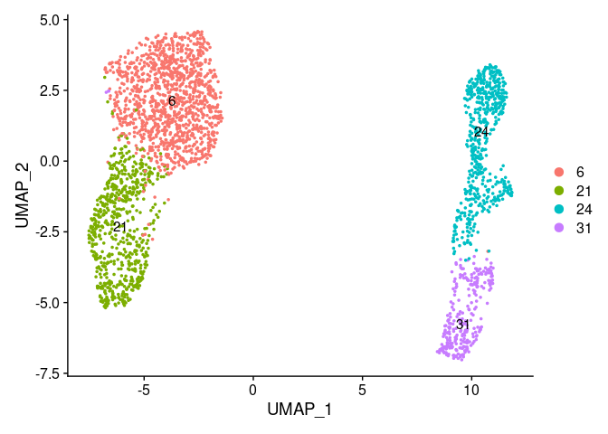
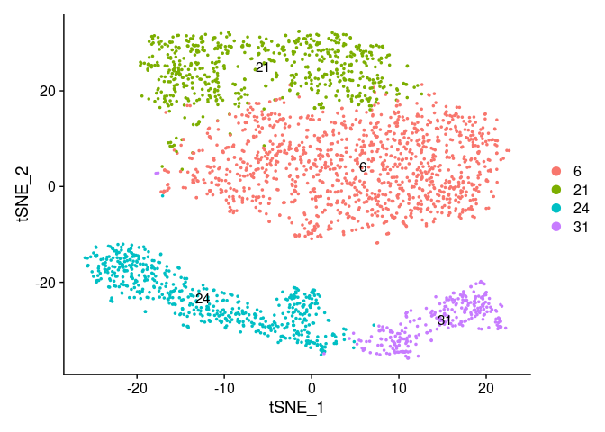
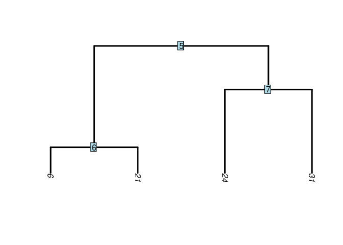
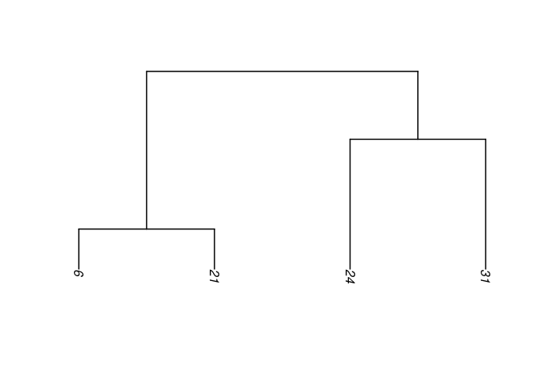
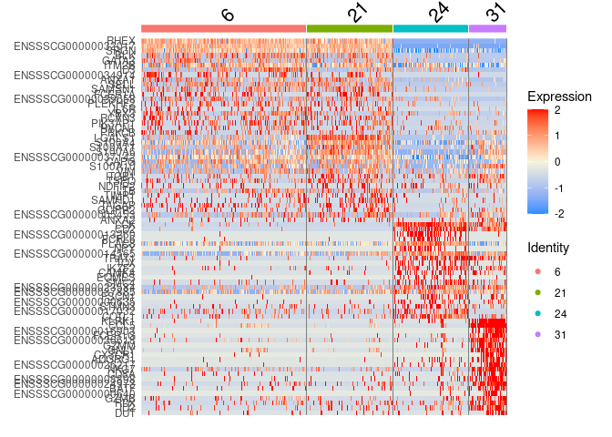
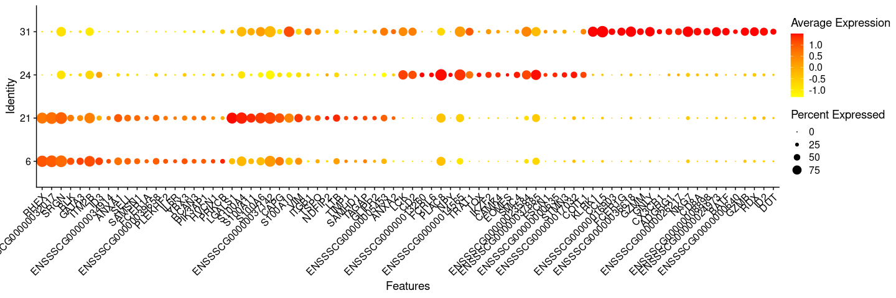
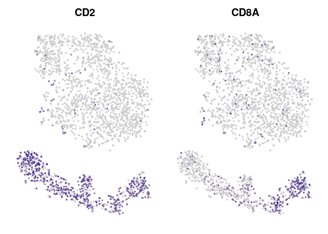

Subset Analysis of GD T Cells
================

### Load required software packages

Refer to sessionInfo() at the bottom of the page for the R and package
versions used.

``` r
library(Seurat)
library(writexl)
library(dplyr)
library(ggplot2)
library(tidyr)
library(scales)
library(SeuratDisk)
```

### Import relevant data

Read in our Seurat object from previous analysis:

``` r
pbmc <- readRDS('/home/Jayne.Wiarda/PBMCscRNAseq/PBMC7_AllCells.rds')
DefaultAssay(pbmc) <- "RNA"
PCdims <- 1:14 # 'significant' PCdims found previously
```

## Create new Seurat object of only GD T cells

Subset to only GD T cells:

``` r
Idents(pbmc) <- pbmc$celltypes
GD <- subset(pbmc, idents = c('CD2+ GD T cells', 'CD2- GD T cells'))
```

Slim down the new Seurat object by removing non-expressed genes, scaled
data, and dimensionality reductions:

``` r
counts <- as.data.frame(GD[['RNA']]@counts) # extract counts matrix
genes <- subset(rownames(counts), rowSums(counts) > 0) # identify genes expressed in dataset
GD <- DietSeurat(GD,
                 features = genes,  # remove all genes that aren't expressed by any of the cells
                 counts = TRUE,
                 data = TRUE,
                 scale.data = FALSE, # remove the scaled data
                 dimreducs = c('pca','tsne','umap'))
```

Rescale the data in the context of just the subsetted cells:

``` r
GD <- ScaleData(GD, # scale the RNA counts data relative to other cells
                assay = "RNA")
```

    ## Centering and scaling data matrix

``` r
dim(GD[["RNA"]]@scale.data) # see that all genes are scaled in RNA assay now
```

    ## [1] 12661  2652

Rerun multidimensional visualization but keep the same clustering as
before:

``` r
Idents(GD) <- GD$seurat_clusters
GD <- RunUMAP(GD,
              dims = PCdims,
              reduction = "pca", 
              assay = "SCT") # create UMAP
GD <- RunTSNE(GD,
              dims = PCdims,
              reduction = "pca", 
              assay = "SCT") # create UMAP

DimPlot(GD, 
        label = TRUE,
        reduction = 'umap')
```

<!-- -->

``` r
DimPlot(GD, 
        label = TRUE,
        reduction = 'tsne')
```

<!-- -->

## Perform hierarchical clustering

``` r
Idents(GD) <- GD$seurat_clusters
GD <- BuildClusterTree(GD, 
                       dims = PCdims, # elected to use same PCs as we used for clustering the entire dataset
                       assay = "PCA")
PlotClusterTree(GD, 
                edge.width = 3) # plot tree with node labels
```

<!-- -->

``` r
data.tree <- Tool(object = GD, 
                  slot = "BuildClusterTree") # pull the tree
ape::plot.phylo(x = data.tree, 
                direction = "downwards", # plot the tree without node labels
                edge.width = 1.5)
```

<!-- -->

``` r
# If you would like to rotate around some of the nodes/branches (but still maintain the phylogenetic structuring)
data.tree <- ape::rotateConstr(data.tree, c('6', '21', '24', '31'))
plot(data.tree, direction = 'downwards', edge.width = 1.5, font = 1)
```

<!-- -->

## Perform DGE analysis

Perform DGE analysis:

``` r
DefaultAssay(GD) <- "RNA"
GDDE <- FindAllMarkers(GD, 
                       only.pos = FALSE, 
                       logfc.threshold = 0.25, # minimum logFC of 0.25
                       min.pct = 0.2, # expressed in at least 20% of all cells in the cluster
                       assay = "RNA") # this will find genes that are enriched
GDDE <- subset(GDDE, p_val_adj < 0.05)
```

Save DE genes:

``` r
write_xlsx(x = GDDE, 
           path = "/home/Jayne.Wiarda/GDDE_PBMCsub.xlsx",
           col_names = TRUE) # this is the file used for cluster-specific cell type 
```

Plot top DE genes in heatmap:

``` r
GDDE <- subset(GDDE, avg_logFC > 0)
topgenes <- GDDE %>% group_by(cluster) %>% top_n(20, avg_logFC) # to use top 20 genes per cluster 
#topgenes <- subset(GDD4DE., avg_logFC >= 1) # all genes with logFC > 1 instead
DoHeatmap(GD, 
          features = as.character(topgenes$gene), 
          assay = "RNA", 
          disp.min = -2, 
          disp.max = 2) +
  scale_fill_gradientn(colors = c("dodgerblue", "beige", "red"))
```

<!-- -->

Plot top DE genes in dot plot:

``` r
DotPlot(GD, 
        features = unique(as.character(topgenes$gene)), 
        cols = c('yellow', 'red')) + RotatedAxis()
```

<!-- -->

## Assess expression of CD8A & CD2

From plot below, we can clearly see 2 clusters of CD2-CD8a- GD T cells
(6, 21), 1 cluster of CD2+CD8a- GD T cells (24), and 1 cluster of
CD2+CD8a+ GD T cells (31), corresponding to GD T cell subsets described
in porcine PBMCs in other literature\!

``` r
FeaturePlot(GD,
            features = c('CD2', 'CD8A'),
            cols = c('grey80', 'navy'),
            reduction = 'tsne') & NoLegend() & NoAxes()
```

<!-- -->

### Save data

Lastly, let’s save data in .rds file and in .h5Seurat formats:

``` r
Idents(GD) <- GD$seurat_clusters
saveRDS(GD, '/home/Jayne.Wiarda/PBMCscRNAseq/PBMC7_GDonly.rds')
SaveH5Seurat(GD, filename = "/home/Jayne.Wiarda/PBMCscRNAseq/PBMC7_GDonly.h5Seurat") # .h5Seurat is about half the file size of .rds
```

### View session information

``` r
sessionInfo()
```

    ## R version 4.0.2 (2020-06-22)
    ## Platform: x86_64-pc-linux-gnu (64-bit)
    ## Running under: Red Hat Enterprise Linux
    ## 
    ## Matrix products: default
    ## BLAS/LAPACK: /usr/lib64/libopenblasp-r0.3.3.so
    ## 
    ## locale:
    ##  [1] LC_CTYPE=en_US.UTF-8       LC_NUMERIC=C              
    ##  [3] LC_TIME=en_US.UTF-8        LC_COLLATE=en_US.UTF-8    
    ##  [5] LC_MONETARY=en_US.UTF-8    LC_MESSAGES=en_US.UTF-8   
    ##  [7] LC_PAPER=en_US.UTF-8       LC_NAME=C                 
    ##  [9] LC_ADDRESS=C               LC_TELEPHONE=C            
    ## [11] LC_MEASUREMENT=en_US.UTF-8 LC_IDENTIFICATION=C       
    ## 
    ## attached base packages:
    ## [1] stats     graphics  grDevices utils     datasets  methods   base     
    ## 
    ## other attached packages:
    ## [1] SeuratDisk_0.0.0.9013 scales_1.1.1          tidyr_1.1.2          
    ## [4] ggplot2_3.3.2         dplyr_1.0.2           writexl_1.3.1        
    ## [7] Seurat_3.2.2         
    ## 
    ## loaded via a namespace (and not attached):
    ##   [1] Rtsne_0.15            colorspace_2.0-0      deldir_0.2-3         
    ##   [4] ellipsis_0.3.1        ggridges_0.5.2        spatstat.data_1.5-2  
    ##   [7] leiden_0.3.6          listenv_0.8.0         farver_2.0.3         
    ##  [10] ggrepel_0.9.1         bit64_4.0.5           RSpectra_0.16-0      
    ##  [13] fansi_0.4.1           codetools_0.2-16      splines_4.0.2        
    ##  [16] knitr_1.30            polyclip_1.10-0       jsonlite_1.7.2       
    ##  [19] ica_1.0-2             cluster_2.1.0         png_0.1-7            
    ##  [22] uwot_0.1.9            shiny_1.5.0           sctransform_0.3.1    
    ##  [25] compiler_4.0.2        httr_1.4.2            assertthat_0.2.1     
    ##  [28] Matrix_1.2-18         fastmap_1.0.1         lazyeval_0.2.2       
    ##  [31] limma_3.44.3          cli_2.2.0             later_1.1.0.1        
    ##  [34] htmltools_0.5.0       tools_4.0.2           rsvd_1.0.3           
    ##  [37] igraph_1.2.6          gtable_0.3.0          glue_1.4.2           
    ##  [40] RANN_2.6.1            reshape2_1.4.4        Rcpp_1.0.5           
    ##  [43] spatstat_1.64-1       vctrs_0.3.5           ape_5.4-1            
    ##  [46] nlme_3.1-148          lmtest_0.9-38         xfun_0.19            
    ##  [49] stringr_1.4.0         globals_0.14.0        mime_0.9             
    ##  [52] miniUI_0.1.1.1        lifecycle_0.2.0       irlba_2.3.3          
    ##  [55] goftest_1.2-2         future_1.21.0         MASS_7.3-51.6        
    ##  [58] zoo_1.8-8             promises_1.1.1        spatstat.utils_1.17-0
    ##  [61] parallel_4.0.2        RColorBrewer_1.1-2    yaml_2.2.1           
    ##  [64] reticulate_1.18       pbapply_1.4-3         gridExtra_2.3        
    ##  [67] rpart_4.1-15          stringi_1.5.3         rlang_0.4.9          
    ##  [70] pkgconfig_2.0.3       matrixStats_0.57.0    evaluate_0.14        
    ##  [73] lattice_0.20-41       ROCR_1.0-11           purrr_0.3.4          
    ##  [76] tensor_1.5            patchwork_1.1.0       htmlwidgets_1.5.3    
    ##  [79] labeling_0.4.2        cowplot_1.1.0         bit_4.0.4            
    ##  [82] tidyselect_1.1.0      parallelly_1.21.0     RcppAnnoy_0.0.17     
    ##  [85] plyr_1.8.6            magrittr_2.0.1        R6_2.5.0             
    ##  [88] generics_0.1.0        pillar_1.4.7          withr_2.3.0          
    ##  [91] mgcv_1.8-31           fitdistrplus_1.1-3    survival_3.2-7       
    ##  [94] abind_1.4-5           tibble_3.0.4          future.apply_1.6.0   
    ##  [97] crayon_1.3.4          hdf5r_1.3.3           KernSmooth_2.23-17   
    ## [100] plotly_4.9.2.1        rmarkdown_2.7         grid_4.0.2           
    ## [103] data.table_1.13.4     digest_0.6.27         xtable_1.8-4         
    ## [106] httpuv_1.5.4          munsell_0.5.0         viridisLite_0.3.0
